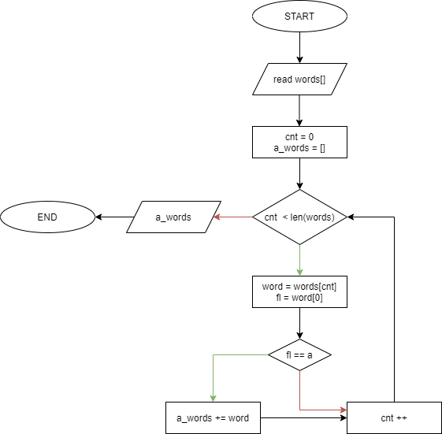

# Esercizi per l'esame scritto

Questi sono esempi degli esercizi la cui risoluzione potrebbe essere richiesta durante un appello.

!!!warning "Parte teorica"
	Si sottolinea che questi esercizi **non** sono rappresentativi delle domande (a risposta aperta) che verranno poste all'appello; queste ultime, infatti, riguarderanno gli aspetti prettamente teorici del corso.

!!!warning "Esercizi ed appelli"
	Questi esercizi sono **simili**, come difficoltà ed impostazione, a quelli che saranno proposti durante un appello; ciò implica che, ovviamente, gli esercizi da risolvere non saranno **mai** scelti tra questi.

## Esercizio 1

Definire una funzione che accetti come parametro in ingresso due interi $a$ e $b$ e stampi a schermo in uscita un valore reale, in cui la parte intera è pari ad $a$, e la parte decimale è composta dalle stesse cifre di $b$. Si tronchi la parte decimale alla seconda cifra dopo la virgola.

Ad esempio:

$a = 8; b = 107; \Rightarrow res = 8.10$

E' possibile utilizzare C/C++ o Python.

!!!tip "Suggerimento"
	Per stampare a schermo soltanto le prime due cifre decimali, si utilizzi il format specifier `%.2f` in C/C++, e `:.2f` in Python.

### Risoluzione

=== "C/C++"
	```c
	void funzione(int a, int b) {
		float c = (float) a;
		float d = (float) b;
		while (d > 1.0) { 			// Divido il valore di b fino a che la parte intera non è minore di 1.
			d = d / 10;
		}
		c += d; 					// Aggiungo c (parte reale) a d (parte decimale)
		printf("%.2f", c); 			// Stampo a schermo il risultato.
	}
	```

=== "Python"
	```python
	def funzione(a: int, b: int):
		while b > 1.0:
			b = b / 10
			a += b
			print("{:.2f}".format(a))
		```

## Esercizio 2

Descrivere l'output delle seguenti funzioni Python.

```python
# Funzione A
def funzione_a(s: str) -> str:
	print('La stringa passata in ingresso è {}\n'.format(s))
	s[0] = 'A'
	print('La stringa modificata è {}\n'.format(s))
	return s

# Funzione B
def funzione_b(s: str) -> str:
	print('La stringa passata in ingresso è {}\n'.format(s))
	s = 'A'
	print('La stringa modificata è {}\n'.format(s))
	return s
```

### Risoluzione

La funzione A stamperà a schermo la stringa passata in ingresso, per poi restituire un errore, in quanto una stringa non è mutabile in Python, dunque l'istruzione `s[0] = 'A'` non è valida.

La funzione B stamperò a schermo la stringa passata in ingresso, per poi stampare a schermo il nuovo valore assunto dalla stringa come variabile locale (ovvero `A`). Nonostante questo, la stringa originaria non sarà modificata, a meno che non si usi la seguente sintassi:

```python
>>> s = 'stringa'
>>> s = funzione_b(s)
```

Questo è legato al fatto che Python gestisce il passaggio dei parametri per valore e non per reference.

## Esercizio 3

Definire una funzione C++ che aggiunga un elemento ad un vettore passato come argomento alla stessa. Si usi il container `vector` ed un iteratore.

### Risoluzione

```cpp
void append(vector<int> &v, int el) {
  	v.insert(v.end(), el);
}
```

La funzione `append()` accetta un container di tipo `vector`, contenente a sua volta valori interi, ed un intero. Viene quindi usato un iteratore che punta al termine del container (`v.end()`), in abbinata al metodo `insert`, per aggiungere l'elemento in coda al vettore. Si noti come il passaggio avvenga per _reference_, e non per _valore_, in modo da non dover usare alcuna istruzione `return`; la sintassi alternativa (con istruzione `return`) sarebbe stata:

```cpp
vector<int> append_v(vector<int> v, int el) {
  v.insert(v.end(), el);
  return v;
}
```

```cpp
// Esempio di funzionamento
int main ()
{
	vector<int> v = { 1 };
  	append(v, 4);

	for (vector<int>::iterator it = v.begin(); it != v.end(); ++it) {
		cout << *it << endl;
	}
}
```

## Esercizio 4

Si utilizzi lo strumento descrittivo dei diagrammi di flusso per rappresentare la selezione di tutte le parole che iniziano con la lettera A dalle seguenti: *Abaco*, *Geometria*, *Matematica*, *Aritmetica*, *Trigonometria*.

### Risoluzione

Una possibile risoluzione è mostrata nel seguente diagramma di flusso.



I passi sono i seguenti:

1. legge la lista di parole in ingresso, e salvala in una variabile chiamata `words`;
2. crea un contatore `cnt` ed una lista `a_words` (vuota) che conterrà le parole che iniziano con la lettera *a*;
3. fino a che `cnt < len(words)`:
	a. seleziona la parola attuale (`word`);
	b. se la prima lettera è *a*, allora aggiungi `word` ad `a_words`;
	c. incrementa il contatore `cnt`;
4. restituisci in output `a_words`.
