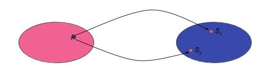

## Formulare un problema

Per comprendere gli algoritmi, partiamo definendo il concetto di _problema_.

In tal senso, il dizionario De Mauro - Paravia ci viene in aiuto definendolo come:

!!! quote "Definizione di problema"
_...quesito da risolvere mediante la determinazione di uno o più enti, partendo da elementi noti e condizioni fissate in precedenza._

Questa definizione ci dà gli elementi necessari alla formulazione compiuta di un problema. Analizziamoli più nel dettaglio.

### Il problema come _compito_

Un problema è dunque in primis un _quesito_ (o, analogamente, un _compito_) che necessita di una _risoluzione_ (o _svolgimento_). Esempi concreti di problema sono:

- _"Come montare il mobile che abbiamo appena acquistato dall'IKEA?"_
- _"Come calcolare l'ipotenusa di un triangolo rettangolo?"_
- _"Come dimostrare l'ipotesi di Riemann?"_

Possiamo vedere che i problemi possono essere di ogni tipo e difficoltà; sono tutti accomunati però dal fatto che, _qualora siano risolvibili_, per farlo è necessario adoperare un _algoritmo_.

### L'_ente risolutore_

La risoluzione del problema è delegata ad un o più _enti_, propriamente intesi come _esecutori_ di una serie di step necessari a risolvere il problema.

Rimanendo agli esempi precedenti, il risolutore del primo problema è il montatore del mobile; quello per il secondo è lo studente che calcola l'area del triangolo mediante il teorema di Pitagora; nel terzo caso invece abbiamo il matematico teorico, che dimostra (o confuta) l'ipotesi di Riemann.

### Gli _elementi noti_ e le _condizioni fissate_

La risoluzione del problema non può prescindere dalla conoscenza degli _elementi noti_ e delle _condizioni fissate_ per lo stesso. Intuitivamente, questo significa _conoscere lo stato del mondo_ a partire dal quale dovremo risolvere il problema.

Torniamo ai nostri esempi.

In primis, per montare il mobile IKEA, avremo bisogno della conoscenza di dettagli quali:

- collocazione desiderata del mobile;
- numero e tipo di pezzi nella confezione del mobile;
- attrezzi di cui abbiamo bisogno.

Oltre questo, potrebbero esserci alcune _condizioni_ da rispettare, come ad esempio cercare (invano) di montare il mobile prima che tramonti il sole, o il provare a non rompere nulla.

Analogamente, per calcolare l'area di un triangolo rettangolo, dovremo conoscerne base ed altezza, e rispettare i vincoli imposti dalla geometria di base.

!!! note "Nota"
La determinazione degli elementi noti e delle condizioni fissate per la dimostrazione dell'ipotesi di Riemann è lasciata come banale esercizio al lettore.

## Risolvere un problema

La formulazione di un problema implica quindi la determinazione del _cosa_ (il quesito da risolvere), del _chi_ (l'esecutore materiale della risoluzione) e del _da dove_ (lo stato di partenza e le condizioni fissate). In particolare, diamo a questi ultimi il nome di _dati_: i dati caratterizzano, anche parzialmente, lo stato iniziale del mondo, e possono essere forniti in un linguaggio naturale che permetta di descrivere delle _situazioni_, o _stati_, e le differenze tra di essi.

### Problemi e soluzioni

Il lettore più attento noterà che manca ancora un elemento fondamentale, ovvero il _come_. Questo è definito individuando un apposito _metodo di risoluzione_ o, più semplicemente, una _soluzione_ al problema.

Dal punto di vista formale, l'individuazione del metodo di risoluzione può essere espressa come una _relazione univoca_ che associa ad ogni elemento dello spazio dei problemi (o meglio, delle _classi di problemi_, come sarà più chiaro in seguito) $\mathbb{P}$ uno o più elementi dello spazio delle soluzioni $\mathbb{S}$. Questo è rappresentato dal seguente diagramma di Eulero-Venn:

Informalmente, possiamo dire che _per ogni problema_ (se risolvibile) _esiste almeno una soluzione_.

### Costruire la soluzione

Il compito del risolutore è quindi quello di "costruire", o "individuare", la soluzione. La possibilità di farlo è legata ad alcune condizioni fondamentali, ovvero:

- le operazioni _atomiche_ disponibili;
- il modo in cui le operazioni di cui sopra possono essere combinate per realizzare operazioni più complesse.

#### Operazioni atomiche

Per operazione "atomica" intendiamo un'operazione che non è possibile _semplificare_ (ovvero suddividere) in alcun modo. Esempi di operazione atomica possono essere:

- sommare due numeri;
- fare un passo in avanti;
- finalizzare una transazione sul proprio conto corrente bancario.

Esempi di operazioni _non_ atomiche sono invece:

- risolvere un'equazione di secondo grado;
- correre per dieci metri;
- effettuare un versamento ed un prelievo sul proprio conto corrente bancario.

!!! note "Nota sulla somma"
Il lettore più zelante potrebbe pensare che una somma è suddivisibile usando l'inverso della proprietà associativa. Ciò porterebbe però a scomporre una somma in due somme, che potrebbero essere scomposte in tre somme, e via dicendo. Questa operazione risulta essere controproducente, oltre che contraria al senso comune; si invita quindi il lettore zelante ad adeguarsi al senso comune ed evitare una

!!! note "Nota sul conto corrente bancario"
La singola transazione sul proprio corrente bancario è in realtà scomponibile, dal punto di vista informatico, in un gran numero di operazioni atomiche: il correntista, infatti, effettua l'autenticazione, completa un form, finalizza la transazione e la esegue. Dato che tutte queste operazioni devono però essere necessariamente _completate_ in un ordine ben definito, i sistemi bancari le vedono come un'unica operazione, che è possibile annullare qualora sopravvenga un problema qualsiasi (problemi di autenticazione, rete non disponibile, mancanza di energia elettrica su uno dei sistemi, etc.).

#### Combinare operazioni atomiche

Le operazioni atomiche possono essere combinate in due modi:

- effettuandole in _sequenza_ (come nel caso del versamento e del prelievo sul proprio conto corrente bancario);
- effettuandole in _parallelo_.

Nel secondo caso, più operazioni vengono eseguite contemporaneamente. Ciò comporta però la necessità di due problemi principali, ovvero:

- _mantenere indipendenti le singole operazioni_;
- _coordinare più esecutori_, o _suddividere il tempo di un esecutore in modo che "simuli" il parallelismo_.

Il primo problema è di importanza cruciale. Immaginate di voler montare assieme a vostro cugino due mobili IKEA allo stesso tempo, ma di avere a disposizione un unico cacciavite: cosa succede se usate il cacciavite e questo contestualmente serve al cugino? O, ancora peggio se, avendo a disposizione un cacciavite a punte intercambiabili, ne modificate la punta da stella a brucola senza avvertire il povero cugino?

Il secondo è meno evidente, ma altrettanto degno di attenzione. Infatti, voi e vostro cugino dovrete necessariamente coordinarvi per non urtarvi, usare gli stessi attrezzi, e via dicendo. L'alternativa sarebbe fare a meno del cugino, e simulare il parallelismo montando i due mobili da voi contemporaneamente; in questo caso, però, il tempo che impieghereste è sicuramente maggiore, ed avreste la necessità di ottimizzare le operazioni da fare cercando di minimizzare lo sforzo necessario a terminare i lavori.

#### Determinare l'insieme di operatori

Individuare le operazioni atomiche e trovare dei modi per combinarle permette quindi di definire un _insieme di operatori_ che possono essere applicati ad un problema per modificarne lo stato (idealmente, da "aperto" a "risolto", considerando eventualmente gli step intermedi). Per essere comprensibili dal risolutore, questi operatori dovranno essere espressi in un _linguaggio_ che faccia riferimento _esplicito_ al contesto del problema.

#### Da _soluzione_ ad _algoritmo_

La soluzione sarà quindi definita come un operatore composto nel linguaggio di processo, il cui compito è trasformare lo stato iniziale del mondo (ovvero problema aperto) in quello che definisce la situazione desiderata (ovvero problema risolto).

L'algoritmo è la serie di istruzioni che specifica l'insieme delel azioni che è necessario compiere per risolvere il problema.

## Un esempio

Facciamo un esempio. Proviamo a formulare e risolvere un semplice problema matematico, ovvero il calcolo dell'ipotenusa di un triangolo rettangolo.

### Formulazione del problema

_Dati due numeri interi $c_1$ e $c_2$, rappresentanti le lunghezze dei due cateti di un triangolo rettangolo $T$, calcolarne l'ipotenusa $i$._

### Dati

Sia $c_1$ la lunghezza del primo cateto, e $c_2$ quella del secondo.

### Algoritmo risolutivo (in operazioni atomiche, o quasi)

1. Calcolare il quadrato di $c_1$.
2. Calcolare il quadrato di $c_2$.
3. Sommare i quadrati calcolati ai punti **1** e **2**.
4. Calcolare la radice quadrata della somma ottenuta al punto **3**.

### Esempio numerico

#### Dati

$$
\begin{eqnarray}
c_1 &= 3 \\
c_2 &= 4 \\
\end{eqnarray}
$$

#### Passi dell'algoritmo

$$
\begin{eqnarray}
\text{Step 1} & \rightarrow & {c_1}^2 = 9 = v_1 \\
\text{Step 2} & \rightarrow & {c_2}^2 = 16 = v_2 \\
\text{Step 3} & \rightarrow & v_1 + v_2 = 25 = v_3 \\
\text{Step 4} & \rightarrow & \sqrt{v_3} = 5 = v_4
\end{eqnarray}
$$

Il risultato è $v_4 = 5$.

## Caratteristiche degli algoritmi risolutivi

### Le cinque caratteristiche principali

Un algoritmo è contraddistinto da cinque caratteristiche principali.

1. _finitezza_: gli algoritmi sono _finiti_, sia dal punto di vista _spaziale_, sia da quello _temporale_;
2. _generalità_: gli algoritmi sono _generici_, ovvero rappresentano una soluzione ad un'intera classe di problemi;
3. _completezza_: gli algoritmi sono _completi_, e quindi possono risolvere tutte le istanze del problema;
4. _non ambiguità_: gli algoritmi _non sono ambigui_, e ciò comporta che tutte le istruzioni sono univoche e ben interpretabili;
5. _eseguibilità_: gli algoritmi sono _eseguibili_, nel senso che l'esecutore deve (potenzialmente) essere in grado di eseguire ogni singolo passo dell'algoritmo.

Tornando al nostro esempio, il metodo di individuazione dell'ipotenusa rispetta le condizioni perchè:

1. può essere risolto in un numero di passi finito, che non occupa uno spazio (ad esempio su carta o nella memoria di un computer) infinito;
2. può risolvere ogni problema di determinazione dell'ipotenusa, anche cambiando i valori dei cateti (a patto ovviamente che si tratti sempre di un triangolo rettangolo, e che quindi si sia nell'ambito della stessa classe dei problemi);
3. le istruzioni sono chiare e non equivocabili;
4. le istruzioni possono essere eseguite da chiunque sia in grado di calcolare un quadrato ed una radice quadrata.

In merito alla 4, è interessante notare come, probabilmente, nessun manuale IKEA (o affini) sia algoritmico.

### Determinismo

Un algoritmo si dice _deterministico_ quando al momento dell'esecuzione di ogni istruzione è nota l'istruzione successiva. Ciò comporta che eseguire due volte un algoritmo deterministico sugli stessi dati produce gli stessi effetti. L'algoritmo di esempio è a tutti gli effetti un algoritmo deterministico.

Gli algoritmi non deterministici sono invece affetti da fenomeni di tipo casuale, o stocastico; sono in genere algoritmi avanzati, usati perlopiù in applicazioni di statistica e machine learning, che non tratteremo durante questo corso.

### Input, Output e Variabili

Generalmente, i dati in ingresso ad un algoritmo sono anche chiamati _input_ dell'algoritmo, mentre la "risposta" che restituisce l'algoritmo stesso è chiamata _output_.

E' importante sottolineare come gli algoritmi possano accettare sia input sia output _anche non numerici_.

Un esempio è dato dall'algoritmo per determinare se una stringa è palindroma: questo accetta come dati una serie di caratteri, e dà una risposta di tipo binario (VERO o FALSO).

Oltre ad input ed output, gli algoritmi spesso utilizzano dei dati di _supporto_, chiamati _variabili_. Ne tratteremo molto più estesamente durante il prosieguo del corso.
