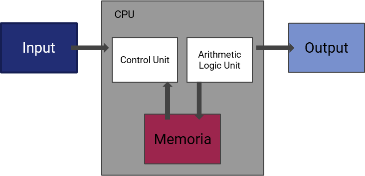

# L'architettura dei calcolatori

## Un po' di storia

Le origini del concetto di *calcolatore* (o, nell'accezione comune del termine, *computer*) possono essere fatte risalire alla storia antica, con invenzioni come l'*abaco*, ovvero dei veri e propri strumenti di supporto che permettevano all'operatore umano di svolgere in maniera più rapida calcoli anche complessi.

Il calcolatore si è poi evoluto in età moderna: si è passati dalle prime sperimentazioni, come le macchine di Pascal e di Leibniz, alle prime *calcolatrici*, per arrivare al primo modello (teorico) di dispositivo *programmabile*, ovvero in grado di adattarsi a compiti anche molto diversi tra loro, che si deve al matematico britannico Charles Babbage con la sua Macchina Analitica, progettata nel 1833, e considerata il primo progetto di *computer* nella storia.

Nei decenni successivi, vennero introdotti diversi tipi di calcolatori analogici. Successivamente, si passò alla concettualizzazione della *macchina di Turing*, per poi arrivare ai computer meccanici ed elettromeccanici, ed infine alle architetture digitali ed elettroniche, basate su transistor e circuiti integrati ad altissima densità.

Le prossime frontiere sono probabilmente quelle dettate dal *quantum computing*, che potrebbero rivoluzionare completamente l'idea attuale di elaborazione, rendedo vetusta qualsiasi applicazione dell'informatica odierna.

Tuttavia, nessuno degli scenari verificatisi negli ultimi 80 anni si sarebbe potuto realizzare se John von Neumann (un altro matematico) non avesse proposto la sua *architettura*.

## L'architettura di von Neumann

Le architetture precedenti alla definizione della *macchina di von Neumann* sono anche conosciute come *architetture non programmabili*. Questo implica che queste macchine, a meno di non procedere al ricablaggio manuale della logica "insita" all'interno delle stesse, non potevano modificare il loro funzionamento: per fare un esempio un po' "estremo", un calcolatore pensato per effettuare le addizioni non poteva essere usato per svolgere le divisioni!

!!!note "Nota"
	Questo esempio è volutamente "estremo": anche le calcolatrici più basilari implementano per lo meno le quattro operazioni aritmetiche fondamentali.

Il modello proposto da John von Neumann, quindi, è quello unanimamente riconosciuto come la base sulla quale sono basate le moderne architture dei calcolatori, ed ha avuto un ruolo fondamentale nella definizione del paradigma di *stored-program computer*, ovvero di macchine *riprogrammabili*.

L'architettura di von Neumann, mostrata nell'immagine precedente, consta di quattro entità fondamentali, ovvero:

* una *Central Processing Unit*, più comunemente nota come CPU, a sua volta composta da una *Control Unit* (CU) ed una *Arithmetic Logic Unit* (ALU);
* una unità di memoria;
* uno o più dispositivi di *input* ed *output*;
* un *bus di comunicazione*.

Vediamo nel dettaglio ciascuna di queste parti.

TODO: da qui

### Central Processing Unit

#### Componenti fondamentali

La CPU è il "cuore" della macchina di von Neumann, ed è a sua volta divisa in due parti:

- una *control unit*, responsabile per il prelievo (fetch) e decodifica (decode) delle istruzioni;
- una *processing unit*, responsabile dell'esecuzione delle operazioni aritmetiche e logiche.

La *control unit* contiene al suo interno due *registri* (ovvero piccole sezioni di memoria rapidamente accessibili) fondamentali, ovvero:

* il *Current Instruction Register* (*CIR*), che contiene l'istruzione attualmente in esecuzione;
* il *Program Counter*, che contiene l'indirizzo dell'istruzione successiva del programma in esecuzione.

La *processing unit* è invece composta da:

* una *Arithmetic Logic Unit* (*ALU*), ovvero l'unità delegata alla gestione delle operazioni aritmetiche e logiche;
* una serie di *registri* che memorizzano le operazioni fondamentali e più utilizzate dalla macchina.

Alcune varianti della CPU prevedono anche la presenza di un segnale di clock.

### Memoria

Rappresenta la memoria "centrale" del sistema, di lavoro. Il suo ruolo è assimilabile a quello delle *RAM*, in quanto contiene tutti i dati e le istruzioni necessarie alla corretta esecuzione del programma attuale. E' importante non confondere questa memoria con la memoria di massa (ovvero gli hard disk o gli SSD), nella quale sono immagazzinati i dati ed i programmi quando questi non sono in uso.

La memoria dialoga principalmente con la CPU, ed il suo compito consiste nell'agire da "magazzino", accessibile in maniera rapida (anche se non tanto rapida quanto i registri) dalla CPU, allo scopo di recuperare i dati necessari all'esecuzione del programma attuale.

### Dispositivi di Input/Output

Sono i dispositivi con cui, rispettivamente, sono *forniti dati e programmi* alla CPU (Input) e vengono restituiti dalla CPU i *risultati dell'elaborazione*. E' interessante notare come una memoria di massa possa fungere sia da dispositivo di input, sia da dispositivo di output.

### Bus

Il *bus* è il mezzo con cui i vari componenti della macchina di von Neumann comunicano tra loro.

TODO:

## Funzionamento

# Esecuzione di programmi

La macchina di von Neumann è in grado di eseguire programmi espressi in un opportuno linguaggio macchina

- per le macchine reali, il linguaggio macchina è codificato secondo codici binari o esadecimali

Si suppone che il programma da eseguiresia caricato in memoria prima dell'esecuzione. può essere quindi caricato a partire da qualche memoria di massa su cui è stato precedentemente registratot, fornito in input dal programmatore, etc

Si suppone che il programma sia suddiviso logicamente in due parti.

una parte di *dati*, di *I/O* e di supporto, calcolati e temporanei, su cui operano le istruzioni;

ed una parte logica, rappresentativa dell'insieme delle istruzioni che devono essere eseguite

# Ciclo Fetch-Decode-Execute

L'esecuzione del programma avviene ripetendo iterativamente le fasi di

- Acquisizione (fetch) dell'istruzione da eseguire
- Interpretazione (DECODE) dell'istruzione
- Esecuzione (EXECUTE)

In pratica:

- il contenuto del PC viene caricato nel CIR
- il PC viene aggiornato con l'indirizzo dell'istruzione successiva,
- l'istruzione del CIR viene decodificata ed eseguita, eventualmente accedendo ai dati

FINE
TODO:

## L'importanza della macchina di von Neumann

### I primi computer

I primi computer non avevano una memoria propriamente intesa: i programmi infatti erano spesso "cablati" nella logica della macchina. Di conseguenza, un computer progettato per eseguire (ad esempio) determinati calcoli matematici, non poteva essere usato per scrivere, a meno di *riprogrammarlo*. Questo significava ovviamente imbarcarsi in una procedura lunga, tediosa e complessa, spesso con implicazioni anche di tipo meccanico (ovvero, necessità di ricablare i collegamenti tra le diverse parti della macchina). Per fare un esempio, modificare il programma in esecuzione su una macchina ENIAC (il primo computer *general-purpose*) richiedeva circa tre settimane.

La macchina di von Neumann permise di superare questo limite introducendo il concetto di *stored-program computer*, inteso come calcolatore in grado di memorizzare le istruzioni da eseguire in forma elettronica, ottica, o comunque *facilmente accessibile*. Questo, ovviamente, derivava dalla struttura stessa della macchina, che non implicava una completa integrazione di CPU e memoria, le quali erano bensì separate ed indipendenti. Va da sé che riscrivere la memoria non comportava la riprogrammazione completa della CPU, con un notevole vantaggio in termini di accessibilità e riprogrammabilità del calcolatore.

### Il collo di bottiglia di von Neumann

La macchina di von Neumann soffre di un notevole limite, legato principalmente al rapporto tra la *velocità della CPU* ed il *transfer rate* della memoria. Il problema principale è legato al fatto che, nel corso del tempo, la velocità delle CPU è aumentata seguendo per molti anni la cosiddetta *legge di Moore*, mentre le evoluzioni delle memorie si sono concentrate sulla loro *densità* (ovvero sul quantitativo di memoria disponibile) piuttosto che sul *throughput* (ovvero sul quantitativo di dati che è possibile trasferire dalla memoria verso la CPU). Questo fenomeno è detto *collo di bottiglia di von Neumann*, o *von Neumann bottleneck*.

La conseguenza di questo fenomeno sta nel fatto che le *CPU elaborano troppe informazioni rispetto a quelle che la memoria può inviare*, e quindi i processori si ritrovano a "dover attendere" le istruzioni fornite dalla memoria, lasciando che preziosi cicli di clock passino inutilizzati.

Per mitigare questo fenomeno, nel tempo sono stati elaborati diversi approcci, come:

- creare delle memorie *cache*, di dimensioni limitate rispetto alle RAM, ma comunque molto più veloci;
- fare in modo che dati ed istruzioni viaggino su percorsi differenti, riducendo la congestione sul bus;
- usare degli algoritmi di *branch prediction*, che tentano di prevedere quali istruzioni saranno usate successivamente, precaricandole dalla memoria.

Nonostante questi "escamotage", però, la soluzione al *von Neumann bottleneck* arrivò introducendo un'altra architettura.

## L'architettura Harvard

Inizialmente implementata sulla macchina *Harvard Mark I*, l'*architettura Harvard* venne introdotta per superare i limiti imposti dal modello di von Neumann, separando la memoria dedicata ai programmi (*instruction memory*) da quella dedicata ai dati (*data memory*).

### Differenze con l'architettura di von Neumann

L'architettura Harvard permette di superare il collo di bottiglia intrinseco nell'architettura di von Neumann permettendo alla CPU di leggere un'istruzione contemporaneamente all'accesso ai dati, anche senza utilizzare una cache; ciò significa che, al costo di una complessità circuitale superiore, un computer basato su architettura Harvard è più veloce di uno basato sull'architettura di von Neumann.

### L'architettura Harvard modificata

Una *architettura Harvard modificata* è definita in modo molto vago, ma vi sono tre diverse possibilità.

Queste architetture sono la *Split Cache*, *access Instruction Memory as Data*, e *Read Instructions from Data Memory*.

#### Access Instruction Memory as Data

Questa architettura ricorda l'architettura Harvard standard, ma con uno speciale insieme di istruzioni che permettono di leggere le costanti dalla memoria legata

A modified Harvard architecture machine is very much like a Harvard architecture machine, but it relaxes the strict separation between instruction and data while still letting the CPU concurrently access two (or more) memory buses. The most common modification includes separate instruction and data caches backed by a common address space. While the CPU executes from cache, it acts as a pure Harvard machine. When accessing backing memory, it acts like a von Neumann machine (where code can be moved around like data, which is a powerful technique). This modification is widespread in modern processors, such as the ARM architecture, Power ISA and x86 processors. It is sometimes loosely called a Harvard architecture, overlooking the fact that it is actually "modified".
