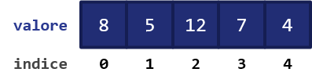
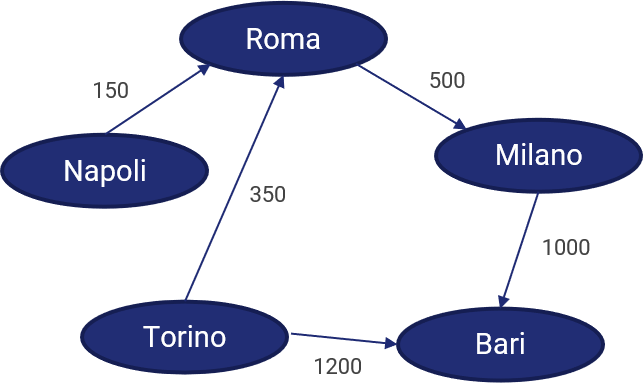

I linguaggi di programmazione sfruttano il cocnetto **struttura dati** per _organizzare_, _gestire_ e _memorizzare_ una serie di valori nella maniera più _efficiente_ psosibile.

Le strutture dati non sono quindi altro che degli _insiemi_, o _collezioni_, di valori, che caratterizzano anche le relazioni intercorrenti tra essi, oltre che le operazioni che vi possono essere applicate.

Esistono diverse tipologie di strutture dati, ognuna delle quali particolarmente adatta a determinati scopi. Vediamone alcune di seguito.

## Array

Un **array** è concettualmente riconducibile ad un vettore, inteso nel senso più "algebrico" del termine.

Un array contiene quindi un vettore (o, per estensione, una matrice) di elementi, tipicamente (ma, a seconda del linguaggio, _non necessariamente_) dello stesso tipo, i quali sono organizzati seguendo un ordine specifico, esplorabile mediante il concetto di **indice**.

Questo definisce la modalità di accesso ai dati di un array, che è chiamata **accesso diretto** o **casuale**: in pratica, l'elemento viene estratto in maniera diretta, utilizzando l'indice, e di conseguenza l'operazione è immediata (in termini di complessità computazionale, abbiamo un $O(1)$, ovvero un'unica operazione necessaria).

Questo vantaggio ha però come contraltare la necessità di implementare una serie laboriosa di operazioni di accesso alla memoria nel caso si voglia inserire o rimuovere un elemento nell'array.

Una tipica rappresentazione di un array è la seguente:

```
[8, 5, 12, 7, 4]
```

In particolare, il precedente array è composto esclusivamente da elementi di tipo intero, ed ha lunghezza pari a `5`; da notare che l'indice del primo elemento (in questo caso, il valore `3`) _non_ è quasi mai pari ad `1`: nella maggior parte dei linguaggi di programmazione, infatti, l'indicizzazione parte da `0` e termina ad un valore `n - 1`, con `n` lunghezza dell'array. Nel caso precedente:



## Liste

Una **lista** (conosciuta anche come **linked list**) è una struttura dati simile agli array, ma che consta di una differenza fondamentale. Nella lista, infatti, ogni elemento contiene un **riferimento** a quello successivo.

Vediamo un esempio nella seguente figura:


Dall'immagine precedente, vediamo che:

- il primo elemento nella lista ha valore `5`, e conserva un riferimento all'elemento successivo `R3`;
- il secondo elemento nella lista ha valore `3`, e conserva un riferimento all'elemento successivo `R2`;
- ciò prosegue sino all'elemento `7`, che conserva un riferimento all'ultimo elemento `R12`.

Questa particolarità della lista rispetto all'array ha due effetti. Il primo consiste nel fatto che la lista è una struttura ad **accesso sequenziale**; in parole povere, occorrerà "scorrere" tutti gli elementi della lista fino ad arrivare a quello desiderato. In molti linguaggi di programmazione, esistono appositi costrutti per compiere questa operazione chiamati _iteratori_.

La seconda conseguenza sta nel fatto che risulta essere molto più semplice aggiungere o riumuovere un elemento alla lista, specie se comparato con l'array: basterà infatti manipolare opportunamente i riferimenti agli elementi successivi della lista.

## Struct

Una **struct** (conosciuta anche come **tupla**) è una struttura dati che contiene a sua volta un insieme di valori chiamati _membri_ o _campi_. In una struct, il numero, la sequenza ed il tipo dei campi sono solitamente fissi.

Ecco un esempio di struct che ci permette di rappresentare una persona:

```c
struct persona {
	char nome[16];
	char cognome[32];
	int eta;
} ettore;
```

La struct precedente ci permetterà quindi di definire la variabile `ettore` con nome, cognome ed età.

## Union

Una **union** è una struttura dati che specifica il tipo del valore che può essere memorizzato tra un certo numero di tipi primitivi. Nonostante sia sintatticamente simile alla struct, ne differisce _semanticamente_ e _funzionalmente_, in quanto ammette la presenza di un unico valore per volta (che però può essere di tipo di volta in volta differente).

Ad esempio:

```c
union lettura_sensore {
	int lettura_intera;
	float lettura_reale;
} lettura;
```

Analogamente alla struct, potremo definire la variabile `lettura` come valore intero o reale.

## Pile e code

Abbiamo visto che gli array sono strutture ad accesso casuale, mentre le liste sono ad accesso sequenziale. Esiste un altro tipo di accesso ai dati presenti in una struttura, detto _accesso limitato_, che viene usato da alcune strutture dati come **pile** e **code**. Scopriamolo insieme.

### Pile

Una **pila** (o **stack**) è un contenitore di oggetti che possono essere inseriti o rimossi seguendo il principio _LIFO_ (_Last-In, First-Out_). In parole povere, questo significa che _l'ultimo elemento che accede alla pila è anche il primo ad uscirne_.

Lo stack prevede due diverse operazioni: la prima è quella di **push**, ovvero di inserimento di un oggetto all'interno dello stack, mentre la seconda è quella di **pop**, ovvero di estrazione di un elemento dallo stack.

Il fatto che l'accesso sia limitato è dovuto proprio ad una limitazione a queste due operazioni: in particolare, sia il push, sia il pop, possono essere effettuati soltanto sugli elementi _in cima_ alla pila. Quindi:

!!! cite "Operazione di push"
L'operazione di push permette di inserire un oggetto in cima ad uno stack.

!!! cite "Operazione di pop"
L'operazione di pop permette di estrarre l'oggetto attualmente in cima allo stack.

Notiamo anche che lo stack è una struttura dati di tipo ricorsivo: infatti, è facile dimostrare che uno stack non vuoto è in realtà composto da un elemento in cima (_top_) ad un altro stack.

#### Pila come array

Per implementare una pila sotto forma di array, abbiamo bisogno dei seguenti elementi:

1. un array di lunghezza superiore ad uno (`stack`);
2. una variabile che caratterizza l'elemento in cima all'array (`top`);
3. una variabile che si riferisce alla lunghezza dell'array (`capacity`).

Lo `stack` è pieno quando `top` è pari a `capacity - 1`; invece, è vuoto quando `top` è pari a `-1`. Questi principi sono riassunti nella figura successiva:

E' importante notare che possiamo avere due tipi di implementazione: una in cui la dimensione dell'array è fissa, ed una in cui la dimensione dell'array varia in maniera dinamica. Nella prima, ovviamente, quando il `top` è pari a `capacity` si genera un errore; ciò non avviene nel secondo caso.

L'operazione di `push` prevede quindi che sia inserito un nuovo elemento all'indice `top` dell'array; di converso, l'operazione di `pop` prevede che tale elemento sia rimosso. In etrambi i casi, è importante aggiornare il valore di `top`.

```
push(array, top, capacity, element)
STEP 1 -> top = top + 1;
STEP 2 -> if (top >= capacity)
		      return ERROR;
STEP 3 -> array[top] = element;
```

```
pop(array, top)
STEP 1 -> element = array[top];
STEP 2 -> top = top - 1;
STEP 3 -> return element;
```

### Code

Una coda (_queue_) è un contenitore di oggetti che sono inseriti o rimossi secondo il principio _FIFO_ (_first-in, first-out_). Concettualmente, è quella che siamo abituati a vedere negli Uffici Postali, ad esempio: il primo arrivato sarà il primo ad essere servito (e, di conseguenza, _rimosso dalla coda_). Definiremo quindi una funzione `enqueue` per mettere in coda un nuovo elemento, e `dequeue` per togliere dalla coda l'elemento presente da più tempo.

La differenza fondamentale rispetto agli stack sta nella rimozione degli oggetti: in uno stack, rimuoviamo l'oggetti che abbiamo aggiunto più di recente, mentre in una coda rimuoviamo quello che abbiamo aggiunto meno di recente.

#### Esempio di implementazione come array

Nel caso volessimo implementare una coda come array, dovremmo definire almeno i metodi `enqueue` e `dequeue`.

In particolare, la procedura di `enqueue` prevede che sia posto come primo membro dell'array proprio l'elemento che si vuole aggiungere. Per farlo, potremmo ad esempio salvare l'array in una variabile temporanea, e concatenarlo all'elemento che entra in coda.

```
enqueue(array, element)
STEP 1 -> temp_array = array;
STEP 2 -> new_array = concatenate(element, temp_array);
STEP 3 -> return new_array;
```

La procedura di `dequeue` di converso comporta la semplice rimozione dell'ultimo elemento nell'array.

```
dequeue(array)
STEP 1 -> element = array[length(array) - 1]
STEP 2 -> new_array = remove_last(array)
STEP 3 -> return new_array, element
```

## Grafi

Ecco un modo per rappresentare una rete sociale:


Le linee presenti tra i nomi di due persone indicano che queste si conoscono tra loro. Ovviamente, la conoscenza è _bidirezionale_: dato che Alice conosce Bob, anche Bob conosce Alice.

Questo modo di schematizzare una rete sociale è conosciuto come _grafo_.

### Vertici ed archi

Ciascun nodo è noto come _vertice_, mentre ogni linea è un _arco_ che connette due vertici.

L'insieme dei vertici è dato da $V$, mentre quello degli archi è dato da $E$. Il grafo è quindi rappresentabile come una coppia $G=(V,E)$.

Anche i nodi possono essere rappresentati a coppie: in particolare, due nodi $u$ e $v$ connessi da un arco sono una coppia $(u, v)$.

### Grafo non diretto

Abbiamo detto che le relazioni rappresentate nella nostra rete sociale sono bidirezionali: ciò significa che non è possibile individuare una "direzione" specifica nella relazione. Siamo quindi in presenza di un _grafo non diretto_.

In un grafo non diretto, un arco $(u, v)$ equivale all'arco $(v, u)$. Ciascun arco incide su entrambi i vertici, ed i vertici connessi da un arco sono _adiacenti_ o _vicini_. Definiamo inoltre il numero di archi che incide su un vertice come _grado_ dello stesso.

### Cammini e cicli

Immaginiamo che Bob voglia conoscere Eric. non vi è un arco che li collega; però, Bob potrebbe chiedere ad Alice di presentargli David, che a sua volta potrebbe presentargli Eric. Esiste quindi un **percorso**, o **cammino**, composto da tre archi tra Bob ed Eric, e rappresenta il modo più diretto per i due per incontrarsi. Chiamiamo un percorso del genere (ovvero il percorso con un numero minimo di archi) **cammino minimo**, o **shortest path**.

Un cammino che ha come punto di partenza e di arrivo lo stesso vertice è chiamato **ciclo**. Ad esempio, quello che va da Alice, passa per David, Eric e Charlie, e torna ad Alice, è appunto un ciclo.

### Grafo pesato

Alle volte, gli archi sono **pesati**, ovvero correlati da valori numerici. Ad esempio, potremmo rappresentare la distanza tra diverse città come segue:


Il termine generale per ognuno dei numeri che mettiamo su un lato è **peso**, ed un grafo i cui archi hanno dei pesi è un **grafo pesato**. In questo caso, volendo trovare il percorso minimo tra due posizioni, dovremo tenere contro del valore dei pesi. Ad esempio, per Andare da Bari a Napoli, occorrerà, nel nostro caso, passare da Roma e Milano (piuttosto che da Torino).

!!! note "Nota"
Il Docente si scusa per questa interpretazione poco realistica. Non seguite questa mappa, e risparmierete molte ore.

### Grafo diretto

Cosa accade se inseriamo informazioni inerenti i sensi di marcia all'interno del grafo precedente? Otteniamo un **grafo diretto**.



Le direzioni degli archi mostrano quali percorsi possono essere affrontati, e quali no. In questo caso, ad esempio, non potremo uscire da Bari, in quanto non ci saranno archi uscenti. Roma invece perde il suo status, in quanto si dimostra che _non tutte le strade portano a Roma_.

Possiamo fare altre due osservazioni su questo grafo:

- il grafo non ha alcun ciclo, per cui siamo in presenza di un **grafo aciclico diretto**;
- il grafo conserva i pesi, per cui siamo comunque in presenza di un grafo pesato.

Per quello che riguarda infine il grado di ogni arco, abbiamo due termini da tenere in considerazione:

- il **grado esterno**, o **out-degree**, è il numero di archi in uscita da un vertice;
- il **grado interno**, o **in-degree**, è il numero di archi in ingresso in un vertice.

## Alberi

Un **albero** è una struttura dati, particolarmente usata in ambito informatico, che simula una struttura gerarchica, con un valore radice ed una serie di figli, rappresentata sotto forma di grafo **non orientato**, **connesso** ed **aciclico**.

In particolare, il fatto che l'albero sia connesso indica che esiste _almeno un cammino che connette tutti gli archi_.


Un particolare tipo di albero è poi l'**albero binario**, nel quale ciascun nodo ha (al più) due figli.

Un nodo terminale (ovvero uno in basso nella gerarchia) è chiamato **foglia**.
