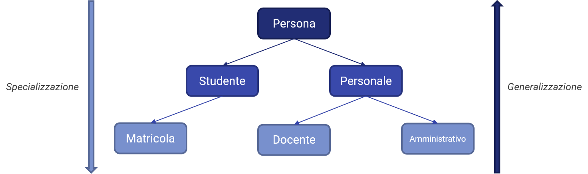

# L'ereditarietà

Il concetto di *ereditarietà* ci permette di "comporre" i dati presenti nei nostri programmi attraverso una *gerarchia di classi*. Possiamo pensare a questa gerarchia come ad una sorta di albero genealogico, con una classe "radice" da cui partono una o più classi "figlie", o per meglio dire *derivate*, le quali poi possono a loro volta avere una o più derivate, e così via.

Oltre a questi rapporti "padre-figlio", è importante sottolineare i concetti di *generalizzazione* e *specializzazione*. Infatti, ogni classe *eredita* i propri metodi dalla classe padre, di cui offre una versione più "specializzata" verso determinati comportamenti; viceversa, la classe padre è giocoforza più *generica*, in quanto è ad un maggior livello di astrazione rispetto alle figlie.

Vediamo un esempio nella seguente figura.



Nel nostro namespace `Persona` abbiamo definito un tipo generico (appunto, `Persona`) da associare a *tutte* le possibili persone. E' chiaro come questa classe sia *volutamente* generica, in quanto, come abbiamo visto, specifica soltanto nome, cognome ed età di una persona, ed è quindi in grado di "rispondere" ad un numero maggiore di necessità ad una classe meno generica.

Possiamo quindi specializzare la classe `Persona`, andando a definire due sottoclassi che definiscono i diversi tipi di persone che è possibile trovare all'interno di un Ateneo; per semplicità, parleremo esclusivamente di `Studenti` e `Personale`. Sicuramente, ogni studente sarà dotato di una serie di caratteristiche comuni, che possono essere ad esempio il numero di matricola, la mail istituzionale ed il libretto; in ugual modo, il personale avrà altre caratteristiche, differenti da quelle degli studenti, ma comuni a quelle più "generiche" che definiscono una persona, come ad esempio tipo di contratto, settore scientifico di appartenenza, materie insegnate, e via dicendo. La classe `Studenti` può essere ulteriormente specializzata andando a considerare le `Matricole`, che godono di uno status particolare rispetto agli studenti fuori corso e degli anni successivi, mentre specializziamo la classe `Personale` in `Docente` ed `Amministrativo`.

Questo esempio, che abbiamo mostrato nella figura precedente, ci aiuta a definire la cosidetta regola **is-a**, che afferma che:

!!!quote "Regola is-a"
	Ogni classe derivata è un tipo particolare della classe base.

Tornando al nostro esempio, risulterà che:

* una `Matricola` è sicuramente uno `Studente`, ma non tutte le istanze di `Studente` sono un'istanza di `Matricola`;
* un `Docente` fa sicuramente parte del `Personale`, così come un `Amministrativo`, ma non tutto il Personale è Docente o `Amministrativo`;
* tutti le istanze di `Studente` e `Personale` sono sicuramente delle istanze di `Persona`, ma non è vero il contrario.

Seguire questa regola ci permette quindi, nei fatti, di implementare i meccanismi di ereditarietà di cui necessitiamo a definire la nostra gerarchia di classi.

## Definire una classe derivata

Abbiamo definito la classe `Persona` come base della nostra gerarchia di classi. Per prima cosa, quindi, cambiamo il modificatore dei nostri attributi da `private` a `protected`, in modo da accedervi direttamente dalle classi derivate.

```cpp
// persona.h
class Persona {
	//...
	protected:
		string nome;
		string cognome;
		int eta;
}
```

Definiamo adesso due classi derivate: come abbiamo detto, in primis definiamo `Studente`, e poi `Personale`. Per ognuna delle classi avremo un file header ed un sorgente definiti a parte.

```cpp
// persone.h
namespace Persone 
{
	class Persona;
	class Studente;
	class Personale;
}
// ...
class Persone::Studente : public Persona {
	protected:
		int matricola;
		int* libretto;
	public:
		Studente();
		Studente(string nome, string cognome, int eta, int matricola, int* libretto);
		~Studente();
		void setMatricola(int matricola);
		void setLibretto(int* libretto);
		int getMatricola();
		int* getLibretto();
}

class Persone::Personale : public Persona {
	protected:
		int matricola;
		string tipoContratto;
	public:
		Personale();
		Studente(string nome, string cognome, int eta, int matricola, string libretto);
		void setMatricola(int matricola);
		void setTipoContratto(string tipoContratto);
		int getMatricola();
		string getTipoContratto();
}

// persone.cpp
// Costruttore di Studente
Studente::Studente() : Persona() {
	// implementazione
}
// Invocazione del costruttore della classe base
Studente::Studente(string nome, string cognome, int eta, int matricola, int* libretto) : Persona(nome, cognome, eta) {
	setMatricola(matricola);
	setLibretto(libretto);
}
```

I vincoli di ereditarietà e specializzazione fanno ovviamente sì che le classi derivate (`Studente` e `Personale`) ereditino i membri e le funzioni della classe padre (`Persona`), per cui avranno accesso a nome, cognome ed età.

E' importante sottolinare il ruolo che ha l'invocazione delle funzioni della classe padre, e soprattutto dei costruttori: infatti, notiamo come l'implementazione del costruttore parametrizzato di `Studente` invochi esplicitamente uno dei costruttori parametrizzati di `Persona` passandogli i parametri richiesti in ingresso.

### Ereditarietà pubblica, privata e protetta

E' interessante notare come si sia utilizzato un modificatore di accesso per definire la tipologia di ereditarietà. La sua utilità si ripercuote nel fatto che C++ prevede diverse forme di ereditarietà, alcune delle quali si discostano dalla regola is-a.

Infatti, il qualificatore usato per definrie il vincolo di ereditarietà altera il livello di accesso di ogni membro della classe base nelle sue derivate. Infatti, un'ereditarietà pubblica renderà accessibili dalla classe derivata tutti i membri (pubblici, protetti e privati) della classe padre, mentre un'ereditarietà protetta o privata renderanno accessibili esclusivamente i livelli fino al `protected` o al `private`, rispettivamente.

!!!note "Membri privati della classe base"
	*Indipendentemente dal qualificatore scelto*, i membri dichiarati come privati nella classe base non sono accessibili dalle classi derivate;

## Classi astratte

In arrivo...

## Ereditarietà multipla

In arrivo...
