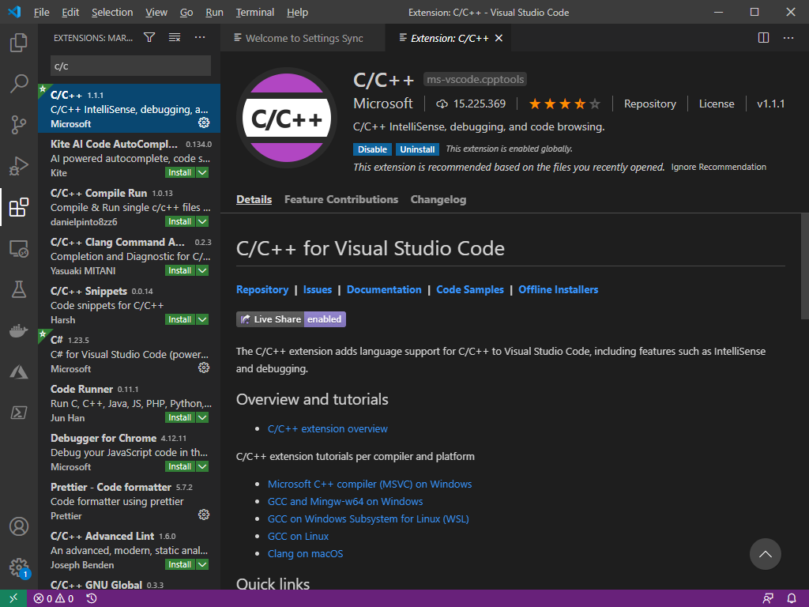
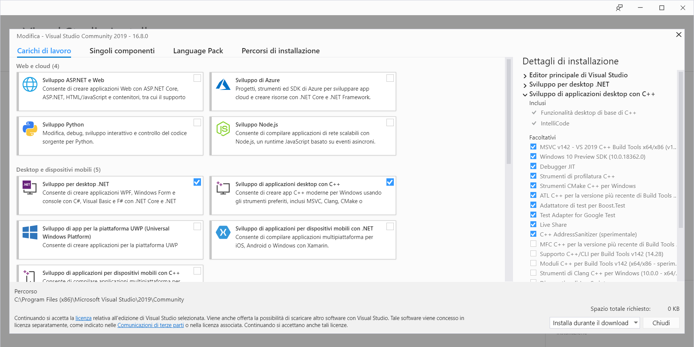
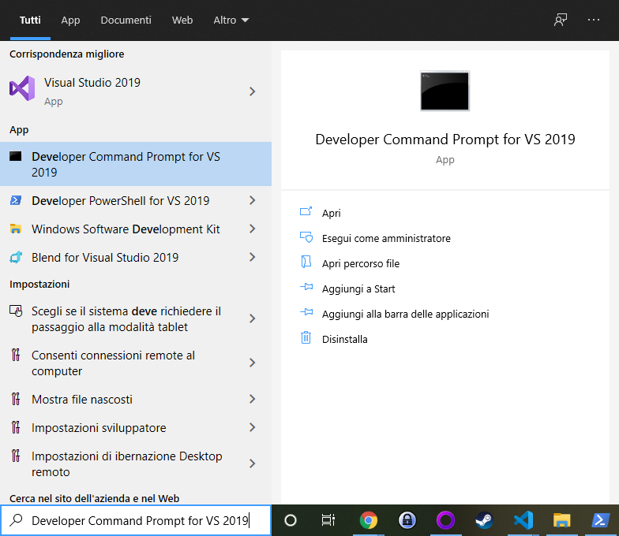
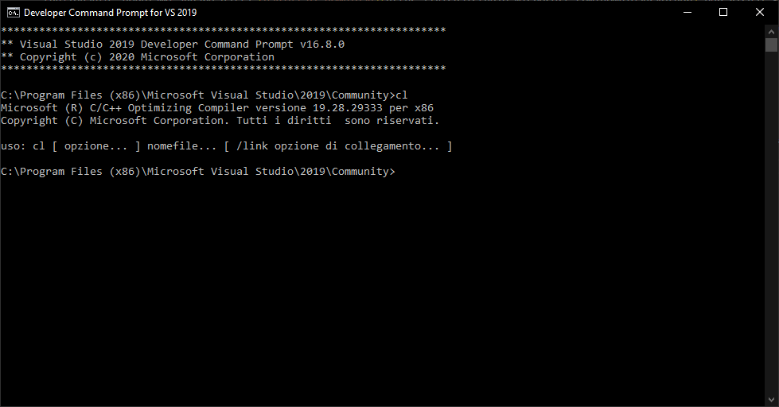
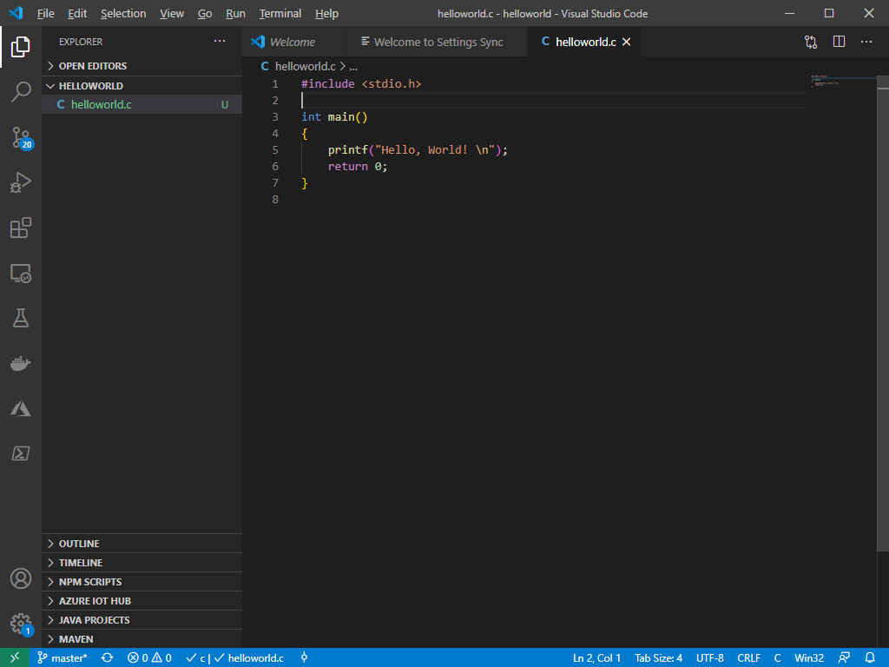
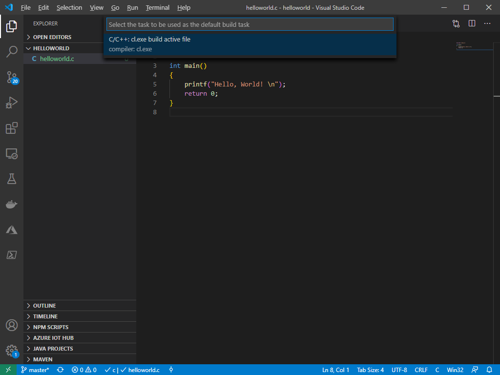
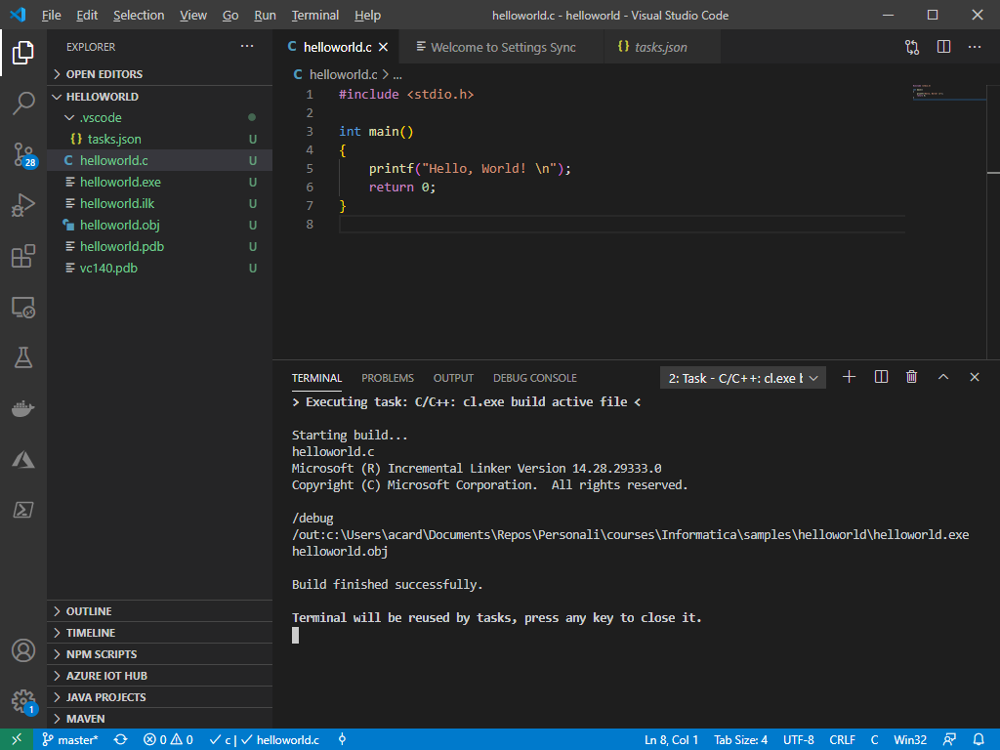

## Installazione e configurazione di C/C++

Una volta installato il software Visual Studio Code (VS Code), reperibile al seguente [link](https://code.visualstudio.com/download), dovremo configurarlo per poter lanciare il compilatore nei diversi linguaggi che utilizzeremo durante le esercitazioni.

### Installazione del supporto

1. Per prima cosa, installiamo l'estensione C/C++. Per farlo, selezioniamo da VS Code il menu "Estensioni", oppure premiamo la combinazione `Ctrl + Maiusc + X`, e quindi scriviamo `c/c++` nella barra di ricerca. Selezioniamo quella ufficiale di Microsoft ed installiamola seguendo la procedura guidata.



2. Useremo il compilatore ufficiale fornito da Microsoft per Visual Studio. Per scaricarlo, usiamo questo [link](https://visualstudio.microsoft.com/it/thank-you-downloading-visual-studio/?sku=BuildTools&rel=16). In alternativa, qualora questo link non fosse funzionante, dobbiamo andare dalla [pagina di download](https://visualstudio.microsoft.com/downloads#other) per Visual Studio, e cercare nella pagina **Strumenti per Visual Studio > Build Tools for Visual Studio**.

3. Installiamo il programma scaricato al passo precedente. Una volta terminata l'installazione, eseguiamo il programma **Visual Studio Installer**. Si aprirà una schermata come la seguente:



Dal menu che si apre, selezioniamo l'opzione **Sviluppo di applicazioni desktop con C++** mediante il segno di spunta.

!!! note "Nota"
Qualora non dovesse aprirsi la schermata precedente, ma una schermata in cui sono mostrate tutte le possibili installazioni di Visual Studio, selezioniamo l'opzione **Modifica**.

#### Verifica dell'installazione

Apriamo la **Developer Command Prompt for VS**, cercandola dal menu Start, come mostrato in figura.



Verifichiamo che il compilatore sia installato digitando `cl` da riga di comando e premendo `Invio`.



### Creazione di un progetto di esempio

Creiamo ora un progetto di esempio. Navighiamo in una cartella a nostra scelta (ad esempio `C:\progetti\informatica`) digitando, da shell, il seguente comando:

```shell
cd C:/progetti/informatica
```

A questo punto, creiamo una cartella `helloworld`, spostiamoci all'interno di essa, e lanciamo Visual Studio Code:

```shell
mkdir helloworld
cd helloworld
code .
```

Si aprirà una nuova schermata di Visual Studio Code. Creiamo un file chiamato `helloworld.c` e scriviamo il seguente codice.

```c
#include <stdio.h>

int main()
{
	printf("Hello, World! \n");
	return 0;
}
```



#### Compilazione del progetto

Per compilare il progetto, scegliamo dal menu principale l'opzione **Terminal > Configure Default Build Task** (l'ultima opzione). Apparirà un menù a scorrimento; scegliamo l'opzione **cl.exe build active file**, come mostrato in figura.



A questo punto, sarà creato un file `tasks.json` all'interno di una cartella `.vscode`. Possiamo configurarlo come meglio ci aggrada; per i nostri scopi, però, potremo lasciare la configurazione di default.

Torniamo al nostro file `helloworld.c`, e compiliamo premendo la combinaziont `Ctrl + Maiusc + B`. Se escono a schermo i messaggi mostrati nella seguente figura, avremo completato correttamente la configurazione.



!!! warning "Attenzione!"
Potremmo ricevere un errore che ci comunica che non è stato possibile trovare `cl.exe`. In questo caso, basta riavviare Visual Studio Code dal prompt degli sviluppatori che abbiamo aperto in precedenza, recandoci all'interno della cartella di progetto e scrivendo l'istruzione `code .`
