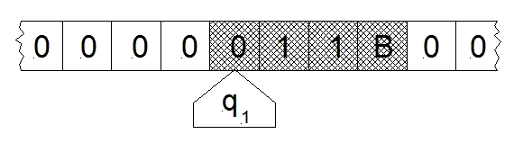

## Modelli di calcolo

Con il termine **modello di calcolo** rappresentiamo tutte quelle macchine, astratte o reali, in grado di risolvere degli algoritmi. 

E' quindi bene premettere che *non esiste un modello di calcolo univoco*: ogni modello adotta un esecutore con *caratteristiche* e *capacità* variabili, il che porta ad un approccio *differente* alla risoluzione di un problema. Dall'altro lato, basarsi su un modello di calcolo comune è necessario per confrontare l'efficienza di diversi algoritmi, ed è quindi un ottimo modo di integrare le nostre capacità di analisi computazionale *a priori*.

Nonostante esistano quindi diversi modelli, alcuni dei quali recenti o in fase di sviluppo, come ad esempio il **quantum computing** o il **DNA computing**, il modello di riferimento in informatica è sempre stato, e probabilmente rimarrà, la **macchina di Turing**.

## Macchina di Turing

Ideata nel 1936 da uno dei "padri" dell'informatica, il famoso matematico inglese Alan Turing, la macchina di Turing è un modello di calcolo astratto composto essenzialmente da due componenti:

* in primis, un *nastro infinito*, che opera da dispositivo di memorizzazione (in pratica, tramite il nastro, la macchina può accedere alle informazioni);
* in secundis, una *testina* di lettura e scrittura che, scorrendo sul nastro, può leggerne e modificarne il contenuto.

!!! note "Nota"
	La macchina di Turing è un modello astratto, ma non c'è alcun modello astratto che i Lego non possano rappresentare, come dimostra la seguente figura.

La macchina di Turing funziona modificando il suo *stato* sulla base del *contenuto* (o *simbolo*) presente sul nastro in corrispondenza della testina. Infatti, la macchina valuta il contenuto della posizione corrente del nastro ed il suo stato interno attuale; a partire da questi, è in grado di passare in un altro stato, eventualmente accedendo in scrittura al nastro, e scorrendo sullo stesso a destra o sinistra.

Questo ci permette di definire la macchina di Turing come un *Automa a Stati Finiti Deterministico*.

!!! note "Automa a Stati Finiti Deterministico"
	La definizione formale di Automa a Stati Finiti Deterministico esula dagli obiettivi del corso. Tuttavia, possiamo darne una rapida definizione *informale*, come "macchina" che può avere un numero *finito* di possibili stati interni, ognuno dei quali è determinato a partire dallo stato precedente e dalla lettura del nastro in posizione attuale.

!!! note "Nastro inifinto ed ASFD"
	Da notare che il fatto che il nastro abbia lunghezza infinita *non* modifica il fatto che gli stati raggiungibili siano in quantità finita.

### Risoluzione di problemi mediante la macchina di Turing

La risoluzione di un problema (e, quindi, la definizione di un algoritmo atto a risolverlo) richiede la progettazione di un'adeguata macchina di Turing. In tal senso, è necessario definire almeno cinque parametri:

* un *alfabeto* $\Sigma$ dei simboli che è possibile scrivere (leggere) sul (dal) nastro;
* un *insieme di stati* $S$ in cui si può trovare la macchina;
* uno *stato iniziale* $s_0$ nel quale la macchina si trova inizialmente, con $s_o \in S$;
* un *insieme di stati finali* $S_f$ nel quale la macchina si arresta, con $S_f \in S$;
* una *funzione di transizione* $\delta$ che determina il passaggio da uno stato ad un altro.

La funzione di transizione può essere definita come segue:

$$
\delta: \langle \sigma_I, s_I \rangle \rightarrow \langle t, \sigma_F, s_F \rangle
$$

dove:

* $\sigma_I$ è il simbolo letto dalla testina sul nastro;
* $\s_I$ è lo stato della macchina di Turing antecedente la transizione;
* $t$ è la transizione che verrà applicata al nastro (es. scorrimento verso destra o sinistra);
* $\sigma_f$ è il simbolo scritto dalla testina sul nastro dopo la transizione;
* $\s_F$ è lo stato della macchina di Turing successivo alla transizione.

Formalmente, è possibile definire una macchina di Turing $T$ come:

$$
T = \langle \Sigma, S, s_0, S_f, \delta \rangle
$$

### Un esempio

Vediamo come è possibile risolvere un problema mediante una macchina di Turing. Per farlo, utilizzeremo un *grafo degli stati* per rappresentare l'automa.

Il nostro problema è quello di *valutare se una stringa contiene il carattere $a$*.

Per questo, definiamo una macchina di Turing nel seguente modo:

* l'alfabeto $\Sigma$ sarà dato da tutte le lettere dell'alfabeto inglese, più il simbolo #, che indica la fine della stringa;
* l'insieme degli stati $S$ sarà dato da ${s_0, s_1, s_T, s_F}$;
* lo stato iniziale è $s_0$ (stringa non contenente $a$);
* gli stati finali sono $s_T$ (vero) ed $s_F$ (falso).

La strategia risolutiva ci permette di individuare la funzione $\delta$. Infatti:

* partiamo dal primo carattere della stringa, e scorriamo il nastro verso destra;
* se incontriamo il carattere $a$, la macchina entra nello stato $s_1$, e ivi permane. Il nastro continua a scorrere verso destra fino a che non trova il carattere #, al quale si sposta in $s_T$;
* se non incontriamo il carattere $a$, scorriamo il nastro fino al carattere #, al quale si sposta in $s_F$.

Ciò definisce la seguente funzione di transizione (in formato matriciale):

|   | $s_0$ | $s_1$ | $s_T$ | $s_F$ |
| - | ----- | ----- | ----- | ----- |
| $a$ | $\langle D, s_1, - \rangle$ | $$\langle D, s_1, - \rangle$ | / | / |
| $b-z$ | $\langle D, s_0, - \rangle$ | $\langle D, s_1, - \rangle$ | / | / |
| # | $\langle -, s_F, - \rangle$ | $\langle -, s_T, - \rangle$ | / | / |

L'automa a stati finiti corrispondente sarà:

## Tesi di Church-Turing

Abbiamo detto che la macchina di Turing è un **modello di riferimento**. Ciò significa che è possibile dimostrare che tutti i diversi tipi di modello sono *equivaòenti*, e quindi un problema risolvibile usando la macchina di Turing è risolvibile mediante qualsiasi modello di calcolo, astratto o reale.

La **tesi di Church - Turing** afferma che:

!!! quote "Tesi di Church - Turing"
	Se un problema è umanamente calcolabile, allora esisterà una macchina di Turing in grado di risolverlo (cioè di calcolarlo)

E' importante sottolineare come questa sia solo una *tesi*, e non un *teorema*.
