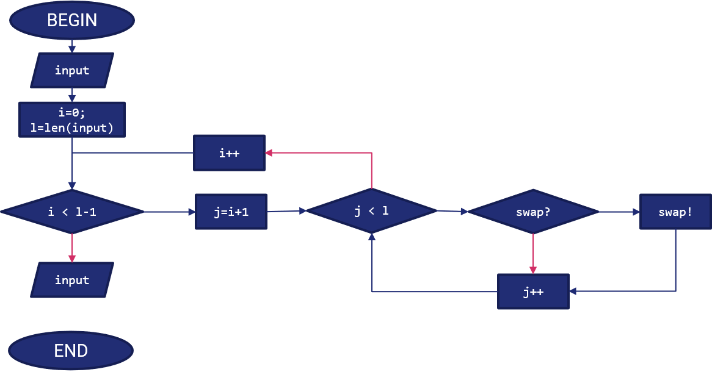

## Modalità di valutazione del Tema d'Anno

Il tema d'anno è composto da quattro parti. Di seguito le modalità di valutazione per ciascuna parte (**in aggiornamento**).

### Parte Prima - Analisi del problema

La parte prima prevede che il gruppo fornisca, relativamente al problema, i seguenti dettagli, il cui obiettivo e valutazione sono descritti di seguito.

| Topic | Obiettivo | Punteggio |
| ----- | --------- | --------- |
| Descrizione del problema | Capacità di analisi e spiegazione dell'approccio usato | 0 - 10 punti |
| Individuazione di input ed output | Capacità di interpretare gli input forniti e comunicare i risultati | 0 - 4 punti |
| Diagramma di flusso e pseudocodice | Capacità di strutturare e mostrare la risoluzione del problema | 0 - 10 punti |
| Analisi computazionale a priori | Capacità di stimare il costo relativo all'esecuzione dell'algoritmo | 0 - 6 punti |

La valutazione terrà conto dei fattori di inesperienza e del numero di componenti del gruppo.

## Esempio di tema d'anno

!!! note "Nota"
	Il presente è un esempio di tema d'anno svolto dal Docente. Tuttavia, non è da considerarsi comparabile al livello di difficoltà delle tracce assegnate per i temi d'anno; lo scopo, meramente illustrativo, è quello di mostrare l'output atteso.

### Quesito

Dato un vettore $n$, scrivere un programma che lo ordini mediante l'algoritmo di *selection sort*.

### Parte Prima - Analisi del Problema

#### Descrizione del problema

Il problema concerne l'utilizzo della tecnica di selection sort per ordinare un vettore ad $n$ elementi.

Il selection sort è un algoritmo base per l'ordinamento del vettore; può essere applicato, ad esempio, per ordinare come segue il vettore $[1,4,2,3]$:

$$
[1, 4, 2, 3] \Rightarrow [1, 2, 4, 3] \Rightarrow [1, 2, 3, 4]
$$

Il selection sort opera suddividendo l'array in una sequenza ordinata (a sinistra) ed in una non ordinata; essendo un approccio iterativo, ad ogni iterazione viene sostituito l'elemento più a destra della sequenza ordinata con il minore tra quelli nella sequenza ordinata.

Sarà quindi necessario usare un approccio iterativo come indicato nella sezione **Diagramma di flusso e pseudocodice**.

#### Individuazione di input ed output

* Input: è richiesto all'utente di inserire un vettore in input ad $n$ elementi. Questo potrà essere inserito in maniera ricorsiva (ad esempio, chiedendo all'utente di inserire un elemento alla volta da riga di comando), oppure chiedendo all'utente di inserire una stringa ed interpretandola di conseguenza, oppure ancora leggendo un file di testo. I valori del vettore saranno ovviamente numerici; saranno comunque trattati come numeri reali, e quindi sarà usato il formato `float`.
* Output: l'utente si attende in uscita il vettore ordinato; in tal senso, potrà scegliere se gli verrà restituito sulla riga di comando oppure stampato su un file di testo.

#### Diagramma di flusso e pseudocodice

Lo pseudocodice è il seguente:

```
STEP 1:		read(input);							// Lettura dell'input dell'utente
STEP 2:		i = 0;									// Contatore per indicare l'indice del sotto-vettore ordinato
STEP 3: 	for (i; i < length(input) - 1; i++)		// Aumento l'indice dell'ultimo elemento del sotto-vettore ordinato fino a che non sono sicuro di aver ordinato l'intero vettore
STEP 4: 		j = i+1;							// Contatore per indicare l'indice del sotto-vettore non ordinato
STEP 4:			for (j; j<= length(input); j++)		// Controllo tutti i valori dimanenti dell'array
STEP 5: 			if input[i] > input[j]			// Effettuo l'operazione di swap se necessario
STEP 6: 				input[i] = input[j]
STEP 7:					input[j] = input[i]
					end
				end
			end
STEP 8: 	RETURN(input)
```

Il diagramma di flusso è mostrato nella figura seguente:



!!! note "Nota"
	Nel diagramma di flusso le frecce in rosso sulle selezioni indicano un `FALSE`, mentre quelle in blu un `TRUE`.

#### Analisi computazionale

L'algoritmo nel caso peggiore ha un'analisi di complessità pari proprio a quella del selection sort, ovvero un $O(n^2)$.
