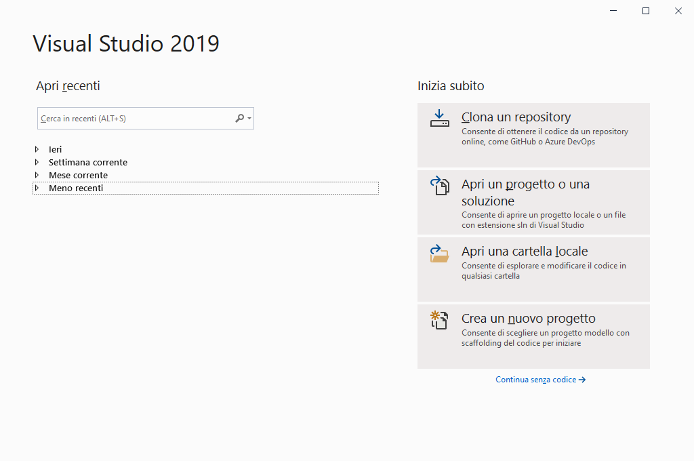
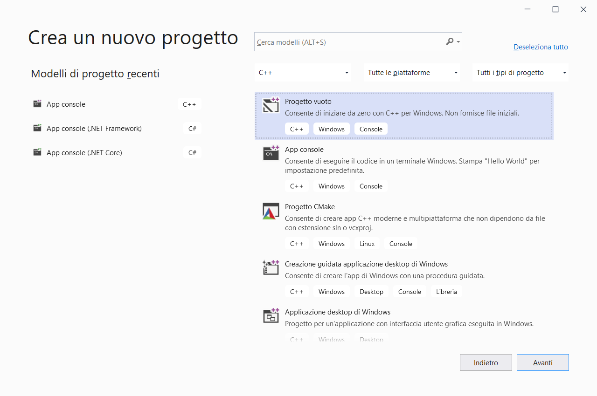
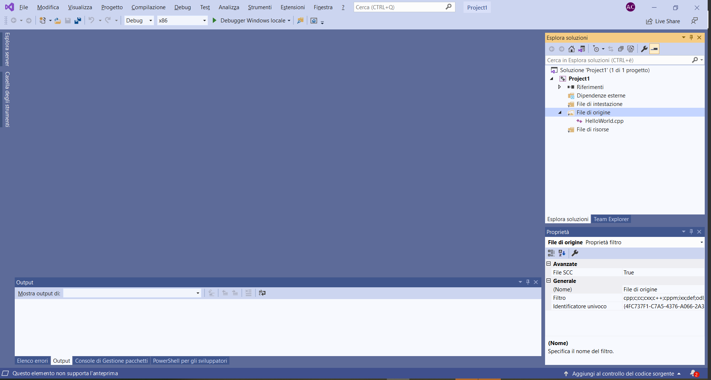
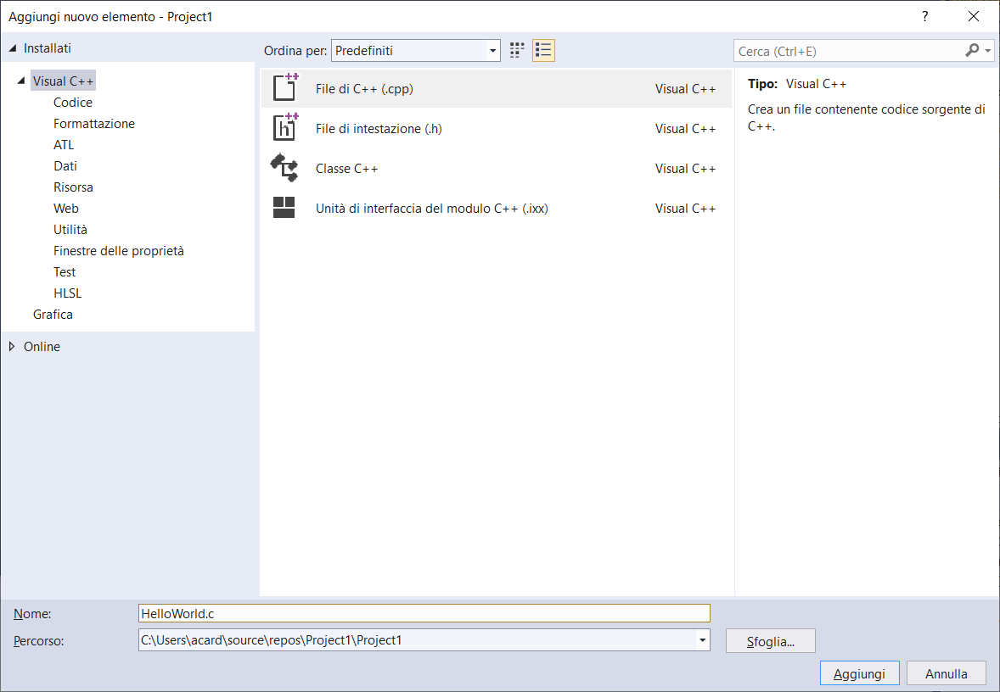
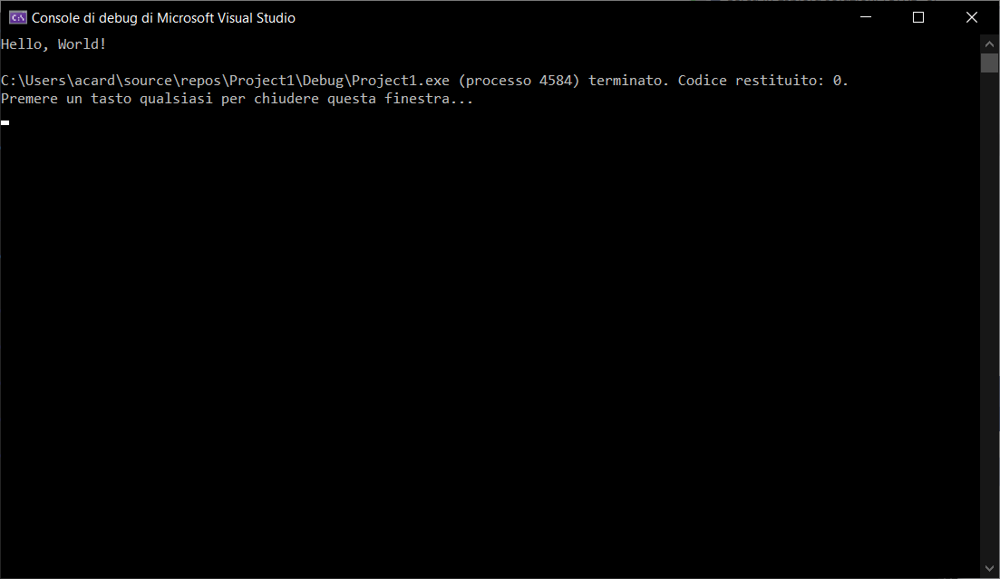

## Installazione e configurazione di C/C++

Una volta installato il software Visual Studio Community (VS), reperibile al seguente [link](https://visualstudio.microsoft.com/it/downloads/), dovremo configurarlo per poter lanciare il compilatore nei diversi linguaggi che utilizzeremo durante le esercitazioni.

### Installazione del supporto

Per prima cosa, installiamo gli strumenti per lo sviluppo di applicazioni in C e C++. Eseguiamo il programma **Visual Studio Installer** dal menu Start. Si aprirà una schermata come la seguente:


Dal menu che si apre, selezioniamo l'opzione **Sviluppo di applicazioni desktop con C++** mediante il segno di spunta.

!!! note "Nota"
	Qualora non dovesse aprirsi la schermata precedente, ma una schermata in cui sono mostrate tutte le possibili installazioni di Visual Studio, selezioniamo l'opzione **Modifica**.

### Creazione di un progetto

Una volta installati i tool per lo sviluppo, eseguiamo il programma **Visual Studio 2019** dal menu Start. Si aprirà la seguente schermata:



Selezioniamo l'opzione **Crea un nuovo progetto**. Apparirà la seguente schermata:



Selezioniamo prima **App console C++** a sinistra, e poi **Progetto vuoto** o **App Console** a destra. Scegliamo quindi l'opzione **Avanti**.

Diamo un nome al progetto (ad esempio, **Primo progetto**) ed alla soluzione (ad esempio, **Prima soluzione**), scegliamo la cartella in cui salvare il tutto, e scegliamo l'opzione **Crea**.

Se abbiamo scelto **App Console**, apparirà già un progetto di esempio. Qualora scegliessimo **Progetto vuoto**, apparirà la seguente schermata.



In quest'ultimo caso, selezioniamo clicchiamo con il destro sulla cartella (mostrata nel menu a destra) chiamata **File di origine** e selezioniamo dal menu che appare **Aggiungi > Nuovo Elemento**. Da qui possiamo creare direttamente un file C++, oppure un file C modificandone manualmente l'estensione. Creiamo un file chiamato `HelloWorld.c` ed aggiungiamolo al nostro progetto.



Aggiungiamo il seguente codice:

```c
#include <stdio.h>

int main()
{
	printf("Hello, World! \n");
	return 0;
}
```

Eseguiamo il nostro programma premendo Ctrl + F5, oppure scegliendo l'opzione **Avvia senza eseguire Debug** dal menu **Debug**. Se tutto è andato a buon fine, apparirà la seguente finestra:


