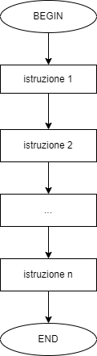

# E7 - Esercizi sulla complessità computazionale

## Tracce

### Esercizio 1

Calcolare la complessità di caso peggiore di una sequenza di $m$ istruzioni; si tenga a mente che se la complessità è costante, allora si ha un $O{1}$.

### Esercizio 2

Calcolare la complessità di caso peggiore di un ciclo `while`.

### Esercizio 3

Calcolare la complessità di caso peggiore del seguente algoritmo:

```linenums="1"
for i che va da 1 a 10:
    for j che va da 1 a 10:
        calcola i + j;
    endfor
endfor
```

### Esercizio 4

#### Parte 1

Supponiamo di ricevere due prestiti. Il primo prestito, dell'importo totale di 1000 €, ci viene garantito dalla Banca di Paperopoli il 01/04/2022. Il secondo prestito, dell'importo di 100 €, ci viene garantito dalla Banca di Topolinia lo stesso giorno. Successivamente, apriamo un filone di credito presso la banca di Topolinia, e per i 99 giorni successivi al 01/04 riceviamo 100 € al giorno. Calcolare:

* il valore totale dei due prestiti al primo giorno e dopo 100 giorni;
* quanto incide (in percentuale) ciascun prestito sul totale al primo giorno;
* quanto incide (in percentuale) ciascun prestito sul totale al centesimo giorno.

Spiegare questi concetti riconducendoli alle nozioni di complessità computazionale.

#### Parte 2

Cosa accadrebbe se la Banca di Paperopoli ci facesse 100 bonifici al giorno per 100 giorni a partire dal primo aprile?

## Soluzioni

### Esercizio 1

Una sequenza di $m$ istruzioni è data da un diagramma di flusso simile a questo.

{: .center}

Di conseguenza, dato che la complessità legata a ciascuna istruzione è unitaria, la complessità di caso peggiore sarà approssimabile ad un $O(1)$.

### Esercizio 2

Definiamo un ciclo `while` mediante un diagramma di flusso simile a questo, direttamente dall'esercizio 3 sulle strutture dati.

{: .center}

In questo caso, il numero di operazioni non è deterministico, ma dipende dalla funzione `genera_magia`, che abbiamo definito essere randomica.

Supponendo che la funzione generi un numero superiore a 10 con probabilità pari a $\frac{1}{n}$ (ovvero, che la funzione generi un numero superiore a 10 una volta su n), allora avremo che la complessità di caso peggiore sarà pari a $O(n)$: in altre parole, *nel caso peggiore*, ci attendiamo che ci servano $n$ iterazioni per uscire dal ciclo.

### Esercizio 3

Partiamo dalla costruzione del diagramma di flusso dell'algoritmo, che è quello riportato nella seguente figura.

{: .center}

Notiamo subito la presenza di due cicli `for` annidati l'uno dentro l'altro. Entrambi i cicli prevedono dieci iterazioni ciascuno; tuttavia, il ciclo interno sarà eseguito dieci volte per ciascuna iterazione del ciclo esterno. Di conseguenza, il numero totale di iterazioni sarà dato dalla moltiplicazione delle iterazioni previste per il ciclo interno (ovvero dieci) per quelle previste per il ciclo esterno (sempre dieci), ovvero 100.

Aumentando il numero $n$ di iterazioni, vedremo come il numero totale di operazioni aumenterà secondo una legge quadratica:

* per $n=11$, il numero di iterazioni sarà pari a $11 \cdot 11 = 121$;
* per $n=12$, il numero di iterazioni sarà pari a $12 \cdot 12 = 144$;
* per $n=13$, il numero di iterazioni sarà pari a $13 \cdot 13 = 169$;

e così via. Di conseguenza, la complessità computazionale dipende dal quadrato di $n$, per cui quella di caso peggiore è un $O(n^2)$.

### Esercizio 4

#### Parte 1

Al primo aprile, la nostra situazione finanziaria sarà la seguente:

$$
P_{p_1} = 100 € \\
P_{t_1} = 100 €
$$

con $P_{p_1}$ prestito ricevuto al primo aprile dalla Banca di Paperopoli, e $P_{t_1}$ prestito ricevuto al primo aprile dalla Banca di Topolinia.

Le percentuali del prestito relativo alle due banche, rispettivamente $P_{p_1}(\%)$ e $P_{t_1}(\%)$, saranno del $50(\%)$ ciascuna, dato che i prestiti incidono egualmente sull'intera cifra a debito.

Vediamo cosa accade al 10 luglio, ovvero 100 giorni dopo.

La cifra che dovremo alla Banca di Paperopoli sarà sempre di 100 €, per cui $P_{p_{100}} = P_{p_1} = 100 €$. Per quello che riguarda la Banca di Topolinia, invece:

$$
P_{t_{100}} = P_{t_1} + g * p_g = 100 € + 99 * 100 € = 10.000 €
$$

dove $g$ è il numero di giorni (escluso il primo) in cui riceviamo un prestito di valore $p_g$.

A questo punto, il totale a debito è dato da:

$$
P_{TOT} = P_{p_{100}} + P_{t_{100}} = 100 € + 10.000 € = 10.100 €
$$

Calcoliamo le percentuali dovute (rispetto al totale) alle due banche:

$$
P_{p_{100}}(\%) = \frac{P_{p_{100}}}{P_{TOT}} \cdot 100 = \frac{100}{10.100} \cdot 100 \sim 0.0099 \cdot 100 \sim 1 (\%)
$$

per cui:

$$
P_{t_{100}}(\%) = 100 - P_{p_{100}}(\%) \sim 99 (\%)
$$

Ovviamente, questo si può rappresentare con uno pseudocodice del tipo:

```linenums="1"
tot_paperopoli = 100;

tot_topolinia = 100;
for giorno da 1 a 99:
    tot_topolinia = tot_topolinia + 100;
endfor
```

Di conseguenza, è possibile valutare empiricamente come il "peso" del `for`, che comporta una complessità pari ad $O(n)$, incida maggiormente sull'operazione lineare, che ha una complessità pari ad $O(1)$.

#### Parte 2

Con la nuova modalità di finanziamento da parte della banca di Paperopoli, i valori mostrati in precedenza per questa cambiano come segue.

$$
P_{p_1} = n_b * p_g = 100 \cdot 100 € = 10.000 €
$$

con $n_b$ numero di bonifici al giorno, ed $p_g$ importo del singolo bonifico. Di conseguenza, al primo giorno avremo una situazione di questo tipo:

$$
P_{p_1} = 10.000 € \\
P_{t_1} = 100 €
$$

Le percentuali cambiano come segue:

$$
P_{p_1}(\%) \sim 99 (\%) \\
P_{t_1}(\%) \sim 1 (\%)
$$

Al centesimo giorno:

$$
P_{p_{100}} = n_b \cdot p_g \cdot g = 100 \cdot 100 € \cdot 100 =  1.000.000 €
$$

Tenendo conto che P_{t_{100}} è costante, avremo che le nuove percentuali saranno pari a $P_{p_{100}}(\%) \sim 99 (\%)$, e di conseguenza $P_{t_{100}}(\%) \sim 1 (\%)$.

Tutto ciò è correlato al fatto che il contributo della Banca di Paperopoli è assimilabile a due cicli `for` annidati:

```linenums="1"
n = 100;

for giorno da 1 a n:
	for bonifico da 1 a n:
		tot_paperopoli = tot_paperopoli + 100;
	endfor
endfor
```

Provando ad aumentare il valore $n$, portandolo magari a 200, è facile constatare come le percentuali si spostino sempre più verso $P_{p_{200}}(\%)$:

$$
\begin{align*}
    &\begin{cases}
        P_{p_{200}} = 200 \cdot 200 \cdot 100 = 4.000.000 € \\
        P_{t_{200}} = 200 \cdot 100 = 20.000 €
    \end{cases} \Rightarrow \\
    &\Rightarrow \begin{cases}
        P_{p_{200}}(\%) = \frac{4.000.000}{4.020.000} \cdot 100 \sim 99.5 (\%) \\ 
        P_{t_{200}} \sim 0.5 (\%)
    \end{cases}
\end{align*}
$$
