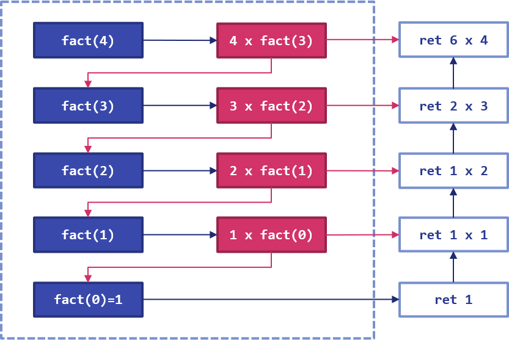

# 11 - Ricorsione

Quella della *ricorsione* è una tecnica di programmazione che permette di "spezzare" un problema in diverse piccole parti, da trattare una alla volta fino alla risoluzione completa dello stesso. E' quindi in qualche modo assimilabile al paradigma "divide-et-impera", tanto caro agli strateghi dell'antica Roma.

Nella pratica, si tratta di riapplicare una serie di istruzioni (e, quindi, una funzione) ad istanze sempre più piccole del problema originario, fino a che non è possibile giungere ad una risoluzione diretta; tuttavia, per comprenderne appieno il funzionamento, è opportuno procedere con un esempio pratico.

## 11.1 - Calcolo del fattoriale

Il *fattoriale* di un numero $n$ è indicato con $n!$ ed è dato dal prodotto di tutti i numeri che vanno da $1$ ad $n$. Formalmente:

$$
n! = 1 \cdot 2 \cdot \ldots \cdot (n-1) \cdot (n)
$$

Ad esempio, $3! = 6$, mentre $4! = 24$, $5! = 120$, e via dicendo. Il fattoriale è definito per ogni numero intero strettamente positivo, oltre che per lo $0$, per il quale vale $0!=1$.

Proviamo per prima cosa a calcolare il fattorale usando un ciclo.

### 11.1.1 - Calcolo iterativo del fattoriale

Calcolare il fattoriale mediante un ciclo è molto semplice. Infatti, basta usare la formulazione stessa di fattoriale:

```linenums="1"
fatt = 1;
for i che varia da 1 ad n:
	fatt = fatt * i;
endfor
return fatt;
```

### 11.1.2 - Calcolo ricorsivo del fattoriale

"Complichiamoci" la vita, e vediamo come è possibile calcolare il fattoriale in maniera ricorsiva. Riprendiamo la definizione di fattoriale, applicando la proprietà commutativa:

$$
n! = n \cdot(n-1) \ldots 2 \cdot 1
$$

Notiamo che $(n - 1)! = (n - 1) \cdot \ldots \cdot 2 \cdot 1$, per cui possiamo scrivere che:

$$
n! = n \cdot (n - 1)!
$$

Abbiamo quindi scomposto il problema del calcolo del fattoriale di $n$ nel problema della moltiplicazione di $n$ per il fattoriale di $(n-1)$; di conseguenza, $(n-1)!$ è un *sottoproblema* di $n!$. Se provassimo ad estendere il concetto, avremmo che:

$$
n! = n \cdot (n-1)! = n \cdot (n-1) \cdot (n-2)! = \ldots = n \cdot (n-1) \cdot \ldots \cdot 1 \cdot 0!
$$

da cui deriva che:

$$
0! * 1 = 1 = 1! \Rightarrow \\
\Rightarrow 1! * 2 = 2 = 2! \Rightarrow \\
\Rightarrow \ldots \Rightarrow \\
\Rightarrow (n-1)! * n = n! \Rightarrow \\
$$

#### 11.1.2.1 - Caso base e ricorsione

Risulta quindi che:

* nel caso $n=0$, allora $n! = 1$;
* nel caso $n > 0$, allora dobbiamo moltiplicare $n$ per il valore restituito dalla funzione $(n-1)!$.

Il caso $n =0$ assume il nome di *caso base*, ed è la situazione che cerchiamo per "terminare" la ricorsione; alternativamente, dovremo procedere a richiamare ricorsivamente la funzione desiderata.

#### 11.1.2.2 - Implementazione della ricorsione

Proviamo ad implementare la funzione ricorsiva in pseudocodice. Scriviamo:

```linenums="1"
int factorial(int n):
	if n = 0:
		return 1;
	else:
		return n * factorial(n - 1);
	endif
```

Analizziamo il comportamento della funzione. Se `n` è maggiore di zero, la funzione restituirà il prodotto tra `n` ed il risultato della funzione `factorial` applicata ad `n - 1`. La funzione quindi "chiama sè stessa", usando parametri differenti, fino a che non ci si ritrova nel caso base, e viene restituito `1`.

Ci si potrebbe chiedere come faccia la funzione ricorsiva a restituire il valore complessivo di $n!$. La risposta è da ricercarsi nel modo in cui sono memorizzati i dati durante la ricorsione: infatti, questi vengono organizzati secondo un *call stack* (traducibile in "stack di chiamate"), che conserva al suo interno i risultati derivanti dalle precedenti chiamate a funzione. Questo concetto è riassunto nella seguente figura, che mostra il call stack per il calcolo ricorsivo del fattoriale di 4.

{: .center}
