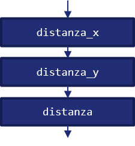
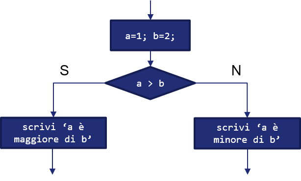
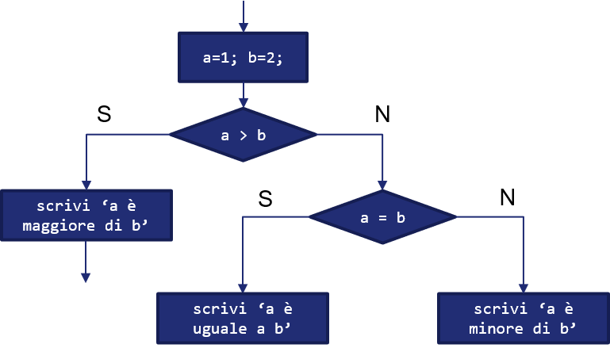
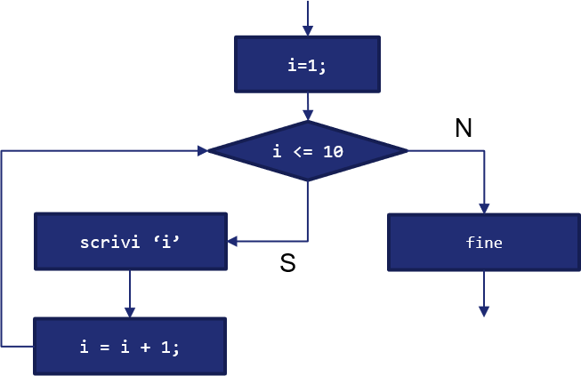

# 2.2.1 La Programmazione Strutturata

Ai più "esperti" tra i lettori sarà capitato di leggere del codice prodotto negli anni '70 ed '80, in linguaggi come il BASIC, simile a qualcosa di questo tipo:

```basic
10 dim i
20 i = 0
30 i = i + 1
40 if i <= 10 then goto 70
50 print "Programma terminato."
60 end
70 print i & " al quadrato = " & i * i
80 goto 30
```

Un codice in questa forma (per la cronaca: il codice è tratto direttamente da [Wikipedia](https://it.wikipedia.org/wiki/Spaghetti_code)) "intreccia" le istruzioni tra loro: ad esempio, alla riga `80` notiamo come la presenza della (famigerata) istruzione `goto` imponga di tornare alla riga `30`, con la `70` richiamata dalla `40` qualora si verifichi una determinata condizione.

Il codice appare quindi simile ad un "piatto di spaghetti", i quali si intrecciano ed ingarbugliano tra loro, confondendosi alla vista; ed è proprio per questo che scrivere un codice com il precedente è associato alla pratica, divenuta con tempo un *antipattern* (ovvero, una pratica da sconsigliare), dello *spaghetti coding*.

Lo spaghetti coding rende il nostro programma difficile da interpretare, non solo da parte di altri, ma anche da noi stessi quando lo andiamo a riaprire dopo un po' di tempo. Per questo motivo, nel tempo, sono andati sempre più diffondendosi nuovi e più efficaci paradigmi di programmazione, come quella imperativa, orientata agli oggetti e, più recentemente, funzionale. Tutti, però, partivano da un presupposto: dare una *struttura* al codice. E, in tal senso, l'assunto da cui si parte è sempre e solo uno, ovvero il *teorema di Bohm e Jacopini*.

## Il teorema di Bohm-Jacopini

Il teorema di Bohm - Jacopini venne enunciato nel 1966, ed afferma che qualsiasi algoritmo può essere implementato (sia sotto forma di codice, sia sotto forma di flow chart) utilizzando esclusivamente le cosiddette tre *strutture di controllo*, ovvero *sequenza*, *selezione* e *ciclo*. Le implicazioni sono ovviamente importantissime, e ci permettono di semplificare enormemente il nostro lavoro.

In tal senso, però, è necessario conoscere in maniera appropriata le diverse strutture di controllo, che saranno quindi illustrate di seguito.

### Sequenza

La *sequenza* prevede che una serie di istruzioni siano realizzate sequenzialmente, ovvero l'una in cascata all'altra. Immaginiamo ad esempio di dover calcolare la distanza euclidea tra due punti, ovvero `a` e `b`, di cui conosciamo le coordinate $(x_a, y_a)$ ed $(x_b, y_b)$. In *pseudo-codice* (ovvero, in un linguaggio simbolico usato per esprimere l'algoritmo senza per questo richiamare necessariamente un linguaggio di programmazione esistente) potremmo esprimere la sequenza come:

``` linenums="1"
distanza_x = (x_a - x_b)^2;
distanza_y = (y_a - y_b)^2;
distanza = (distanza_x + distanza_y)^(1/2);
```

La sequenza di operazioni sarà quella mostrata nella seguente figura:

{: .center}

Come si può notare, il flusso delle istruzioni è *unico*, e queste sono eseguite l'una di seguito all'altra, ovverosia in maniera sequenziale.

### Selezione

La *selezione* prevede invece che il flusso delle istruzioni possa diramarsi tra due diversi rami, mutualmente esclusivi, al verificarsi o meno di una condizione.

In particolare, la selezione è rappresentata mediante il costrutto *IF - THEN - ELSE*, il cui funzionamento può essere riassunto in linguaggio naturale come segue:

!!!cite "L'IF - THEN - ELSE in linguaggio naturale"
	*IF* (se) la condizione è verificata, *THEN* (allora) esegui le istruzioni su di un ramo, *ELSE* (altrimenti) esegui le istruzioni sull'altro ramo.

Per comprendere meglio il funzionamento della selezione, immaginiamo di voler comparare due numeri $a$ e $b$. Di nuovo, esprimiamo la selezione in pseudo-codice:

``` linenums="1"
a = 1;
b = 2;
if (a > b):
	then scrivi "a è maggiore di b"
else:
	scrivi "b è maggiore di a"
```

I due rami del programma sono quindi rappresentati dal THEN e dall'ELSE, mentre la condizione dall'IF. Graficamente:

{: .center}

#### I costrutti ELSE IF e SWITCH

Il costrutto IF - THEN - ELSE limita i rami in cui un programma può derivare a due. Tuttavia, nella realtà, potrebbe essere necessario avere più rami; in questi casi, ci viene in aiuto il costrutto ELSE IF, che permette di specificare ulteriori divergenze del programma. Ad esempio:

``` linenums="1"
a = 1;
b = 2;
if (a > b):
	then scrivi "a è maggiore di b"
else if (a uguale b):
	then scrivi "a è uguale a b"
else:
	scrivi "b è maggiore di a"
```

Vediamo subito come il costrutto ci permetta di ovviare ad una "mancanza" del programma precedente, gestendo anche il caso in cui $a$ sia uguale a $b$. Dal punto di vista del diagramma di flusso, l'ELSE IF è rappresentabile mediante una "cascata" di selezioni:

{: .center}

Il costrutto SWITCH è usato per verificare che una certa variabile assuma un dato valore, chiamato `case` (da cui il nome SWITCH-CASE con cui il costrutto è anche conosciuto), normalmente non relativo ad un intervallo, quanto piuttosto ben specifico. Qualora la variabile di controllo rispetti il valore definito da un case, le istruzioni ivi contenute saranno eseguite fino all'uscita dal costrutto.

Lo SWITCH ha inoltre un case di default, indicato con la parola chiave omonima, che sarà eseguito qualora la variabile da verificare non rispetti alcuno dei case precedenti. Ad esempio:

``` linenums="1"
a = 1;
switch (a)
	case 1:
		scrivi "Uguale ad uno!";
	case 2:
		scrivi "Uguale a due!"
	case 3:
		scrivi "Uguale a tre!";
	default:
		scrivi "Non saprei!";
```

### Iterazione

L'ultimo tipo di struttura di controllo è l'*iterazione*, chiamata anche *ciclo*; in questo caso, un'istruzione verrà reiterata fino a che una certa condizione è verificata.

!!!note "Nota"
	In un certo senso, l'iterazione è una "summa" di struttura e selezione.

Per comprendere il funzionamento dell'iterazione, proviamo ad utilizzarla, sempre in pseudocodice, per scrivere i numeri che vanno da uno a dieci:

``` linenums="1"
i = 1;
for (i che va da 1 a 10):
	scrivi 'i';
endfor
scrivi 'fine';
```

Schematizziamo il funzionamento dell'iterazione nella figura successiva:

{: .center}

Risulta particolarmente interessante notare come l'iterazione (espressa in questo caso da un'istruzione FOR) non faccia altro che verificare una condizione su una variabile contatore (ovvero che i sia minore od uguale a 10), modificando la stessa ad ogni iterazione. Una volta che la condizione sul contatore non sarà più verificata, il programma continuerà la sua esecuzione.

!!!note "Nota"
	Modificare la variabile contatore ad ogni iterazione è *estremamente importante*. Se il contatore non fosse mai modificato, infatti, il programma non potrebbe mai uscire dal ciclo.

#### Costrutti FOR e WHILE-DO

Tradizionalmente, sono usati due costrutti per implementare una struttura iterativa, ovvero il costrutto FOR (che abbiamo visto in precedenza) ed il costrutto WHILE-DO.

La differenza principale tra i due costrutti sta nel fatto che il FOR viene normalmente usato quando il numero di iterazioni è conosciuto a priori, mentre il WHILE-DO quando non si conosce il numero di iterazioni, e si vuole semplicemente verificare una condizione. Ad esempio:

``` linenums="1"
condizione = vero;
while (condizione diverso da falso):
	do [...] // istruzioni
	aggiorna condizione;
endwhile
```

In pratica, il costrutto WHILE-DO verifica ad ogni iterazione che la condizione sia vera; se ciò avviene, sono eseguite le istruzioni specificate nel DO, ed è aggiornata la condizione (che, prima o dopo, non dovrà essere più verificata).

!!!note "L'importanza di aggiornare la condizione"
	Nel WHILE-DO, l'importanza dell'aggiornamento della condizione è *ancora* più evidente rispetto al FOR, ed è molto spesso delegata al programmatore. Ciò comporta maggiore libertà nell'aggiornamento della condizione, ma anche maggiori responsabilità (semi-cit.).

!!!note "Il costrutto DO-WHILE"
	Esiste una variante del costrutto WHILE-DO chiamata DO-WHILE, nella quale le istruzioni specificate nel DO vengono effettuate prima della verifica della condizione. Non tutti i linguaggi di programmazione supportano tale costrutto; inoltre, con pochi accorgimenti, è possibile usare indifferentemente il WHILE-DO ed il DO-WHILE. Tuttavia, occorre tener presente che il DO-WHILE sarà eseguito *almeno* una volta, dato che la condizione è verificata dopo l'esecuzione delle istruzioni, mentre il WHILE-DO potrebbe non essere mai eseguito, dato che la condizione è verificata prima dell'esecuzione delle istruzioni.

## Esercizi

1. Schematizzare, sotto forma di diagramma di flusso, un programma che utilizzi il costrutto WHILE-DO.
2. Schematizzare, sotto forma di diagramma di flusso, un programma che utilizzi il costrutto SWITCH.
