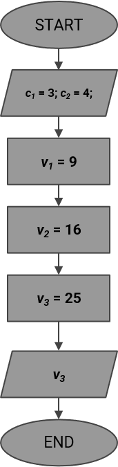

# 2.2.2 I diagrammi di flusso

Abbiamo visto come 

In una delle [lezioni precedenti](../../01_algorithms/lecture.md), abbiamo visto come un algoritmo può essere espresso come una sequenza arbitrariamente complessa di operazioni atomiche.

Detta sequenza, ovviamente, deve essere in qualche modo "fissata", di modo da indirizzare il funzionamento dell'algoritmo secondo le modalità desiderate. In tal senso, la tentazione potrebbe essere quella di limitarsi a tenere a mente i passi della sequenza di istruzioni, ed implementarle *di getto*. Tuttavia, questo non è il modo migliore per farlo, in quanto risulta essere abbastanza complesso gestire tali informazioni all'aumentare della complessità dell'algoritmo.

Un'altra soluzione potrebbe essere quella di scrivere le istruzioni su un qualche tipo di supporto o documento; tuttavia, la soluzione migliore è quella di affidarsi a degli strumenti appositamente predisposti in tal senso, ovvero i *diagrammi di flusso*.

## Cosa sono i diagrammi di flusso?

I *diagrammi di flusso* (in inglese *flow charts*) sono uno strumento utile a gestire il flusso delle istruzioni.

Un flow chart è uno strumento prettamente *visivo*, atto a schematizzare il flusso delle singole istruzioni di un algoritmo. In tal modo, diventa estremamente più semplice scrivere l'algoritmo, e valutare come i dati cambiano all'interno dello stesso.

## Quali sono le componenti fondamentali?

Un diagramma di flusso può avere al suo interno diverse componenti, le più importanti delle quali sono visualizzate nella tabella successiva.

{: .center}

In particolare:

* una *ellisse* indica l'inizio o la fine dell'algoritmo, ed andrebbe *sempre* apposta;
* un *rettangolo* indica una singola istruzione (o anche un gruppo di istruzioni) da eseguire nel programma;
* un *parallelogramma* indica un input o un output;
* un *rombo* indica una ramificazione nel percorso dell'algoritmo, legata prevalentemente alla verifica di una condizione;
* infine, le frecce sono usate per collegare tra loro diverse parti dello stesso algoritmo.

### Un esempio

Nella seguente figura mostriamo un esempio di diagramma di flusso.

{: .center}

Vediamo come il diagramma inizi con un'ellisse, che sarà contrassegnata dalla scritta START (inserita arbitrariamente). Immediatamente dopo, vi sarà la lettura di due variabili, ovvero $c_1$ e $c_2$; a quel punto, vi sarà l'assegnazione di altre tre variabili, con infine la variabile $v_3$ scritta su un dispositivo di output, seguita dal simbolo di fine algoritmo.

E' estremamente importante notare come l'assegnazione e la lettura siano, in realtà, quasi "ambigue" dal punto di vista della notazione: occorre quindi in tal senso fare attenzione al fatto che si stia usando un parallelogramma o un rettangolo, seguendo le regole descritte nel paragrafo 5.2.
