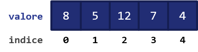

# 2.7.1 Strutture dati base

Nelle [lezioni precedenti](../../05_functions/01_intro/lecture.md) abbiamo ad un certo punto parlato di "insieme" dei voti relativi ai nostri esami, senza però ben specificare come rappresentarlo con i concetti a nostra disposizione. Se ci pensiamo, infatti, non abbiamo (apparentemente) strumenti per rappresentare degli insiemi: non possiamo certamente utilizzare un singolo dato numerico, così come neanche un dato booleano o un carattere.

Per risolvere questo problema (e, in realtà, mille altri) dobbiamo utilizzare una serie di concetti che vanno sotto il nome collettivo di *strutture dati*, ovvero dei costrutti progettati per organizzare e gestire un insieme di valori nella maniera più efficiente possibile.

Esistono diversi tipi di struttura dati, ognuno dei quali adatto ad un determinato scopo. Vediamo quelli più diffusi.

## Array

La maniera più rapida di rappresentare i nostri voti è quella di immaginarli come un vettore di numeri interi; per far questo esiste una struttura dati apposita chiamata *array*.

Un array contiene quindi una sequenza di elementi, tipicamente dello stesso tipo (anche se, come vedremo, ciò dipende dal linguaggio di programmazione), ed organizzati seguendo un ordine specifico, "esplorabile" mediante il concetto di *indice*.

La presenza dell'indice permette di definire la modalità di accesso ai dati dell'array, indicata come *accesso diretto*. Nella pratica, possiamo estrarre qualsiasi elemento nell'array mediante l'indice stesso, in maniera diretta, senza dover "scorrere" l'intero vettore; questo fa sì che l'accesso abbia sempre una complessità $O(1)$, dato che è richiesta un'unica operazione.

!!!note "Nota"
	A far da contraltare all'efficienza in termini di accesso vi è una certa laboriosità legata all'inserimento o rimozione di un elemento dall'array.

Tipicamente, un array viene rappresentato come una serie di singole variabili racchiuse tra due parentesi quadre. Ad esempio:

```py
array = [8, 5, 12, 7, 4]
```

In particolare, il precedente array è composto da elementi di tipo intero, ed ha una lunghezza pari a cinque elementi. Da notare che nella maggior parte dei linguaggi di programmazione l'indice del primo elemento *non* è pari ad uno, ma a zero. La figura successiva esplicita adeguatamente questo concetto.

{: .center}

## Liste

Una *lista*, conosciuta anche con il nome di *linked list*, è una struttura dati simile all'array, ma che consta di una differenza fondamentale. Nella lista, infatti, ogni elemento contiene un riferimento esplicito a quello successivo. Questo concetto è esplicitato nella seguente figura:

{: .center}

In particolare, osserviamo che:

- il primo elemento nella lista, il cui valore è `5`, ha un riferimento all'elemento successivo `R3`;
- il secondo elemento nella lista ha valore `3`, e conserva un riferimento all'elemento successivo `R2`;
- ciò prosegue sino all'elemento `7`, che conserva un riferimento all'ultimo elemento `R12`.

Il fatto che ogni elemento della lista contenga un riferimento al successivo ha due conseguenze:

1. la prima consiste nel fatto che la lista è una struttura dati ad *accesso sequenziale*, il che significa che occorrerà "scorrere" tutti gli elementi della stessa fino ad arrivare a quello desiderato;
2. la seconda sta nel fatto che risulta essere molto più semplice aggiungere o rimuovere un elemento da una lista che da un array: infatti, basterà semplicemente modificare i riferimenti dagli elementi contigui a quello che si sta aggiungendo o rimuovendo.

## Struct

Una *struct* contiene un insieme di valori tipicamente chiamati *membri* o *campi*, il cui numero, sequenza e tipo sono tipicamente prefissati. Le struct trovano ampia applicazione in linguaggi come il C, ed hanno una sintassi di questo tipo:

```c
struct nome_struct {
	tipo_campo_uno id_campo_uno;
	tipo_campo_due id_campo_due;
};
```

Questa sintassi ci permette di definire quindi un tipo di struct chiamato `nome_struct` ed avente, in questo caso, due campi, ovvero un primo campo di tipo `tipo_campo_uno` ed identificatore `id_campo_uno`, ed un secondo campo di tipo `tipo_campo_due` ed identificatore `id_campo_due`.

## Union

Una *union* è un tipo di struttura dati che permette di specificare il tipo del valore che può essere memorizzato al suo interno tra un certo numero di tipi primitivi. Nonostante sia sintatticamente affine alla struct, ne differisce quindi dal punto di vista funzionale: non è una "struttura", ma piuttosto un "ventaglio di possibili tipi" da cui selezionare. La sintassi di una union è simile alla seguente:

```c
union nome_union {
	tipo_union_uno id_union_tipo_uno;
	tipo_union_due id_union_tipo_due;
};
```

In questo caso, la union di nome `nome_union` potrà assumere uno tra due possibili valori, ovvero `id_union_tipo_uno` di tipo `tipo_union_uno` o `id_union_tipo_due` di tipo `id_union_tipo_due`.

!!!note "Nota"
	Per adesso, non facciamo un esempio "concreto" di union; lo vedremo più avanti, quando ritorneremo su queste due strutture dati in C.

## Pile e code

Abbiamo visto in precedenza due tipi di accesso ai dati, ovvero quello *casuale*, proprio degli array, e quello *sequenziale*, proprio dell eliste. Esiste un altro tipo di accesso ai dati, chiamato *accesso limitato*, usato da specifiche strutture dati come *pile* e *code*. Vediamo brevemente entrambi questi tipi di struttura dati.

### Pile

Una *pila* (in inglese, *stack*) è una struttura dati che contiene al suo interno variabili inserite e/o rimosse seguendo il principio *Last-In, First-Out* (*LIFO*). In altre parole, ciò significa che l'ultimo elemento che accede ad una pila è anche il primo ad uscirne.

Una pila ha a disposizione quindi due diverse operazioni, ovvero quella di `push`, mediante la quale un oggetto viene inserito in cima allo stack, e quella di `pop`, che permette di estrarre l'oggetto dalla cima dello stesso.

Il funzionamento della pila è schematizzato all'interno della seguente figura.

{: .center}

!!!note "Nota"
	Il motivo alla base dell'aggettivo "limitato" è da ricercarsi proprio nel fatto che sia il push sia il pop possono essere effettuati soltanto sugli elementi in cima alla pila.

### Code

Una *coda* (in inglese, *queue*) è una struttura dati concettualmente simile alla pila, ma che segue il principio (*First-In, First-Out*) (*FIFO*); in questo caso, il primo ad uscire dalla coda sarà il primo ad esservi entrato.

Le operazioni definite sulla coda sono concettualmente simili a quelle definite sulla pila, e vengono chiamate `enqueue` (per mettere in coda un nuovo elemento) e `dequeue` (per togliere dalla coda l'elemento presente da più tempo).

Il funzionamento della coda è schematizzato all'interno della seguente figura.

{: .center}
