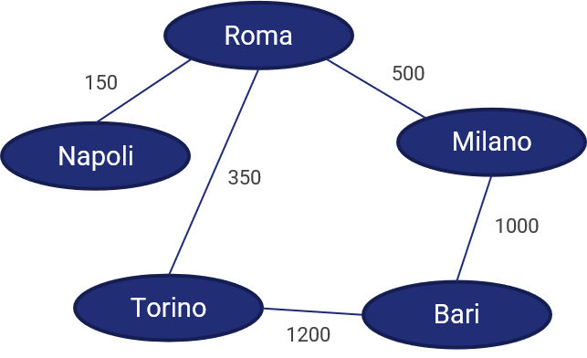
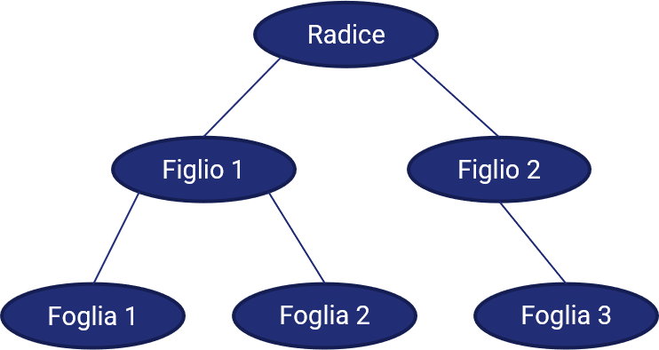

# 2.7.2 Strutture dati avanzate

In questa lezione, vedremo prima come progettare una pila ed una coda come degli array, per poi passare a presentare un altro tipo di strutture dati estremamente utilizzate, ovvero *grafi* ed *alberi*.

## Pila come array

### Variabili da utilizzare

Proviamo adesso ad implementare una pila utilizzando un array. Per farlo, avremo bisogno di tre elementi:

1. un array, che chiameremo `stack`;
2. una variabile che indica l'elemento in cima allo `stack`, che chiameremo `top`;
3. una variabile che indica la lunghezza dello `stack`, che chiameremo `capacity`.

Da qui consegue che:

* lo `stack` è pieno quando `top` è pari a `capacity`;
* lo `stack` è vuoto quando `top` è pari a `0`.

### Operazioni di `push` e `pop`

Ricordiamo che lo stack segue una strategia LIFO, per cui una `push` prevede che sia inserito un nuovo elemento nella parte superiore dell'array (ovvero, all'indice `top`). Quindi:

```linenums="1"
push(stack, top, capacity, element):

STEP 1 -> top = top + 1;
STEP 2 -> if (top >= capacity)
		      return ERROR;
STEP 3 -> top = element;
```

Ciò implica che:

* allo `STEP 1` viene aumentato il valore attuale di `top`;
* allo `STEP 2` viene verificato che `top` non sia superiore a `capacity`, e che quindi la pila non sia già piena;
* allo `STEP 3` l'elemento `element` viene inserito al posto `top` dello della pila.

L'operazione di `pop` invece prevede che l'elemento al vertice dello stack sia rimosso:

```linenums="1"
pop(stack, top)

STEP 1 -> if (top <= 0):
			  return ERROR;
STEP 2 -> element = top;
STEP 3 -> top = top - 1;
STEP 4 -> return element;
```

Ciò implica che:

* allo `STEP 1` si verifica che lo `stack` non sia vuoto;
* allo `STEP 2` viene assegnato ad `element` il valore presente al `top` dello `stack`;
* allo `STEP 3` il valore di `top` viene ridotto di uno;
* allo `STEP 4` viene restituito il valore estratto dallo `stack`.

## Coda come array

### Variabili da utilizzare

Anche in questo caso dovremo usare tre diversi elementi:

1. un array, che chiameremo `queue`;
2. una variabile che indica l'elemento da più tempo in coda, chiamata `first`;
3. una variabile che indica la lunghezza della `queue`, che chiameremo `capacity`.

Ovviamente, come nel caso precedente, se `first` è uguale a `capacity` allora la coda è piena.

### Operazioni di enqueue e dequeue

Ricordiamo che la strategia seguita da una coda è di tipo FIFO, per cui dovremo definire i metodi `enqueue` e `dequeue`.

In particolare, il metodo `enqueue` prevede che al primo posto nell'array sia inserito l'elemento che si vuole aggiungere.

```linenums="1"
enqueue(array, element)

STEP 1 -> if (first >= capacity):
			  return ERROR;
STEP 2 -> for element in queue:
			  element = prev_element;
STEP 3 -> last = new_element;
```

In pratica:

* allo `STEP 1`, controlliamo che la coda non sia già satura;
* allo `STEP 2`, spostiamo ogni elemento della coda in avanti (in pratica, assegnamo a ciascun elemento il valore dell'elemento precedente nella coda);
* allo `STEP 3`, aggiungiamo il nuovo elemento in ultima posizione.

La procedura di `dequeue`, di converso, comporta la semplice rimozione dell'ultimo elemento nell'array.

```linenums="1"
dequeue(array)

STEP 1 -> remove first from queue;
STEP 2 -> first = prev_element;
```

In altre parole:

* allo `STEP 1` viene rimosso il primo elemento dalla coda;
* allo `STEP 2` il valore di first viene aggiornato, assegnandovi quello associato all'elemento immediatamente precedente.

## Grafi

Il concetto di grafo può essere compreso in maniera intuitiva partendo da quelli che sono i nostri contatti sulle reti sociali (possiamo tranquillamente pensare a Facebook).

Chiunque abbia un account su Facebook, infatti, ha una serie più o meno estesa di "collegamenti", i quali a loro volta possono essere collegati tra loro, andando a creare una sorta di "intreccio" di relazioni. Rappresentando ciascun account con un punto, e tutti i collegamenti mediante delle linee, avremmo una situazione più o meno simile a quella che vediamo nella figura seguente.

{: .center}

Notiamo anche che, nella maggior parte dei casi, la conoscenza tra due persone è *bidirezionale*: ovvero, dato che noi conosciamo una certa persona, questa persona ci conoscerà a sua volta.

Questo modo di schematizzare una rete sociale avviene mediante una struttura nota come *grafo*.

Formalmente, un grafo è definito come una coppia $G=(V, E)$, dove $V$ è l'insieme dei *vertici*, o *nodi* (quelli che abbiamo prima chiamato "punti"), mentre $E$ è l'insieme degli *archi*, o *lati* che connette detti vertici (le "linee"). Interessante notare come un arco possa essere rappresentato mediante i nodi che connette: infatti, si può dire che l'arco che connette i vertici $u$ e $v$ è descrivibile mediante la coppia $(u, v)$.

### Grafi diretti e non diretti

Nell'esempio precedente, abbiamo visto come le relazioni all'interno di un social network siano perlopiù bidirezionali. Non è quindi possibile individuare una direzione "specifica" nell'arco che collega due nodi: l'arco che collega i nodi $u$ e $v$ può essere inteso sia come un collegamento che da $u$ va verso $v$, sia, al contrario, come un collegamento che va da $v$ verso $u$. Una situazione di questo tipo implica la presenza di un grafo *non diretto*. In un grafo non diretto l'arco $(u, v)$ coincide quindi con l'arco $(v, u)$.

Per un grafo non diretto possiamo definire la condizione di *adiacenza* per due vertici $u$ e $v$:

!!!info "Vertici adiacenti"
	Due vertici $u$ e $v$ sono definiti *adiacenti* o *vicini* quando vi è un arco che li connette.

Contestualmente, possiamo definire il concetto di *grado* di un vertice:

!!!info "Grado di un vertice"
	Si definisce *grado* di un vertice $u$ il numero di archi che vi incidono.

Ad esempio, se abbiamo cento contatti su Facebook, il nostro "grado" all'interno del social network sarà proprio pari a 100.

Viceversa, se ad ogni arco è associata una direzione, otterremo un grafo *diretto*, nel quale non sarà sempre possibile andare indifferentemnete da $u$ a $v$, e viceversa. Per fare un esempio di grafo indiretto, immaginiamo che i nodi del nostro grafo siano gli incroci di una città, mentre i lati le vie che li connettono; in tal senso, ogni via a senso unico sarà un esempio di arco diretto, e percorrobile (*teoricamente*) in un'unica direzione.

Per un grafo diretto dovremo ridefinire il concetto di *grado*, separandolo in due concetti distinti.

!!!info "Grado esterno"
	Si definisce *grado esterno*, o *out-degree*, di un vertice $u$ il numero di archi in uscita da $u$.

!!!info "Grado interno"
	Si definisce *grado interno*, o *in-degree*, di un vertice $u$ il numero di archi in ingresso su $u$.

### Cammini e cicli

Prendendo una licenza ed usando un "gioco di parole", immaginiamo di voler contattare il contatto di un nostro contatto. Per farlo, potremmo semplicemente chiedere al nostro amico di presentarci il suo amico il quale, ovviamente, non ha un collegamento diretto con noi, ma che risulta essere in qualche modo "raggiungibile": esiste, quindi, un *percorso* o, più propriamente, un *cammino*, che mette in relazione noi con la nostra conoscenza futura.

Ovviamente, il numero di cammini esistenti tra due nodi $u$ e $v$ è potenzialmente molto elevato, se non addirittura infinito: ad esempio, nel caso precedente, potremmo sicuramente costruire una rete di contatti indiretti con la quale arrivare al nostro obiettivo in maniera più "larga". Tuttavia, è opportuno sempre cercare il *cammino minimo* (*shortest path*), che rappresenta il modo più diretto per arrivare al nostro obiettivo.

Definiamo inoltre altre due condizioni.

!!!info "Cicli"
	Un cammino che ha come punto di partenza e di arrivo lo stesso vertice è chiamato *ciclo*.

!!!info "Connessione del grafo"
	Un grafo si dice connesso quando esiste almeno un percorso che colleghi due nodi $(u, v)$, $\forall (u, v) \in V$.

#### Un esempio

Facciamo un esempio pratico. Immaginiamo che Bob voglia conoscere Eric; come è possibile notare, non esiste alcun grafo che li collega. Tuttavia, Bob ha due strade: la prima è quella di chiedere ad Alice di presentargli Charlie, che potrebbe a sua volta introdurgli Eric. La seconda, invece, prevede che Bob si metta in contatto con David, che potrà direttamente introdurgli Eric.

{: .center}

Abbiamo quindi individuato due cammini tra Bob ed Eric, di cui uno (quello che passa per David) è da considerarsi minimo, in quanto tiene conto del numero minimo di vertici e lati intercorrenti tra il nodo di partenza e quello di arrivo.

Per quello che riguarda i cicli, quello che va da Alice verso Bob verso David e torna poi ad Alice è da considerarsi appunto come tale.

### Grafo pesato

E' possibile che a tutti gli archi di un grafo sia associato un *peso*, ovvero un valore numerico. In uno degli esempi precedenti, ovvero quello delle vie e degli incroci, potremmo associare ad ogni strada un numero indicativo della sua lunghezza in metri:

{: .center}

Un grafo i cui archi hanno dei pesi è chiamato *grafo pesato*. Ovviamente, per trovare il cammino minimo in un grafo di questo tipo, dovremo tenere conto del valore dei pesi: nella figura precedente, infatti, TODO: esempio

## Alberi

Un concetto *cugino* di quello di grafo è quello di *albero*, struttura dati particolarmente usata soprattutto in ambito informatico, che permette di modellare una struttura gerarchica fatta di un nodo radice e di una serie di nodi figli, fino ai nodi *foglia*, ovvero quelli che non hanno ulteriori successori.

Per comprendere al meglio la struttura di un albero, vediamo quella che è la "geneaologia" della razza umana (in versione *volutamente* semplificata):

{: .center}

In particolare, notiamo come a partire da un "antenato comune" (il famoso "anello mancante") si siano evoluti diversi *rami* dell'albero, ognuno afferente ad un diverso genere, di cui gli ultimi esemplari rappresentano i nodi foglia; nel nostro caso, l'Homo sapiens è la foglia del ramo rappresentativo del genere Homo.

!!!note "Nota"
	L'albero *è* un grafo, con delle particolari caratteristiche: infatti, è non diretto, connesso ed aciclico (ovvero, non presenta alcun ciclo al suo interno).

Concludiamo questo excursus citando infine gli alberi *binari*, caratterizzati dal fatto che ciascun nodo ha (al più) due figli.
