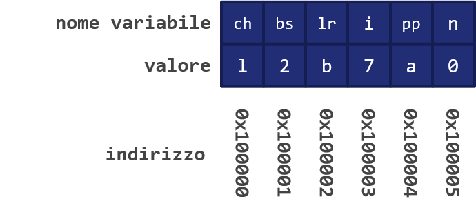

# 19 - I puntatori

Quello di *puntatore* è un concetto estremamente importante per la comprensione del linguaggio C, nonostante possa a volte rivelarsi ostico.

In particolare, un puntatore è, nei fatti, una variabile che contiene l'indirizzo di memoria dove risiede un'altra variabile. Per meglio comprendere questo concetto, osserviamo la seguente figura.



Analizziamo brevemente la figura precedente. Ad esempio, la variabile di nome `ch`, il cui valore è pari ad `l`, risiede nell'indirizzo di memoria `0x100000`; la variabile `bs`, intero di valore `2`, risiede nell'indirizzo di memoria immediatamente adiacente, ovvero `0x100001`, e via discorrendo; un puntatore ci permette quindi di tenere traccia di questi valori.

!!!note "Gli indirizzi di memoria"
    Gli indirizzi di memoria, nei fatti, sono rappresentabili mediante variabili di tipo intero. Tuttavia, molto spesso si preferisce utilizzare la notazione esadecimale.

!!!tip "Operazioni aritmetiche"
    Dato che gli indirizzi di memoria sono variabili di tipo intero, è possibile effettuare su di essi delle operazioni di natura aritmetica. Tuttavia, è sconsigliato farlo se non in casi eccezionali.

## 19.1 - L'operatore `&`

Se invocato su di una variabile, l'operatore `&` permette di restituirne l'indirizzo, ottenendo quindi il valore associabile ad un puntatore. Ad esempio:

```c
printf("%x", &ch);      // questa istruzione restituirà 0x100000
```

!!!note "Format specifier per il puntatore"
    Notiamo che il format specifier usato per il puntatore non è quello usato per i numeri interi.

Di conseguenza, possiamo definire la modalità con cui è possibile dichiarare ed inizializzare una variabile da associare ad un puntatore come:

```c
char ch = 'l';
char* puntatore_char = &ch;
```

La notazione `type*` indica quindi che stiamo definendo un puntatore ad un tipo specifico; ad esempio, `char*` è un puntatore a `char`, mentre `int*` è un puntatore ad `int`, e via dicendo.

## 19.2 - L'operatore di dereferenziazione

Nel contesto dei puntatori, l'operatore `*` ci permette anche di effettuare la cosiddetta operazione di *dereferenziazione*, che ci permette di recuperare il valore associato all'indirizzo di memoria cui si riferisce il puntatore. Ad esempio:

```c
print("%c", *pointer);      // questa istruzione restituirà l
```

## 19.3 - Passaggio per valore e passaggio per reference

Il passaggio di una variabile come argomento di una funzione avviene secondo due diverse modalità.

Nella prima modalità, il passaggio avviene per *valore*: questo significa che viene creata una copia della variabile, la quale sarà mandata in ingresso alla funzione. Ovviamente, ciò implica che la variabile originaria *non* sarà modificata.

Il secondo modo è, invece, per *reference*: in questo caso, viene passato il riferimento all'indirizzo di memoria associato alla variabile in ingresso alla funzione, e la variabile originaria sarà quindi modificata.

!!!note "Nota"
    I "fanatici" del C affermano che il linguaggio preveda esclusivamente il passaggio per valore. Tuttavia, il passaggio per reference può essere tranquillamente emulato utilizzando un puntatore come argomento della funzione, come vedremo a breve.

### 19.3.1 - Passaggio di un puntatore come argomento di una funzione

Come abbiamo detto in precedenza, per "emulare" un passaggio per reference potremo passare un puntatore come argomento di una funzione. Questo implica, ovviamente, che il passaggio avverrà sì per valore, ma sarà relativo ad un indirizzo di memoria!

Di conseguenza, ogni operazione effettuata sul puntatore avrà esclusiva validità all'interno della funzione, ma la variabile puntata sarà, nei fatti, passata per reference, e potrà essere modificata. In questi casi, si parla (in maniera in qualche modo forzata) di *passaggio per indirizzo*. Ad esempio:

```c
#include <stdio.h>

void f(int *j) {
  (*j)++;
}

int main() {
  int i = 20;
  int *p = &i;
  f(p);
  printf("i = %d\n", i);        // i sarà pari a 21!
  return 0;
}
```

## 19.4 - Puntatore a void

A volte potrebbe essere necessario creare un puntatore prima che il programma "conosca" il tipo della variabile puntata. In questo caso, si utilizza un puntatore a `void`:

```c
void* puntatore_generico;
```

In pratica, un puntatore di questo tipo può essere utilizzato come generico placeholder, e non può essere in alcun modo dereferenziato. Nel momento in cui lo si vorrà utilizzare, inoltre, sarà necessario effettuare un cast al tipo cui si riferisce:

```c
char* puntatore_char = (char*) puntatore_generico;
```

## 19.5 - Puntatori ed array

Esiste una corrispondenza pratica tra array e puntatori; infatti, dal punto di vista semantico, *gli array sono dei particolari tipi di puntatori*. Infatti, nel momento in cui si dichiara un array, si alloca la memoria necessaria sia alla struttura dati stessa, sia all'area puntata; è per questo, quindi, che è necessario definire a priori la lunghezza dell'array, e procedere con un'allocazione di tipo statico.

Interessante anche notare come il puntatore associato all'array sia dichiarato costante mediante la keyword `const`. La conseguenza diretta di questo è che *l'indirizzo dell'array non è modificabile*; una conseguenza indiretta, ma altrettanto importante, è che l'array non può essere usato come l-value. E, in definitiva, è questo il motivo per il quale una serie di istruzioni di questo tipo non è valida:

```c
int lista[3];
lista = { 1, 2, 3 };
```

## 19.6 - Puntatori e funzioni

Per una funzione è possibile avere un puntatore come valore di ritorno.

Ricordiamo che il valore di ritorno è, come sempre, passato per valore: ciò garantisce quindi che il puntatore usato nell'ambito della funzione sia restituito correttamente. Ciò, tuttavia, non è garantito per la variabile puntata, che deve appartenere ad un ambito adeguato (e, quindi, non locale alla funzione), oppure essere dichiarata `static`.

## 19.7 - Esercizi

1. Scriviamo le funzioni, `mostra_puntatore_intero` e `mostra_puntatore_decimale`, che accettano, rispettivamente, un valore intero ed un valore reale. Le due funzioni non restituiscono alcun valore, e stampano a schermo l'indirizzo di memoria associato alla variabile passata come parametro.
2. Scriviamo le funzioni `deferenzia_compara_intero` e `deferenzia_compara_decimale`, che accettano due argomenti in ingresso, ovvero una variabile ed un puntatore alla stessa. Come suggerisce il nome delle funzioni, la prima tratta valori interi, la seconda decimali. Le funzioni devono verificare la correttezza dell'operazione di dereferenziazione, ed in caso affermativo restituire il vlaore della variabile dereferenziata, mentre in caso negativo restituire il valore -1.
3. Scriviamo la `restituisci_puntatore` che accetta come parametro un intero e restituisce il puntatore allo stesso. Verificare se l’indirizzo associato al puntatore restituito è lo stesso ottenuto utilizzando l’operatore `&` all’interno della funzione chiamante.
4. Scriviamo la funzione `puntatore_a_void` per creare un puntatore a void da associare poi ad una variabile di tipo `char` passata in ingresso.
