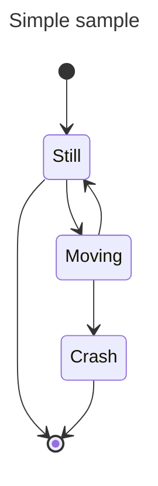

# L'architettura di Von Neumann

!!!quote
    John Von Neumann era un genio del calibro di Leonardo Da Vinci.

Von Neumann viene introdotto in questo modo da uno dei principali divulgatori in ambito informatico della nostra epoca, ovvero Andrew Tanenbaum. Il nostro è, a buona ragione, il padre dell'informatica moderna, assieme ad un altro genio del calibro di Alan Turing.

A Von Neumann si deve l'architettura che prende il suo nome, chiamata appunto architettura di Von Neumann, che contiene al suo interno le parti fondamentali del calcolatore che, al giorno d'oggi, vengono ancora utilizzate, anche se in maniera ovviamente riveduta e corretta.

L'architettura della macchina di Von Neumann si mostra come nella seguente figura.

Le componenti fondamentali dell'architettura sono quindi quattro.

In primis, abbiamo il *processore centrale*, in inglese *Central Processing Unit* (CPU), che è quello che si occupa di gestire i processi di elaborazione dati ed informazioni della macchina. 

Abbiamo poi la *memoria centrale*, all'interno della quale sono memorizzati i programmi (che, ricordiamo, sono composti da istruzioni e dati).

Il terzo componente è il *bus* di sistema, che permette la comunicazione delle informazioni tra memoria centrale e processore.

L'ultimo componente sono le *interfacce* verso i dispositivi di input ed output.

Vediamo ciascuno di questi componenti più nel dettaglio.

## La CPU