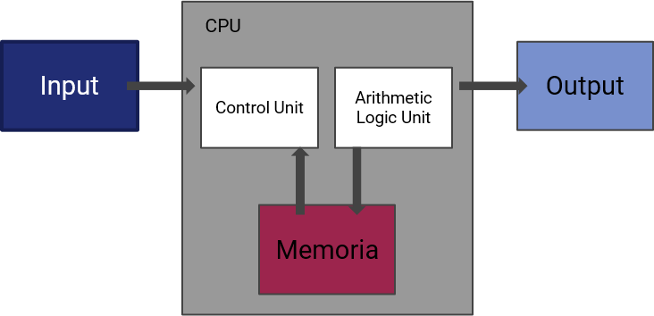

# 4.1 L'architettura di Von Neumann

## Introduzione

Nelle lezioni precedenti abbiamo parlato di algoritmi e della loro rappresentazione in codice. Ma come viene effettivamente eseguito un programma all'interno di un calcolatore? Per rispondere a questa domanda, dobbiamo comprendere l'architettura su cui si basa la maggior parte dei computer moderni: l'**architettura di Von Neumann**.

Proposta dal matematico e fisico John von Neumann nel 1945, questa architettura descrive un modello di calcolatore in cui i dati e le istruzioni del programma sono memorizzati nella stessa memoria e vengono elaborati sequenzialmente da un'unità di elaborazione centrale (CPU).



## I componenti fondamentali

L'architettura di Von Neumann si compone di quattro elementi principali.

### Unità di elaborazione centrale (CPU)

La **CPU** (*Central Processing Unit*) è il "cervello" del calcolatore. Si occupa di eseguire le istruzioni dei programmi, effettuare operazioni aritmetiche e logiche, e coordinare il flusso dei dati tra i vari componenti. La CPU è a sua volta suddivisa in due sotto-unità.

#### Unità di controllo (CU)

L'**unità di controllo** (*Control Unit*, o **CU**) ha il compito di interpretare le istruzioni del programma e di generare i segnali di controllo necessari per coordinarne l'esecuzione. Legge le istruzioni dalla memoria, le decodifica e attiva i circuiti appropriati all'interno della CPU.

#### Unità aritmetico-logica (ALU)

L'**unità aritmetico-logica** (*Arithmetic Logic Unit*, o **ALU**) è il componente che esegue effettivamente le operazioni aritmetiche (addizione, sottrazione, moltiplicazione, divisione) e logiche (AND, OR, NOT, confronti) richieste dalle istruzioni.

### Memoria centrale

La **memoria centrale** (o memoria primaria) è il componente che memorizza sia i dati che le istruzioni del programma. È organizzata in celle, ciascuna delle quali ha un indirizzo univoco. La CPU può leggere o scrivere il contenuto di una cella specificandone l'indirizzo.

!!! note "RAM"
    La memoria centrale è solitamente una memoria **RAM** (*Random Access Memory*), ovvero una memoria ad accesso casuale che permette di accedere a qualsiasi cella con tempi simili, indipendentemente dalla sua posizione. La RAM è una memoria *volatile*: quando il computer viene spento, il suo contenuto viene perso.

### Bus di sistema

Il **bus di sistema** è un insieme di collegamenti elettrici (fili, tracce su circuito stampato) che permette la comunicazione tra CPU, memoria e dispositivi di I/O. Si distinguono tre tipi di bus:

- **bus dati**: trasporta i dati tra i componenti;
- **bus indirizzi**: trasporta gli indirizzi di memoria da leggere o scrivere;
- **bus di controllo**: trasporta i segnali di sincronizzazione e controllo.

### Dispositivi di ingresso/uscita (I/O)

I **dispositivi di I/O** permettono al calcolatore di interagire con il mondo esterno. Esempi sono la tastiera, il mouse, il monitor, il disco fisso, la scheda di rete, etc.

## Il ciclo fetch-execute

La CPU esegue un programma seguendo un ciclo continuo chiamato **ciclo fetch-execute** (prelievo-esecuzione), composto dai seguenti passi:

1. **Fetch**: la CPU preleva l'istruzione dalla memoria all'indirizzo indicato dal *Program Counter* (PC) e la carica nel *Register Instruction* (IR).
2. **Decode**: l'unità di controllo decodifica l'istruzione, determinando quale operazione eseguire e quali operandi sono coinvolti.
3. **Execute**: la CU attiva i circuiti necessari (tipicamente l'ALU) per eseguire l'operazione richiesta.
4. **Write-back**: il risultato dell'operazione viene scritto nella destinazione appropriata (un registro o la memoria).

!!! tip "Ciclo continuo"
    Il ciclo fetch-execute si ripete continuamente fino a quando il programma non termina o il computer viene spento. Ogni ciclo corrisponde all'esecuzione di una singola istruzione.

## I registri della CPU

All'interno della CPU esistono delle piccole memorie ad alta velocità chiamate **registri**. I registri sono fondamentali per il funzionamento della CPU perché permettono di memorizzare temporaneamente dati e indirizzi durante l'elaborazione.

Ecco i registri principali.

### Program Counter (PC)

Il **Program Counter** (chiamato anche **IP** — *Instruction Pointer*) contiene l'indirizzo di memoria della *prossima* istruzione da eseguire. Dopo ogni fetch, il PC viene incrementato per puntare all'istruzione successiva (a meno che l'istruzione corrente non sia un salto, nel qual caso il PC viene modificato con l'indirizzo di destinazione del salto).

### Instruction Register (IR)

L'**Instruction Register** contiene l'istruzione attualmente in fase di esecuzione, prelevata dalla memoria durante la fase di fetch. L'unità di controllo decodifica il contenuto dell'IR per determinare l'operazione da eseguire.

### Memory Address Register (MAR)

Il **Memory Address Register** contiene l'indirizzo di memoria che la CPU intende leggere o scrivere. Il MAR è collegato al bus indirizzi.

### Memory Data Register (MDR)

Il **Memory Data Register** (chiamato anche **MBR** — *Memory Buffer Register*) contiene il dato letto dalla memoria o il dato da scrivere in memoria. L'MDR è collegato al bus dati.

### Accumulatore (ACC)

L'**accumulatore** è un registro speciale utilizzato per memorizzare i risultati intermedi delle operazioni aritmetiche e logiche eseguite dall'ALU. Ad esempio, per sommare due numeri, il primo viene caricato nell'accumulatore, il secondo viene passato all'ALU, e il risultato viene scritto nell'accumulatore.

### Registri generali (GPR)

I **registri generali** (*General Purpose Registers*) sono registri che possono essere usati per memorizzare dati o indirizzi a seconda delle necessità del programmatore. Il numero e la dimensione dei GPR variano a seconda dell'architettura della CPU (ad esempio, 8 registri a 32 bit in x86, 16 registri a 64 bit in x86-64, 32 registri a 64 bit in ARM).

### Registro di stato (Flag Register / Status Register)

Il **registro di stato** (o **FLAGS**) contiene una serie di bit detti *flag* che indicano lo stato della CPU dopo l'esecuzione di un'operazione. I flag più comuni sono:

- **Zero Flag (ZF)**: vale 1 se il risultato dell'ultima operazione è zero;
- **Carry Flag (CF)**: vale 1 se l'ultima operazione ha generato un riporto;
- **Sign Flag (SF)**: vale 1 se il risultato è negativo;
- **Overflow Flag (OF)**: vale 1 se si è verificato un overflow.

## Un esempio pratico

Vediamo come si svolge il ciclo fetch-execute per eseguire la semplice istruzione:

```
ADD R1, R2, R3   ; somma il contenuto di R2 e R3, salva il risultato in R1
```

1. **PC** contiene l'indirizzo dell'istruzione `ADD`.
2. **Fetch**: il contenuto del PC viene copiato nel MAR, la memoria restituisce l'istruzione, che viene caricata nell'IR. Il PC viene incrementato.
3. **Decode**: la CU decodifica l'IR, riconoscendo un'istruzione `ADD` con tre operandi registri.
4. **Execute**: i valori dei registri R2 e R3 vengono inviati all'ALU, che esegue la somma.
5. **Write-back**: il risultato viene scritto nel registro R1.

## Conclusioni

L'architettura di Von Neumann è il fondamento su cui si basa la stragrande maggioranza dei calcolatori moderni. Comprendere il funzionamento della CPU, dei registri e del ciclo fetch-execute è essenziale per capire come i programmi vengono effettivamente eseguiti a livello hardware.


