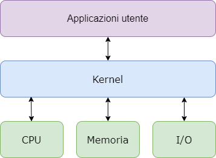

# 5.2 - Il kernel

Per *kernel* si intende il "nucleo" del sistema operativo, ovvero quell'insieme di funzionalità che agiscono da "ponte" tra gli applicativi software ad alto livello e l'hardware del computer. In particolare:

- gestisce le risorse di sistema, come processore, memoria e dispositivi, assicurandosi che tutto funzioni in maniera efficiente ed armoniosa;
- gestisce task come l'esecuzione dei programmi, l'accesso ai file e la connessione ai dispositivi come stampanti, mouse o tastiere.

Il kernel è la base del sistema operativo, ma fornisce anche un'interfaccia utente, un sistema di gestione file, servizi di rete e varie applicazioni che permettono agli utenti di interagire con il sistema. Inoltre, facilita la comunicazione tra le applicazioni utente e l'hardware, assicura il multitasking efficiente e sicuro, gestisce la stabilità del sistema e previene un accesso non autorizzato alle risorse.

<figure markdown>
  
  <figcaption>Figura 1 - La funzionalità del kernel</figcaption>
</figure>

## Tipi di kernel

### Kernel monolitico

Il kernel monolitico è un tipo di kernel in cui tutti i servizi del sistema operativo operano nello spazio del kernel. Ha molte linee di codice ed è complesso. Esempi sono Unix e Linux.

**Vantaggi:**

- **efficienza**: più veloce di altri tipi di kernel perché non deve cambiare tra *user mode* e *kernel mode* per ogni chiamata di sistema;
- **integrazione stretta**: tutti i servizi sono eseguiti nel kernel space e possono comunicare in modo efficiente;
- **semplicità di progettazione**: struttura unificata che rende più semplice gestire il codice;
- **bassa latenza**: chiamate di sistema e interrupt gestiti direttamente dal kernel.

**Svantaggi:**

- **stabilità**: un bug nel kernel può influenzare l'intero sistema;
- **sicurezza**: una vulnerabilità in un servizio può compromettere l'intero sistema;
- **manutenzione**: un cambiamento in un servizio può influenzare l'intero sistema;
- **modularità limitata**: difficile aggiungere o rimuovere funzionalità senza influenzare l'intero sistema.

### Micro kernel

Il micro kernel ha un approccio minimalista: gestisce solo memoria virtuale e thread scheduling, mentre gli altri servizi operano al di fuori del kernel space. Esempi sono AmigaOS e MINIX.

**Vantaggi:**

- **affidabilità**: la maggior parte del sistema operativo è eseguito fuori dal kernel space, quindi bug o vulnerabilità in un servizio non influenzano l'intero sistema;
- **flessibilità**: servizi possono essere aggiunti o rimossi senza influenzare il sistema;
- **modularità**: ogni servizio è eseguito indipendentemente, semplificando manutenzione e debug;
- **portabilità**: più semplice effettuare il porting verso architetture hardware differenti.

**Svantaggi:**

- **performance**: richiede più context switch tra user space e kernel space;
- **complessità**: richiede più meccanismi di comunicazione e sincronizzazione tra i servizi;
- **sviluppo più complesso**: maggiore attenzione ai dettagli nella comunicazione tra servizi;
- **uso risorse**: richiede più memoria e CPU rispetto ai kernel monolitici.

### Kernel ibrido

Questo tipo di kernel è una combinazione di kernel monolitico e microkernel: unisce la velocità del monolitico con la modularità e stabilità del microkernel.

**Vantaggi:**

- **performance**: riduce il numero di context switch rispetto ai microkernel;
- **affidabilità**: isola driver e componenti in domini separati;
- **flessibilità**: servizi possono essere aggiunti o rimossi senza influenzare l'intero sistema;
- **compatibilità**: supporta un range più ampio di driver di dispositivo.

**Svantaggi:**

- **complessità**: design e implementazione più difficili;
- **sicurezza**: superficie di attacco maggiore dei microkernel;
- **manutenibilità**: più difficile da mantenere dei microkernel;
- **risorse**: utilizzo più intenso rispetto ai microkernel.

### Exo kernel

L'exo kernel segue principi *end-to-end*: ha il minor numero possibile di astrazioni hardware e alloca le risorse fisiche direttamente alle applicazioni.

**Vantaggi:**

- **flessibilità**: gli sviluppatori possono customizzare e ottimizzare il sistema operativo per obiettivi specifici;
- **performance**: elimina astrazioni non necessarie e permette l'accesso diretto alle risorse hardware;
- **sicurezza**: controllo più fine sull'allocazione delle risorse di sistema;
- **modularità**: aggiunta o rimozione facile di servizi.

**Svantaggi:**

- **complessità di sviluppo**: maggiore attenzione ai dettagli nell'allocazione delle risorse;
- **sviluppo applicazioni**: richiede la scrittura di codice che accede direttamente all'hardware;
- **supporto limitato**: tecnologia emergente con meno risorse e supporto;
- **debug**: più difficile a causa dell'accesso diretto all'hardware.

### Nano kernel

Tipo di kernel che offre l'astrazione dell'hardware ma senza servizi di sistema, simile al microkernel (i due termini sono spesso usati come sinonimi).

## Funzioni del kernel

Il kernel è responsabile di diverse funzioni critiche:

1. **gestione dei processi**: scheduling ed esecuzione, context switching, creazione e terminazione dei processi;
2. **gestione della memoria**: allocazione e deallocazione, memoria virtuale, protezione e condivisione;
3. **gestione dei dispositivi**: gestione I/O, interfaccia unificata ai dispositivi, comunicazione con i driver;
4. **gestione del file system**: operazioni su file, mounting/unmounting, interfaccia del file system alle applicazioni;
5. **gestione risorse**: allocazione di CPU, disco e banda, monitoraggio utilizzo;
6. **sicurezza e controllo accessi**: policy di controllo, autenticazione, permessi utente;
7. **inter-process communication**: facilitazione della comunicazione tra processi, message passing e memoria condivisa.

## Funzionamento del kernel

Un kernel è caricato in memoria immediatamente quando viene avviato il sistema operativo, e vi rimane fino a quando questo non viene spento. È responsabile per diverse task come la gestione del disco e quella della memoria.

<!-- https://www.geeksforgeeks.org/kernel-in-operating-system/ -->
