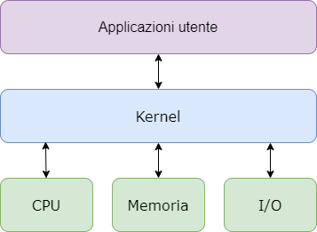

# 5.1 - Il kernel

Per *kernel* si intende il "nucleo" del sistema operativo, ovvero quell'insieme di funzionalità che agiscono da "ponte" tra gli applicativi software ad alto livello e l'hardware del computer. In particolare:

* gestisce le risorse di sistema, come processore, memoria, dispoositivi, assicurandosi che tutto funzioni in maniera efficiente ed armoniosa;
* gestisce tasak comem esecuzione dei programmmi, accesso ai file, e connessione ai dispositivi come stampanti, mouse o tastiere.

Il kernel è la base del sistema operativo, ma fornisce anche un'interfaccia utente, un sistema di gestioe file, servizi di rete, e varie applicazioni che permettono agli utenti di interagire con il sistema.

Inoltre, facilita al comunicazione tra le applicazioni utente e l'hardware, assicura il multitasking efficiente e sicuro, gestisce la stabilità del sistema e previene un accesso non autorizzato alle risorse.

<figure markdown>
  
  <figcaption>Figura 1 - La funzionalità del kernel</figcaption>
</figure>

## 5.1.1 - Tipi di Kernel

Il kenrel gestisce le risorse del sistemma quindi e facilita la comuncaizione tra le componenti hardware e software. Questi kernel sono di diversi tipi, vediamoli nel dettaglio.

##### Kernel monolitico

Il kernel momnolitico è uno dei tipi di kernel dove tutti i servizi dei sistemi operativi operano nello spazio del kernel. Ha delle dipendenze tra le componenti dei sistemi. Ha molte linee di codice, ed è complesso. Esempi sono Unix, Linux.

I vantaggi del kernel monolitico sono:

* efficienza, in quanto sono spesso più veloci di altir tipi di kernel in quanto non devono cammbaire tra due modalità, chiamate user mode e kernel mode, per ogni chiamata di sisetema, il che riduce l'overhead complessivo.
* integrazione stretta, dal momento in cui tutti i servizi del sistema operativo sopno eseguiti nel kernel space, possono comunicare in modo più efficienti tra loro, rendendo più semplice implenmetare funzionalità complesse ed ottimizzazioni.
* semplicità, i kernel monolitici sono più semplici da progettare, implementare, ed effettuare il debug di altri tipi di kernel perché hanno una struttura unificata che rende più semplice gestire il codice.
* latenza bassa: i kernel monolitici hanno una latenza più basa di altri tipi di kernel a causa delle chiamate a sistemma e degli interrupt che possono essere gfestiti direttamente dal kernel.

Gli svantaggi invece sono:

* problemi di stabilità: i kernel monolitici possono essere menos tabili di altri tipi di kernel perché una qualsiasi bug o problema di sicurezza nel kernel influenza l'interno sistema.
* vulnerabilità di sicurezza: dal momento che tutti i sistemi operativi sono eseguiti nello spazio kernel, ogni vulnerabilità di sicurezza in uno dei servizi può compromettere l'intero sistema
* difficoltà di manutenzione: i kernel monolitici possono essere più difficili da manutenere rispetto ad altri tipi di kernel perché un qualsiasi cambio in uno o più servizi possono influenzare l'intero sistema
* modularità limitata: i kernel monolitici sono meno modulare degli altri tipi di kernel perché tutti i sistemi operativi sono strettamente integrati nel kernel. Questo rende più difficile aggiungere o rimuovere funzionalità senza influenzare l'intero sistema

##### Micro kernel

Il micro kernel ha un approccio minimalista. Ha della memoria virtuale e del thread scheduling. E' più stabile con meno servizi nel kernel space, e si basa su un sistema operativo più snello. Esempi sono AmigaOS, ma sono poco diffusi.

I vantaggi del microkernel stanno nella sua affidabilità, in quanto è progettato per essere più affidabile dei kernel monolitici, perché la maggior parte del sistema operativo viene eseguito al di fuori del kernel space, e i bug o le vulnerabilità di ssicurezza in un servizio non ifnluenzano l'iuntero sistema.

E' inoltre piùà flessibile, in quanto permette a diversi servizi del sistema oeperativo di essere aggiunti o rimossi senza influenzare l'intero sistrema.

Offre maggiore modularità, in quanto ogni servizio viene eseguito indipendentemente dagli altri, e rende il sistema più semplice da manutenere e debuggare.

Infine, offre migliori perofmrance in termini di portabilità, in quanto la maggior parte dei seriviz del sistema operativo operano al di fuori dello spazio klernel. Questo rende più semplcie effettuare il porting del sistema operativo verso architetture hardware differenti.

In termini di svantaggi, abbiamo svantaggi di performance, perché l'architettura può essere piùà lenta di quelli monolitici in quanto richiede pioù context switch tra lo user space ed il kernel space.

Inoltre l'architettura è più complessa, perché richiede pi+ù comunicazione e meccanismi di sincronizzazione tra i diversi servizi del sistema operativo

E' anche più compelsso sviluppare questo tipo di sistemi operativi, perché richiede più attenzione al dettaglio nello sviluppo dei meccanismi di comunciazione e sincronizzazione tra i diversi servizi.

Inoltre, vi è un più elevato uso delle risorse di sistema come memoria e CPU rispetto ai kenrel monolitici, perché richiede più comunicazione e sincronizzazione tra i diversi servizi del sistema operativo.

##### Kernel ibridi

Questo tipo di kernel è una combinazione di kernel monolitico e microkernel. Riesce ad avere la velocità ed il design del kernel monolitico, così come la modularità e stabilità del microkernel.

I vantaggi stanno nelle performance, perché riducono rispetto ai microkernel il numero di context switch richiesto tra lo user space ed il kernel space. Poi vi è l'affidabilità, in quanto è più affidabile perché isola i driver ed altre componenti del kernel in sdomini separati. I kernel ibridi sono anche più flessibili di quelli monolitici, anche perché permettono a diversi servizi dei sistemi operativi di essere aggiunti o rimossi senza influenzare l'intero sistema. La compatibilità dei kernel ibridi può essere superiore ai microkernel perché possono suporater eun range più ampio dei driver del dispositivo.

PEr quello che riguarda invece gli svantaggi, questi sono in termini di complessità, in quanto i kernel ibridi sono più complessi perché incluudono sia componenti mmonolitiche sia microkernel, il che può rendere il desgin e l'implementazione più difficile. I kernel ibridi possono essere meno sicure dei mircokernel perché hanno una superficie di "attacco" meno grande a causa dell'inclusione dei componenti monolitici. Anche in termini di manutenibilità, i kernel ibrdii possono essere più difficil da mantener edei mircokernel perché hanno un design ed un'implementazione più complesse. Alla fine, l'utilizzo di risorse nei kernel ibridi sono più intensi dei microkernel, perché includono sia i componenti monolitici sia i microkernel.

##### Exo kernel

E' il tipo di kernel che segue dei principi end-to-end. Ha il minor numero di astrazioni hardware possibile. Alloca risorse fisiche alle applicazioni.

I vantaggi sono in termini di flessibilità (offrono il livello più alto possibile di flessibilità, permettendo agli sviluppatopi di customizzare e dottimizzare il sistema operativo per gli specifici obiettivi dell'applcazione). In termini di performanfe, gli exokernel sono progettati per fornire performance migliori ai kenrel traidzionali percé eliminano astrazioni non necessari e permettono alle applicazioni di accedere direttamente alle risorse hardware. In termini di sicurezza, gli exokernel forniscono una migliore sicurezza rispetto ai kernel tradizionali perché opermettono un controllo più fine sull'allocazione delle risorse di sistema, come memoria e tempo CPU. INfine gli exokernel sono estremamente modulari, poeremttendo l'aggiunta o rimozione facile di servizi dei sistemi operativi.

In termini di complessità, invece, gli exokernel risultano più complessi da sviluppare dei kernele tradizionali in quanot rihicedono una maggiore attenzione ai dettagli e considerazioni attente sull'allocazione delle risorse. Inoltre sviluppare applicazioni per gli exokernel è più difficile perché queste devono essere scritte in modo da accdere direttamente alle risorse harware. vi è anche un supporto limitato agli exokernel, in quanto sono ancora una tecnologia emergente e potrebbero nona vere lo stesso livello di supporto e risorse dei kernel tradizionali. Infine, effettuare il debuig di applicazioni e servizi del sistema operativo sugli exokernel potrebbe essere pià difficile a causa dell'accesso diretto alle risorse hardware.

##### Nano kernel

E' il tipo di kernel che offre l'astrazione dell'hardware ma senza servizi di sistema, un po' come i micro kernel, per cui sono diventati sinonimi.

##### Funzzioni del kernel

Il kernel è responsabile di diverse funzioni critiche che assicurano il funzionamento del sistema. Queste includono:

1. gestione dei processi, ovvero scheduling ed esecuzione dei processi, context switching tra processi, creazione e terminazione dei processi
2. gestione della memoria, ovvero allocazione e deallocazione dello spazio in memoria, gestione della memoria virtuale, gestione della protezione della memoria e condivisione
3. gestione del dispositivo, gestendo i dispositivi di input/outpèut, fornire un'interfaccia unificata ai dispositivi hardware, e gestiere la comunciazione dei driver di dispositivo
4. gestione del file system: gestire le operazioni sui file e in memoria, gestire il mounting e l'unmounting del file system,. fornire l'interfaccai del file system alle applcaizion.
5. gestione risorse;: gestire le risorse di sistema come temmpo CPU, spazio su disco e banda, allocare e deallocare le risorse quanbdo ncecessario, monitorare l'utilizzo delle risorse se forzare dei limiti
6. sicurezza e controllo degli accessi: forzare delle policy di controlloa ccessi, gestire l'autenticazione e i permessi utente, assicurare la sicurezza e l'integrità del sistema
7. inter-processo communication, facilitando la comunciazione tra processi, e fornendo i meccanismi come il message passing e la memorai condivisa

#### Fuznioanmento del kernel

Un kernel è caricato in memoria immedaitamente quanod viene caricato un sistema operativo, e vi rimane fino a che questo non viene spento. E' responsabile per diversi trask come la gestione del disco e quella della memoria.

<!-- https://www.geeksforgeeks.org/kernel-in-operating-system/ -->