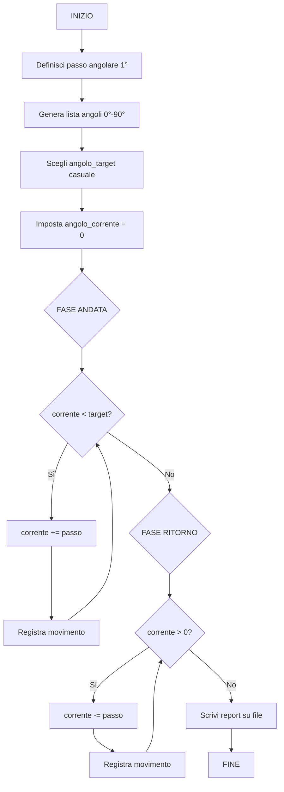

# 6.19.2 — Appello del 17/02/2026 — Turno 1 — Braccio robotico

## Traccia originale

> Un braccio robotico può muoversi ad angoli arbitrari. Si progetti un sistema che seleziona casualmente uno dei possibili valori di rotazione (considerando un angolo massimo di 90 gradi) e invii i valori relativi alla fase di movimentazione e al ritorno alla posizione originaria.
>
> **Esercizio 1 – Diagramma di flusso**: Definire un apposito diagramma di flusso che consenta di generare tutti i possibili angoli di movimento del braccio.
>
> **Esercizio 2 – Programmazione**: Si definisca un programma in grado di schedulare il movimento del braccio per minimizzare l'effettivo movimento, considerando una fase di andata e una di ritorno. Si generi un adeguato report su file di testo.

## Strategia risolutiva

Il braccio robotico si muove ad angoli arbitrari tra 0° e 90°. Dobbiamo:

1. Generare tutti i possibili angoli di movimento (es. con passo di 1°).
2. Selezionarne casualmente uno come destinazione.
3. Simulare la fase di **andata** (da 0° all'angolo target) e la fase di **ritorno** (dall'angolo target a 0°).
4. Per minimizzare il movimento, l'angolo target viene scelto tra quelli disponibili, e il percorso è sequenziale.
5. Generare un report su file di testo.

L'idea di "minimizzare il movimento" significa che non ha senso fare ampie rotazioni se non necessarie: si sceglie una traiettoria diretta dall'angolo corrente a quello target, senza oscillazioni.

## Diagramma di flusso



## Soluzione C

```c
#include <stdio.h>
#include <stdlib.h>
#include <time.h>

#define ANGOLO_MAX 90
#define PASSO 1

void genera_angoli(int angoli[], int *n) {
    *n = 0;
    for (int a = 0; a <= ANGOLO_MAX; a += PASSO)
        angoli[(*n)++] = a;
}

int scegli_angolo(const int angoli[], int n) {
    return angoli[rand() % n];
}

void simula_movimento(int target, const char *filename) {
    FILE *f = fopen(filename, "w");
    if (f == NULL) {
        printf("Errore apertura %s\n", filename);
        return;
    }

    fprintf(f, "Report movimentazione braccio robotico\n");
    fprintf(f, "Angolo target: %d°\n\n", target);
    fprintf(f, "--- FASE ANDATA (0° → %d°) ---\n", target);

    int corrente = 0;
    while (corrente < target) {
        corrente += PASSO;
        fprintf(f, "  Posizione: %d°\n", corrente);
    }

    fprintf(f, "\n--- FASE RITORNO (%d° → 0°) ---\n", target);
    while (corrente > 0) {
        corrente -= PASSO;
        fprintf(f, "  Posizione: %d°\n", corrente);
    }

    fprintf(f, "\nMovimento completato.\n");
    fclose(f);
    printf("Report salvato su %s\n", filename);
}

int main() {
    srand(time(NULL));

    int angoli[ANGOLO_MAX + 1];
    int n;
    genera_angoli(angoli, &n);

    printf("Angoli disponibili: da 0 a %d gradi (passo %d°)\n",
           ANGOLO_MAX, PASSO);
    printf("Totale posizioni: %d\n", n);

    int target = scegli_angolo(angoli, n);
    printf("Angolo target selezionato: %d°\n", target);

    simula_movimento(target, "braccio_robotico.txt");

    return 0;
}
```

### Spiegazione

| Funzione | Ruolo |
|----------|-------|
| `genera_angoli` | Crea la lista completa di tutti gli angoli possibili da 0 a 90 con passo 1° |
| `scegli_angolo` | Seleziona casualmente un angolo dalla lista |
| `simula_movimento` | Simula andata (da 0° a target) e ritorno (da target a 0°) e scrive tutto su file |

L'approccio "minimizzare il movimento" è garantito dal fatto che la traiettoria è monotona crescente in andata e monotona decrescente in ritorno, senza oscillazioni o rotazioni extra.

### Esempio di output (`braccio_robotico.txt`)

```
Report movimentazione braccio robotico
Angolo target: 57°

--- FASE ANDATA (0° → 57°) ---
  Posizione: 1°
  Posizione: 2°
  ...
  Posizione: 57°

--- FASE RITORNO (57° → 0°) ---
  Posizione: 56°
  Posizione: 55°
  ...
  Posizione: 0°

Movimento completato.
```
