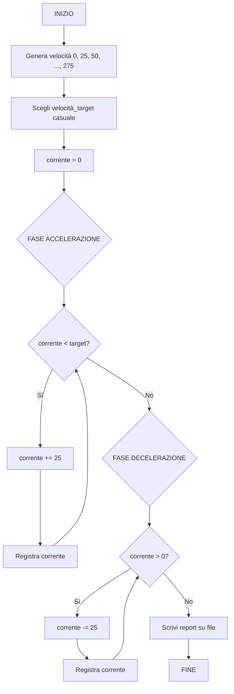

# 6.19.3 — Appello del 17/02/2026 — Turno 2 — Auto da corsa

## Traccia originale

> Un'auto da corsa può raggiungere velocità quantizzate a multipli di 25 km/h. Si progetti un sistema che seleziona casualmente uno dei possibili valori di velocità (considerando una velocità massima di 275 km/h) e invii i valori relativi alla centralina di controllo dell'auto.
>
> **Esercizio 1 – Diagramma di flusso**: Definire un apposito diagramma di flusso che consenta di generare tutti i possibili valori di velocità.
>
> **Esercizio 2 – Programmazione**: Si definisca un programma in grado di schedulare l'accelerazione dell'auto, evitando decelerazioni e riportandola a velocità nulla una volta raggiunto il valore massimo. Si generi un adeguato report in un file di testo.

## Strategia risolutiva

L'auto ha velocità multiple di 25 km/h, da 0 a 275 km/h (massimo). Quindi i valori possibili sono: 0, 25, 50, 75, 100, 125, 150, 175, 200, 225, 250, 275.

Il programma:
1. Genera tutti i possibili valori di velocità (multipli di 25 fino a 275).
2. Ne seleziona uno casualmente come velocità target.
3. Simula l'accelerazione progressiva da 0 a target (senza decelerazioni intermedie).
4. Una volta raggiunto il massimo (o il target), decelera fino a 0.
5. Scrive il report su file.

"Evitando decelerazioni" significa che la fase di accelerazione è monotona crescente senza rallentamenti intermedi.

## Diagramma di flusso



## Soluzione C

```c
#include <stdio.h>
#include <stdlib.h>
#include <time.h>

#define VEL_MAX 275
#define PASSO 25

void genera_velocita(int velocita[], int *n) {
    *n = 0;
    for (int v = 0; v <= VEL_MAX; v += PASSO)
        velocita[(*n)++] = v;
}

int scegli_velocita(const int velocita[], int n) {
    return velocita[rand() % n];
}

void simula_corsa(int target, const char *filename) {
    FILE *f = fopen(filename, "w");
    if (f == NULL) {
        printf("Errore apertura %s\n", filename);
        return;
    }

    fprintf(f, "Report corsa auto\n");
    fprintf(f, "Velocita' target: %d km/h\n\n", target);
    fprintf(f, "--- FASE ACCELERAZIONE ---\n");

    int corrente = 0;
    while (corrente < target) {
        corrente += PASSO;
        fprintf(f, "  %d km/h\n", corrente);
    }

    fprintf(f, "\n--- FASE DECELERAZIONE ---\n");
    while (corrente > 0) {
        corrente -= PASSO;
        fprintf(f, "  %d km/h\n", corrente);
    }

    fprintf(f, "\nCorsa completata.\n");
    fclose(f);
    printf("Report salvato su %s\n", filename);
}

int main() {
    srand(time(NULL));

    int velocita[VEL_MAX / PASSO + 1];
    int n;
    genera_velocita(velocita, &n);

    printf("Velocita' disponibili: ");
    for (int i = 0; i < n; i++)
        printf("%d ", velocita[i]);
    printf("km/h\n");

    int target = scegli_velocita(velocita, n);
    printf("Velocita' target selezionata: %d km/h\n", target);

    simula_corsa(target, "auto_corsa.txt");

    return 0;
}
```

### Spiegazione

| Funzione | Ruolo |
|----------|-------|
| `genera_velocita` | Crea i valori 0, 25, 50, ..., 275 |
| `scegli_velocita` | Seleziona un valore casuale dalla lista |
| `simula_corsa` | Simula accelerazione (0→target) e decelerazione (target→0) scrivendo su file |

### Esempio di output (`auto_corsa.txt`)

```
Report corsa auto
Velocita' target: 150 km/h

--- FASE ACCELERAZIONE ---
  25 km/h
  50 km/h
  75 km/h
  100 km/h
  125 km/h
  150 km/h

--- FASE DECELERAZIONE ---
  125 km/h
  100 km/h
  75 km/h
  50 km/h
  25 km/h
  0 km/h

Corsa completata.
```
