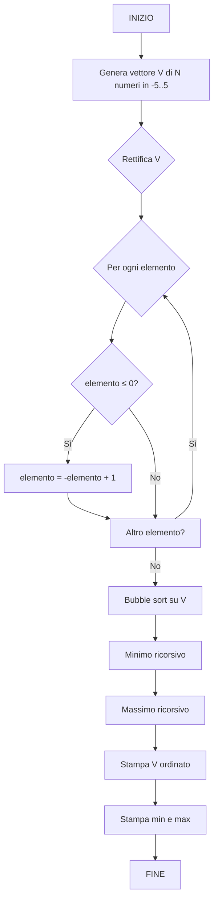

# 6.19.5 — Appello del 17/04/2026 — Vettore e Bubble Sort

## Traccia originale

> Si definisca un programma che:
> 1. Genera un vettore casuale di numeri compresi tra -5 e 5.
> 2. Rettifica i numeri, assicurando che tutti siano maggiori di 0.
> 3. Ordina tale vettore usando l'algoritmo di bubble sort.
> 4. Stampa a schermo il valore minimo e massimo del vettore senza usare iterazioni.
>
> **Esercizio 1 – Diagramma di flusso**: Definire un apposito diagramma di flusso che consenta di generare l'intero programma. Si utilizzino in maniera opportuna le funzioni.
>
> **Esercizio 2 – Programmazione**: Definire un apposito sorgente che consenta di generare l'intero programma. Si utilizzino in maniera opportuna le funzioni.

## Strategia risolutiva

1. **Generazione**: array di N numeri casuali in [-5, 5].
2. **Rettifica**: per ogni elemento, se negativo, si prende il valore assoluto (o si somma abbastanza da renderlo positivo). Un numero > 0 si ottiene con `abs(v[i]) + 1`, ma attenzione: se il numero è 0 va gestito. L'approccio più semplice: sostituire ogni valore ≤ 0 con `-v[i] + 1` (es: -3 → 4, 0 → 1).
3. **Bubble sort**: implementazione standard.
4. **Min/Max senza iterazioni**: usare la ricorsione o un approccio che non sia un ciclo for/while esplicito. Usiamo una funzione ricorsiva.

Non usare iterazioni per min/max significa non usare cicli `for` o `while` per trovarli. Usiamo la ricorsione.

## Diagramma di flusso



## Soluzione C

```c
#include <stdio.h>
#include <stdlib.h>
#include <time.h>

#define N 10

void genera_vettore(int v[], int n) {
    for (int i = 0; i < n; i++)
        v[i] = rand() % 11 - 5;       // [-5, 5]
}

void rettifica(int v[], int n) {
    for (int i = 0; i < n; i++)
        if (v[i] <= 0)
            v[i] = -v[i] + 1;         // es: -3→4, 0→1, -5→6
}

void bubble_sort(int v[], int n) {
    for (int i = 0; i < n - 1; i++) {
        for (int j = 0; j < n - i - 1; j++) {
            if (v[j] > v[j + 1]) {
                int t = v[j];
                v[j] = v[j + 1];
                v[j + 1] = t;
            }
        }
    }
}

int minimo_ricorsivo(const int v[], int n) {
    if (n == 1)
        return v[0];
    int min_resto = minimo_ricorsivo(v + 1, n - 1);
    return v[0] < min_resto ? v[0] : min_resto;
}

int massimo_ricorsivo(const int v[], int n) {
    if (n == 1)
        return v[0];
    int max_resto = massimo_ricorsivo(v + 1, n - 1);
    return v[0] > max_resto ? v[0] : max_resto;
}

void stampa_vettore(const int v[], int n) {
    for (int i = 0; i < n; i++)
        printf("%d ", v[i]);
    printf("\n");
}

int main() {
    srand(time(NULL));

    int v[N];
    genera_vettore(v, N);

    printf("Vettore originale: ");
    stampa_vettore(v, N);

    rettifica(v, N);
    bubble_sort(v, N);

    printf("Vettore rettificato e ordinato: ");
    stampa_vettore(v, N);

    int min = minimo_ricorsivo(v, N);
    int max = massimo_ricorsivo(v, N);

    printf("Minimo (senza iterazioni): %d\n", min);
    printf("Massimo (senza iterazioni): %d\n", max);

    return 0;
}
```

### Spiegazione

| Funzione | Ruolo |
|----------|-------|
| `genera_vettore` | Array casuale in [-5, 5] |
| `rettifica` | Sostituisce i valori ≤ 0 con `-x + 1`, rendendo tutti > 0 |
| `bubble_sort` | Algoritmo bubble sort standard |
| `minimo_ricorsivo` | Ricerca del minimo per ricorsione (senza cicli) |
| `massimo_ricorsivo` | Ricerca del massimo per ricorsione (senza cicli) |

La **rettifica** trasforma numeri negativi o zero in positivi:
- -5 → 6, -3 → 4, 0 → 1, 2 → 2 (invariato)

Funzionamento ricorsione per `minimo_ricorsivo`:
```
minimo([3, 1, 4, 2])
  → min(3, minimo([1, 4, 2]))
       → min(1, minimo([4, 2]))
            → min(4, minimo([2]))
                 → 2
            → min(4, 2) = 2
       → min(1, 2) = 1
  → min(3, 1) = 1
```

### Esempio di output

```
Vettore originale: -1 3 0 -5 4 2 -3 1 -2 5
Vettore rettificato e ordinato: 1 2 2 3 3 4 4 5 6 6
Minimo (senza iterazioni): 1
Massimo (senza iterazioni): 6
```
