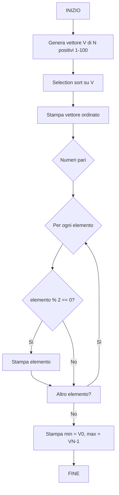

# 6.19.6 — Appello del 24/06/2026 — Selection Sort e Pari

## Traccia originale

> Si definisca un programma che:
> 1. Genera un vettore di numeri casuali positivi.
> 2. Ordini il vettore utilizzando il selection sort o il bubble sort.
> 3. Estragga da tale vettore tutti i numeri pari e visualizzali a schermo.
> 4. Stampi a schermo il valore minimo ed il valore massimo del vettore ordinato.
>
> Si organizzi questo programma in funzioni opportunamente parametrizzabili.
>
> **Esercizio 1 – Diagramma di flusso**: Definire un apposito diagramma di flusso che consenta di generare l'intero programma.
>
> **Esercizio 2 – Programmazione**: Definire il codice che consenta di generare l'intero programma.

## Strategia risolutiva

1. Generare un array di N numeri casuali positivi (es. 1-100).
2. Ordinare con **selection sort**.
3. Estrarre i numeri pari (scorrere l'array e stampare solo quelli pari).
4. Minimo e massimo: dopo l'ordinamento, il minimo è il primo elemento, il massimo è l'ultimo.

"Stampi a schermo il valore minimo ed il valore massimo del vettore ordinato" — dopo l'ordinamento sono rispettivamente `v[0]` e `v[N-1]`. Attenzione: la traccia non vieta iterazioni esplicitamente (a differenza del 17/04), quindi si possono anche calcolare con cicli, ma dopo l'ordinamento è banale.

## Diagramma di flusso



## Soluzione C

```c
#include <stdio.h>
#include <stdlib.h>
#include <time.h>

#define N 10
#define MAX_VAL 100

void genera_positivi(int v[], int n) {
    for (int i = 0; i < n; i++)
        v[i] = rand() % MAX_VAL + 1;          // [1, 100]
}

void selection_sort(int v[], int n) {
    for (int i = 0; i < n - 1; i++) {
        int min_pos = i;
        for (int j = i + 1; j < n; j++)
            if (v[j] < v[min_pos])
                min_pos = j;
        if (min_pos != i) {
            int t = v[i];
            v[i] = v[min_pos];
            v[min_pos] = t;
        }
    }
}

void stampa_pari(const int v[], int n) {
    printf("Numeri pari: ");
    int trovati = 0;
    for (int i = 0; i < n; i++)
        if (v[i] % 2 == 0) {
            printf("%d ", v[i]);
            trovati = 1;
        }
    if (!trovati)
        printf("nessuno");
    printf("\n");
}

void stampa_vettore(const int v[], int n) {
    for (int i = 0; i < n; i++)
        printf("%d ", v[i]);
    printf("\n");
}

int main() {
    srand(time(NULL));

    int v[N];
    genera_positivi(v, N);

    printf("Vettore generato: ");
    stampa_vettore(v, N);

    selection_sort(v, N);

    printf("Vettore ordinato (selection sort): ");
    stampa_vettore(v, N);

    stampa_pari(v, N);

    printf("Minimo: %d\n", v[0]);
    printf("Massimo: %d\n", v[N - 1]);

    return 0;
}
```

### Spiegazione

| Funzione | Ruolo |
|----------|-------|
| `genera_positivi` | Numeri casuali in [1, 100] |
| `selection_sort` | A ogni passo trova il minimo nella parte non ordinata e lo scambia con la prima posizione |
| `stampa_pari` | Itera e stampa gli elementi con `v[i] % 2 == 0` |
| `stampa_vettore` | Stampa tutto l'array |

Minimo e massimo si ottengono direttamente da `v[0]` e `v[N-1]` grazie all'ordinamento.

### Selection sort in azione

```
Passo 1: [64, 25, 12, 22, 11] → trova 11 in [0..4], scambia con 64
         [11, 25, 12, 22, 64]
Passo 2: [11, 25, 12, 22, 64] → trova 12 in [1..4], scambia con 25
         [11, 12, 25, 22, 64]
Passo 3: [11, 12, 25, 22, 64] → trova 22 in [2..4], scambia con 25
         [11, 12, 22, 25, 64]
Passo 4: [11, 12, 22, 25, 64] → già ordinato
```

### Esempio di output

```
Vettore generato: 64 25 12 22 11 88 3 47 56 30
Vettore ordinato (selection sort): 3 11 12 22 25 30 47 56 64 88
Numeri pari: 12 22 30 56 64 88
Minimo: 3
Massimo: 88
```
