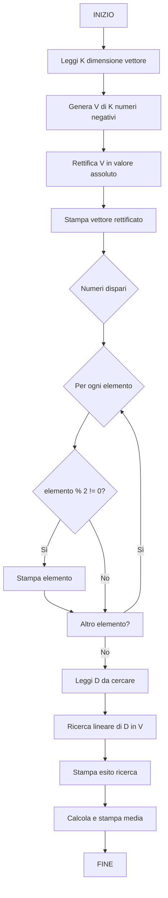

# 6.19.7 — Appello del 09/07/2026 — Vettore Negativi, Dispari, Ricerca Lineare

## Traccia originale

> Si definisca un programma che:
> 1. Genera casualmente un vettore V di K numeri casuali negativi. Esempio: V = [-5, -12, -3, -4]
> 2. Rettifichi tale vettore considerando solo il valore assoluto di ciascun elemento. Quindi V_ret = [5, 12, 3, 4]
> 3. Selezioni tutti i numeri dispari e li visualizzi a schermo. Esempio: V1 = 5, V2 = 3
> 4. Permetta di individuare tramite ricerca lineare un valore D inserito dall'utente.
> 5. Stampi a schermo la media degli elementi del vettore.
>
> Si organizzi questo programma in funzioni opportunamente parametrizzabili e generalizzabili.
>
> **Esercizio 1 – Diagramma di flusso**: Definire un apposito diagramma di flusso che consenta di generare l'intero programma.
>
> **Esercizio 2 – Programmazione**: Definire il codice che consenta di generare l'intero programma.

## Strategia risolutiva

1. **Generazione**: array di K numeri casuali negativi (es. in [-50, -1]).
2. **Rettifica**: valore assoluto con `abs()` (resa positiva con `-v[i]`).
3. **Selezione dispari**: scorrere e stampare gli elementi con `v[i] % 2 != 0`.
4. **Ricerca lineare**: chiedere un valore D all'utente e cercarlo nel vettore con ricerca sequenziale.
5. **Media**: somma/N.

## Diagramma di flusso



## Soluzione C

```c
#include <stdio.h>
#include <stdlib.h>
#include <time.h>

#define MAX_VAL 50
#define DIM_MAX 100

void genera_negativi(int v[], int n) {
    for (int i = 0; i < n; i++)
        v[i] = -(rand() % MAX_VAL + 1);       // [-1, -50]
}

void rettifica(int v[], int n) {
    for (int i = 0; i < n; i++)
        v[i] = -v[i];                         // valore assoluto
}

void stampa_dispari(const int v[], int n) {
    printf("Numeri dispari:\n");
    int count = 0;
    for (int i = 0; i < n; i++)
        if (v[i] % 2 != 0) {
            printf("  V%d = %d\n", count + 1, v[i]);
            count++;
        }
    if (count == 0)
        printf("  Nessun numero dispari\n");
}

int ricerca_lineare(const int v[], int n, int D, int *pos) {
    for (int i = 0; i < n; i++)
        if (v[i] == D) {
            *pos = i;
            return 1;
        }
    return 0;
}

double calcola_media(const int v[], int n) {
    int somma = 0;
    for (int i = 0; i < n; i++)
        somma += v[i];
    return (double)somma / n;
}

void stampa_vettore(const int v[], int n) {
    for (int i = 0; i < n; i++)
        printf("%d ", v[i]);
    printf("\n");
}

int main() {
    srand(time(NULL));

    int K;
    printf("Inserisci il numero K di elementi: ");
    scanf("%d", &K);
    if (K <= 0 || K > DIM_MAX) {
        printf("K deve essere compreso tra 1 e %d\n", DIM_MAX);
        return 1;
    }

    int v[K];
    genera_negativi(v, K);

    printf("Vettore generato: ");
    stampa_vettore(v, K);

    rettifica(v, K);
    printf("Vettore rettificato: ");
    stampa_vettore(v, K);

    stampa_dispari(v, K);

    int D, pos;
    printf("\nInserisci un valore da cercare: ");
    scanf("%d", &D);

    if (ricerca_lineare(v, K, D, &pos))
        printf("Valore %d trovato alla posizione %d\n", D, pos + 1);
    else
        printf("Valore %d non presente nel vettore\n", D);

    double media = calcola_media(v, K);
    printf("Media degli elementi: %.2f\n", media);

    return 0;
}
```

### Spiegazione

| Funzione | Ruolo |
|----------|-------|
| `genera_negativi` | Numeri casuali in [-1, -50] |
| `rettifica` | Trasforma ogni elemento nel suo valore assoluto (`-x`) |
| `stampa_dispari` | Stampa solo gli elementi dispari col formato richiesto |
| `ricerca_lineare` | Scansione sequenziale: restituisce 1 se trovato, 0 altrimenti |
| `calcola_media` | Somma / n come `double` |

La **rettifica** in questo caso è semplice: se i numeri sono tutti negativi, `-v[i]` è il valore assoluto.

### Esempio di output

```
Inserisci il numero K di elementi: 6
Vettore generato: -5 -12 -3 -4 -8 -15
Vettore rettificato: 5 12 3 4 8 15
Numeri dispari:
  V1 = 5
  V2 = 3
  V3 = 15

Inserisci un valore da cercare: 8
Valore 8 trovato alla posizione 5
Media degli elementi: 7.83
```
