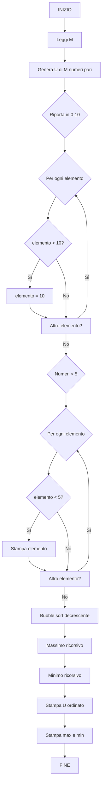

# 6.19.8 — Appello del 27/07/2026 — Vettore Pari, Ordinamento Decrescente

## Traccia originale

> Si definisca un programma che:
> 1. Generi casualmente un vettore U di M numeri casuali pari. Esempio, se M = 4: U = [2, 8, 12, 4]
> 2. Riporti tutti gli elementi di U all'interno dell'intervallo [0, 10]. Quindi: U_ret = [2, 8, 10, 4]
> 3. Selezioni tutti i numeri inferiori a 5 e visualizzarli a schermo. Esempio: U1 = 2, U2 = 4
> 4. Ordini il vettore U in ordine decrescente usando un algoritmo a scelta tra selection, bubble ed insertion sort.
> 5. Stampi a schermo il valore massimo e minimo di U senza usare cicli.
>
> Si organizzi questo programma in funzioni opportunamente parametrizzabili e generalizzabili.
>
> **Esercizio 1 – Diagramma di flusso**: Definire un apposito diagramma di flusso che consenta di generare l'intero programma.
>
> **Esercizio 2 – Programmazione**: Definire il codice che consenta di generare l'intero programma.

## Strategia risolutiva

1. **Generazione**: M numeri casuali **pari** (es. in [0, 100], generando un numero intero e raddoppiandolo).
2. **Riporto in [0, 10]**: per ogni elemento, se > 10, si applica `x % 10` oppure si imposta a 10. La traccia dice "riporti all'interno dell'intervallo [0,10]" — valori già in [0,10] restano invariati; valori > 10 vengono portati al massimo a 10. Es: 12 → 10.
3. **Selezione < 5**: scorrere e stampare.
4. **Ordinamento decrescente**: bubble sort (o selection/insertion) con confronto invertito.
5. **Min/Max senza iterazioni**: approccio ricorsivo (come nel 17/04).

## Diagramma di flusso



## Soluzione C

```c
#include <stdio.h>
#include <stdlib.h>
#include <time.h>

#define DIM_MAX 100
#define MAX_VAL 50

void genera_pari(int v[], int n) {
    for (int i = 0; i < n; i++)
        v[i] = (rand() % (MAX_VAL + 1)) * 2;  // 0, 2, 4, ..., 100
}

void riporta_in_intervallo(int v[], int n) {
    for (int i = 0; i < n; i++)
        if (v[i] > 10)
            v[i] = 10;
}

void stampa_minori_di_5(const int v[], int n) {
    printf("Numeri inferiori a 5:\n");
    int count = 0;
    for (int i = 0; i < n; i++)
        if (v[i] < 5) {
            printf("  U%d = %d\n", count + 1, v[i]);
            count++;
        }
    if (count == 0)
        printf("  Nessun numero < 5\n");
}

void bubble_sort_decrescente(int v[], int n) {
    for (int i = 0; i < n - 1; i++) {
        for (int j = 0; j < n - i - 1; j++) {
            if (v[j] < v[j + 1]) {           // confronto invertito
                int t = v[j];
                v[j] = v[j + 1];
                v[j + 1] = t;
            }
        }
    }
}

int massimo_ricorsivo(const int v[], int n) {
    if (n == 1)
        return v[0];
    int max_resto = massimo_ricorsivo(v + 1, n - 1);
    return v[0] > max_resto ? v[0] : max_resto;
}

int minimo_ricorsivo(const int v[], int n) {
    if (n == 1)
        return v[0];
    int min_resto = minimo_ricorsivo(v + 1, n - 1);
    return v[0] < min_resto ? v[0] : min_resto;
}

void stampa_vettore(const int v[], int n) {
    for (int i = 0; i < n; i++)
        printf("%d ", v[i]);
    printf("\n");
}

int main() {
    srand(time(NULL));

    int M;
    printf("Inserisci il numero M di elementi: ");
    scanf("%d", &M);
    if (M <= 0 || M > DIM_MAX) {
        printf("M deve essere compreso tra 1 e %d\n", DIM_MAX);
        return 1;
    }

    int u[M];
    genera_pari(u, M);

    printf("Vettore generato: ");
    stampa_vettore(u, M);

    riporta_in_intervallo(u, M);
    printf("Vettore riportato in [0, 10]: ");
    stampa_vettore(u, M);

    stampa_minori_di_5(u, M);

    bubble_sort_decrescente(u, M);
    printf("Vettore ordinato decrescente: ");
    stampa_vettore(u, M);

    int max = massimo_ricorsivo(u, M);
    int min = minimo_ricorsivo(u, M);
    printf("Massimo (senza iterazioni): %d\n", max);
    printf("Minimo (senza iterazioni): %d\n", min);

    return 0;
}
```

### Spiegazione

| Funzione | Ruolo |
|----------|-------|
| `genera_pari` | Genera numeri pari moltiplicando per 2 un intero casuale |
| `riporta_in_intervallo` | Cap a 10 per gli elementi > 10 |
| `stampa_minori_di_5` | Filtra e stampa elementi < 5 |
| `bubble_sort_decrescente` | Bubble sort con confronto `<` invece di `>` |
| `massimo_ricorsivo` | Massimo per ricorsione (senza cicli) |
| `minimo_ricorsivo` | Minimo per ricorsione (senza cicli) |

**Generazione numeri pari**: `rand() % (MAX_VAL + 1)` produce 0..50, poi `* 2` dà 0, 2, 4, ..., 100.

**Riporto in [0, 10]**: valori ≤ 10 restano invariati, valori > 10 diventano 10. Es: 12 → 10, 8 → 8.

### Esempio di output

```
Inserisci il numero M di elementi: 6
Vettore generato: 2 8 12 4 16 6
Vettore riportato in [0, 10]: 2 8 10 4 10 6
Numeri inferiori a 5:
  U1 = 2
  U2 = 4
Vettore ordinato decrescente: 10 10 8 6 4 2
Massimo (senza iterazioni): 10
Minimo (senza iterazioni): 2
```
