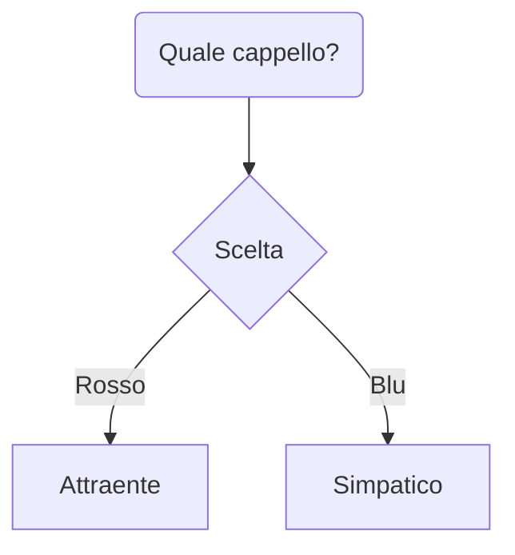
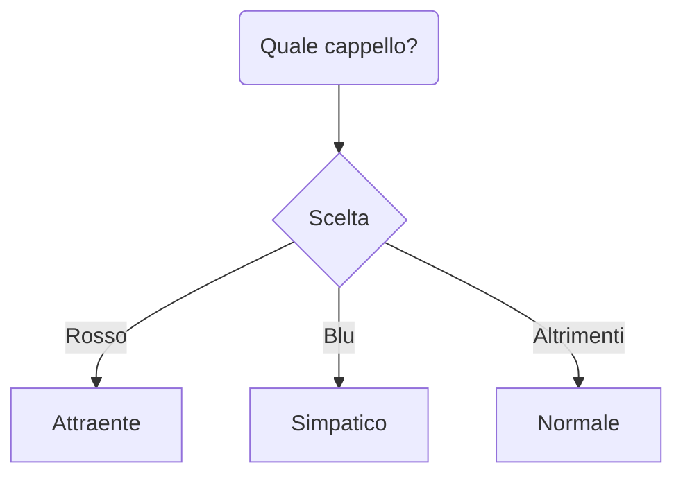

# Le istruzioni condizionali in MATLAB

Abbiamo già visto l'istruzione condizionale quando abbiamo parlato dei concetti alla base della programmazione strutturata. Ricordiamo brevemente a cosa servono.

## L'istruzione condizionale: un breve richiamo

Supponiamo di essere davanti al nostro armadio, e di dover prendere una decisione fondamentale: quale cappello indossare tra i due che abbiamo a disposizione?

La vita, ovviamente, ci pone davanti ad un bivio: se indossiamo il cappello rosso, risulteremo essere molto più attraenti, ma poco simpatici, mentre se indossiamo il cappello blu, saremo simpatici ma poco attraenti. Volendo strutturare la nostra vita come un algoritmo, ci troveremo davanti alla seguente situazione:



Questa scelta è modellabile secondo un blocco `IF-THEN-ELSE`, che descrive le seguenti occorrenze:

```
IF scelta == rosso
    THEN divento attraente
ELSE
    divento simpatico
```

In altri termini:
* *se* (`IF`) scelgo il cappello rosso...
* ...*allora* (`THEN`) divento più attraente...
* ...*altrimenti* (`ELSE`) divento più simpatico.

!!!warning "Attenzione
    Notiamo come l'`ELSE` rappresenti *tutte* le conseguenze che accadono qualora la condizione rappresentata da `IF` *non sia vera*. In altre parole, anche non indossando un cappello risulterò essere più simpatico!

Per ovviare all'eccesso di simpatia derivante dal non indossare un cappello, dovremo necessariamente utilizzare un'altra istruzione, ovvero la `ELSE IF`. In pratica, per portarci in questa situazione:



dovremo usare un blocco di questo tipo:

```
IF scelta == rosso
    THEN divento attraente
ELSE IF scelta == blu
    THEN divento simpatico
ELSE
    resto normale
```

In altri termini:
* *se* (`IF`) scelgo il cappello rosso...
* ...*allora* (`THEN`) divento più attraente...
* ...*altrimenti, se* (`ELSE IF`) scelgo il cappello blu...
* ...*allora* (`THEN`) divento più simpatico...
* ...*altrimenti* (`ELSE`) resto normale.

Utilizzando questa serie di istruzioni siamo quindi in grado di modellare ogni possibile scelta.

!!!note "Cosa succede se ho altri cappelli?"
    B
