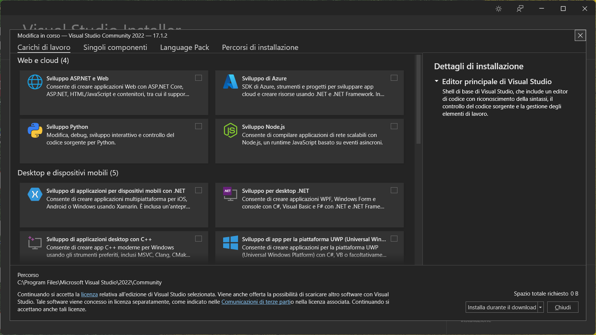

# Appendice A - Installazione di Visual Studio Community

1. Andare al seguente [indirizzo](https://visualstudio.microsoft.com/it/vs/community/), e selezionare l'opzione **Scarica Visual Studio**.
2. Si aprirà un'altra pagina, e verrà scaricato un file chiamato `VisualStudioSetup.exe` (o similari nel caso di installazione via MacOS). Lanciarlo per avviare il programma di installazione.
3. Confermare la procedura di installazione di **Visual Studio Installer**.
4. Una volta terminato il download dei file necessari, apparirà la schermata di **Visual Studio Installer**. Selezionare la versione Community, ed attendere il termine della procedura di installazione.
5. Selezionare **Modifica**. Si aprirà l'interfaccia mostrata in figura.

6. Selezioniamo la casella di spunta a destra di **Sviluppo di applicazioni desktop con C++**, premiamo il pulsante **Modifica** in basso a destra, ed attendiamo il termine dell'installazione.
