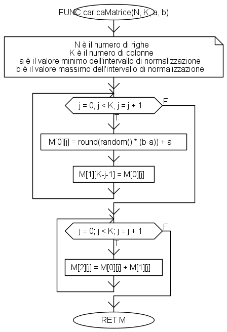
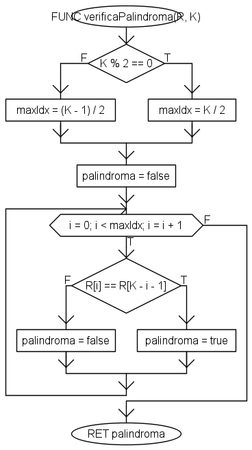
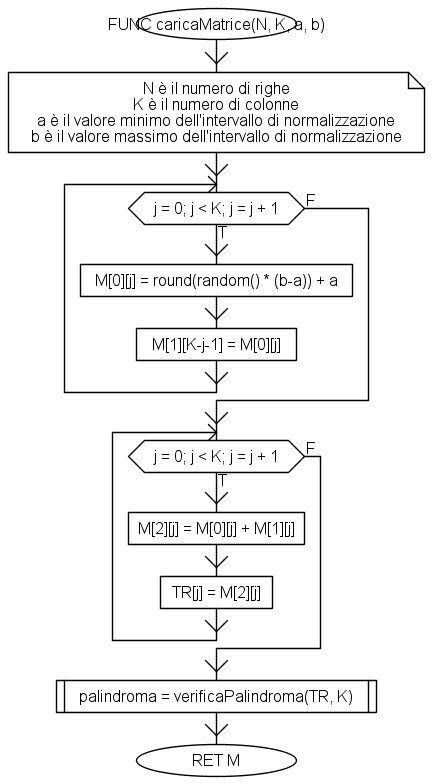

# Soluzione all'esercizio 1

## Parte 1: `caricaMatrice()`

La funzione `caricaVettore()` è mostrata in figura 1.

<figure markdown>
  
  <figcaption>Figura 1 - La funzione caricaMatrice()</figcaption>
</figure>

Facciamo alcune osservazioni. Partiamo dai parametri formali accettati dalla funzione, che sono:
* `N`, ovvero il numero di righe (in questo caso, pari a 3);
* `K`, ovvero il numero di colonne (in questo caso, pari a 4);
* `a`, ovvero il valore minimo dell'intervallo di normalizzazione (in questo caso, pari a 3);
* `b`, ovvero il valore massimo dell'intervallo di normalizzazione (in questo caso, pari a 15).

Vediamo adesso come costruire la matrice. Nel primo ciclo `for`, andiamo a costruire le prime due righe della matrice. In particolare, nella prima istruzione andiamo ad assegnare il valore `M[0][j]`, ovvero il `j`-mo valore della prima riga, generandolo casualmente ed applicando la formula base della normalizzazione. Contestualmente, andiamo a creare la seconda riga, assegnando il valore `M[1][K-j-1]` come `M[0][j]`.

!!!note "Scaling dei valori"
    La funzione implementata tiene conto che i valori generati dalla funzione `random()` sono compresi tra `0` ed `1`, che sono anche i valori minimo e massimo da inserire nella formula standard per la normalizzazione. E' comunque del tutto lecito scrivere una funzione a parte per normalizzare in maniera generalizzabile.

!!!tip "Scelta dell'indice di colonna"
    La scelta dell'indice di colonna è facilmente motivabile tenendo conto del fatto che Algobuild è zero-indexed. Di conseguenza, dato che vogliamo che il primo elemento della prima riga, ovvero `M[0][0]`, sia uguale all'ultimo elemento della seconda, ovvero `M[1][3]`, dobbiamo trovare una forma per esprimere la colonna su cui stiamo agendo nella seconda riga in funzione di quella su cui stiamo agendo nella prima. Considerato quindi che, alla prima iterazione, `j=0`, mentre `K=4`, per ottenere il valore `3` dovremo usare la formula `K-j-1`. Potremo verificare la bontà della nostra scelta andando a valutare cosa accade quando `j=3`: in questo caso, infatti, `K-j-1=4-3-1=0`, il che è ciò che ci aspettiamo accada quando andiamo a considerare l'ultimo elemento della prima riga (`M[0][3]`) ed il primo della seconda (`M[1][0]`).

Nel secondo ciclo, invece, ci limitiamo a sommare i valori nella prima e seconda riga per ottenere la terza.

## Parte 2: `verificaPalindroma()`

La verifica della palindromia della terza riga è mostrata in figura 2.

<figure markdown>
  
  <figcaption>Figura 2 - La funzione verificaPalindroma()</figcaption>
</figure>

I parametri formali da passare a questa funzione sono `R`, ovvero la riga che vogliamo analizzare, e `K`, ovvero la lunghezza della stessa.

Per prima cosa, è opportuno verificare se `K` è dispari o meno. Ciò comporta che:

* se `K` è dispari, allora dovremo andare a confrontare i primi $\frac{K-1}{2}$ elementi della riga con gli ultimi $\frac{K-1}{2}$;
* se `K` è pari, dovremo confrontare la prima metà della stringa con la seconda.

Facciamo un esempio. Se, come nel nostro caso, `K=4`, allora dovremo confrontare i primi due elementi con gli ultimi due, ovvero dovremo verificare che `R[0] == R[3]`, ed `R[1] == R[2]`. Se, invece, `K` è dispari (immaginiamo, ad esempio, `K=7`), allora dovremo confrontare i primi tre elementi di `R` con gli ultimi tre, tralasciando quello centrale che, come ovvio, sarà uguale a sè stesso, garantendo la palindromia.

Determinare quindi il valore dell'indice massimo su cui andare ad effettuare il confronto ci sarà utile per la seconda parte della funzione, nella quale andremo ad effettuare la verifica di quanto asserito in precedenza. In questa versione, la funzione restituisce un booleano chiamato `palindroma`, che assumerà valore vero se e solo se la condizione `R[i] == R[K-i-1]` è verificata per tutti i valori di `i` che vanno da `0` a `maxIdx`. Nel nostro caso, quindi, verificheremo:

* alla prima iterazione, con `i=0`, che `R[0]` sia uguale ad `R[K-i-1]=R[4-0-1]=R[3]`;
* alla seconda iterazione, con `i=1`, che `R[1]` sia uguale ad `R[K-i-1]=R[4-1-1]=R[2]`.

Completata questa verifica, saremo in grado di affermare se la riga è palindroma o meno.

!!!note "Verifica mediante logica booleana"
    I più attenti possono notare come la verifica della condizione di palindromia sia facilmente implementabile anche mediante una condizione booleana. In particolare, potremo andare ad inizializzare `palindroma` come `true` e, conseguentemente, andare ad inserire la condizione `R[i] == R[K-i-1]` in AND logico ad ogni iterazione. L'implementazione è lasciata ai più volenterosi.

La funzione `verificaPalindroma` può quindi essere integrata all'interno di `caricaMatrice`, che assumerà la seguente forma.

<figure markdown>
  
  <figcaption>Figura 3 - La funzione caricaMatrice() aggiornata</figcaption>
</figure>

## Parte 3: `vettorizza()`

## Parte 4: `ordinaVettore()`

La funzione di ordinamento è quella classica del selection sort. L'unica modifica sta nel sengo 

## Parte 5: `calcolaStatistiche()`

## Parte 6: `stampa()`

## Script complessivo

Nello script complessivo usiamo due ulteriori sezioni, una per l'inserimento e la verifica della lunghezza del vettore (parametro `N`), ed una per l'inserimento e la verifica delle modalità di caricamento del vettore (parametro `modCar`). Da notare che in entrambe queste sezioni viene utilizzato un `do-while` per verificare la correttezza del valore inserito dall'utente.

Inoltre, vi è la verifica su quest'ultimo valore che, se pari a `0`, comporta l'uscita dal programma.

<figure markdown>
  
  <figcaption>Figura 1 - Lo script principale</figcaption>
</figure>

!!!note "Nota"
    Le ulteriori sezioni possono essere inserite all'interno di apposite funzioni per la verifica dei valori.
