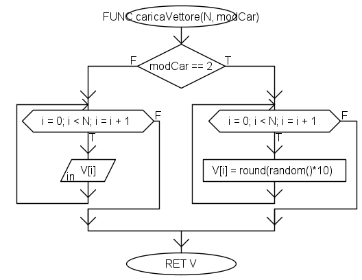
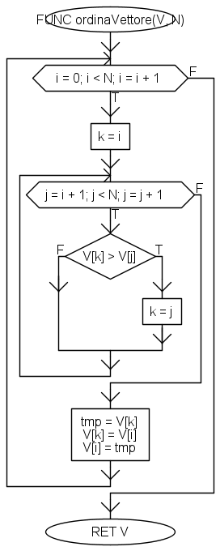
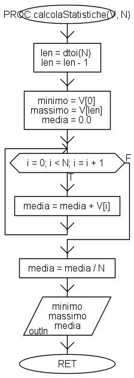
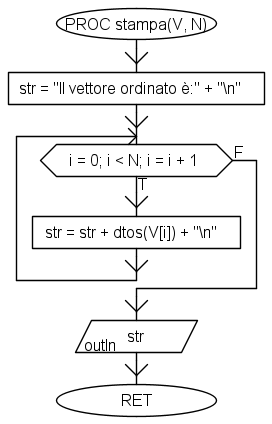
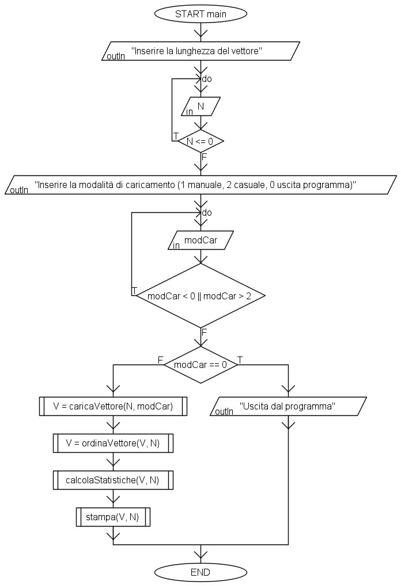

# Traccia del 17/01/2024

## Esercizio 1

Utilizzando i flowchart e formalizzandoli in Algobuild, definire gli algoritmi per soddisfare le seguenti richieste.
1. Caricare un vettore colonna $V$ di dimensione $N$. Gli elementi di $V$ devono essere numeri interi positivi i quali possono essere caricati in maniera autonoma dall’utente o generati in maniera casuale. Si noti che la modalità di caricamento deve essere specificata a monte mediante un opportuno menu di scelta.
2. Ordinare il vettore $V$ secondo un ordinamento crescente.
3. Calcolare il massimo, il minimo e la media dei valori del vettore $V$ (ordinato).
4. Stampare a schermo il vettore $V$ in maniera che venga rappresentato come un vettore colonna. Ad esempio:

\begin{align}
V_1 \\
V_2 \\
\ldots \\
V_n \\
\end{align}


È richiesto che il programma sia suddiviso in procedure e/o funzioni opportunamente generalizzabili.

## Esercizio 2

Utilizzando l’ambiente di programmazione Matlab, implementare un programma che esegua le funzioni dell’esercizio 1, utilizzando un’opportuna combinazione di script, funzioni e procedure.

<!-- ## Soluzione all'esercizio 1

### Parte 1: `caricaVettore()`

La funzione `caricaVettore()` è mostrata nella seguente figura. Da notare come la modalità di caricamento (`modCar`) debba essere specificata tra i parametri formali. Inoltre, dato che non viene specificato altrimenti, si utilizza per semplicità la funzione composta `round(random()*10)` per generare un numero casuale compreso tra `0` ed `1` (mediante `round()`), moltiplicarlo per `10`, ed arrotondarlo.

<figure markdown>
  
  <figcaption>Figura 1 - La funzione caricaVettore()</figcaption>
</figure>

### Parte 2: `ordinaVettore()`

L'ordinamento del vettore avviene per selezione (*selection sort*). Il funzionamento dell'algoritmo è standard.

<figure markdown>
  
  <figcaption>Figura 1 - La funzione ordinaVettore()</figcaption>
</figure>

### Parte 3: `calcolaStatistiche()`

La procedura `calcolaStatistiche()` sfrutta l'ordinamento crescente del vettore. Da notare che, dato che `N` è rimasto `double` (formato di default di Algobuild), utilizziamo la funzione `dtoi` per creare una variabile temporanea `len` di tipo intero, a cui sottraiamo il valore `1` (sempre intero), e che utilizziamo per recuperare il massimo del vettore.

<figure markdown>
  
  <figcaption>Figura 1 - La procedura calcolaStatistiche()</figcaption>
</figure>

### Parte 4: `stampa()`

Nella procedura `stampa` creiamo una singola stringa che man mano popolata con i valori del vettore `V`, opportunamente convertiti in stringhe mediante la funzione `dtos()`, e stampati a schermo al termine dell'iterazione.

<figure markdown>
  
  <figcaption>Figura 1 - La procedura stampa()</figcaption>
</figure>

### Script complessivo

Nello script complessivo usiamo due ulteriori sezioni, una per l'inserimento e la verifica della lunghezza del vettore (parametro `N`), ed una per l'inserimento e la verifica delle modalità di caricamento del vettore (parametro `modCar`). Da notare che in entrambe queste sezioni viene utilizzato un `do-while` per verificare la correttezza del valore inserito dall'utente.

Inoltre, vi è la verifica su quest'ultimo valore che, se pari a `0`, comporta l'uscita dal programma.

<figure markdown>
  
  <figcaption>Figura 1 - Lo script principale</figcaption>
</figure>

!!!note "Nota"
    Le ulteriori sezioni possono essere inserite all'interno di apposite funzioni per la verifica dei valori.

## Soluzione all'esercizio 2

Per l'esecizio 2 è opportuno ragionare allo stesso modo in cui si è ragionato per l'esercizio 1. In particolare, procediamo a strutturare il nostro script principale (`main.m`) ricalcando l'andamento delle istruzioni usate in Algobuild.

Partiamo con la classica coppia `clear` e `clc`, le quali, come ricordiamo, servono (rispettivamente) a rimuovere le variabili esistenti dal workspace, ed a "pulire" la command window.

```Matlab
clear
clc
```

Fatto questo, possiamo richiedere all'utente il valore di $N$, ovvero la lunghezza da assegnare al nostro vettore.

```Matlab
N = -1;
while N > 0
    N = input("Inserire la lunghezza richiesta:\n");
end
```

Ricordiamo che:
1. è necessario inserire l'escape character `\n` per fare in modo che, durante la visualizzazione, la stringa vada a capo;
2. dobbiamo verificare che il valore inserito sia strettamente positivo.

### Parte 1: `caricaVettore()`

Possiamo adesso creare la funzione `caricaVettore()`, delegata al caricamento dello stesso. Creiamo una nuova funzione, ed inseriamo il seguente codice:

```Matlab linenums="1"
function [V, modCar] = caricaVettore(N)

V = zeros(1, N);
modCar = input("Inserire la modalità di caricamento.\n" + ...
    "1: caricamento manuale\n" + ...
    "2: caricamento casuale\n" + ...
    "0: uscita dal programma");

switch modCar
    case 0
        disp("Uscita dal programma")
        return
    case 1
        while i <= N
            fprintf("Inserire l'elemento in posizione %d\n", i);
            val = input("");
            if val > 0
                i = i + 1;
            else
                disp("Valore non valido. Riprovare.")
            end
        end
    case 2
        disp("Generazione casuale del vettore...")
        for i = 1:N
            V(i) = randi(100);
        end
    otherwise
        error("Modalità non conosciuta. Uscita dal programma.")
end

end
```

Analizziamo la funzione istruzione per istruzione.

Alla prima riga, abbiamo la dichiarazione della funzione:

```matlab linenums="1"
function [V, modCar] = caricaVettore(N)
```

In particolare, quindi, la funzione avrà il nome `caricaVettore`, accetterà come parametro formale `N`, rappresentativo della lunghezza del vettore da considerare, e restituirà gli argomenti `V` e `modCar`. Il primo sarà proprio il vettore desiderato (`V`), mentre il secondo sarà un indicatore della modalità di caricamento scelta dall'utente.

Analizziamo adesso le righe 3-7:

```matlab linenums="3"
V = zeros(N, 1);
modCar = input("Inserire la modalità di caricamento.\n" + ...
    "1: caricamento manuale\n" + ...
    "2: caricamento casuale\n" + ...
    "0: uscita dal programma");
```

Queste righe permettono di preallocare un vettore colonna di dimensione `N`, e di richiedere all'utente la modalità di caricamento del vettore, scegliendo tra `1` (caricamento manuale), `2` (caricamento casuale), e `0` (uscita dal programma).

Ovviamente, dovremo gestire tutte e tre le situazioni, oltre che il caso in cui l'utente prema per sbaglio un altro pulsante. In tal senso, potremo usare uno `switch-case`.

```matlab
switch modCar
    case 0
        disp("Uscita dal programma")
        return
    case 1
        while i <= N
            fprintf("Inserire l'elemento in posizione %d\n", i);
            val = input("");
            if val > 0 && mod(val, 0) == 0
                i = i + 1;
            else
                disp("Valore non valido. Riprovare.")
            end
        end
    case 2
        disp("Generazione casuale del vettore...")
        for i = 1:N
            V(i) = randi(100);
        end
    otherwise
        error("Modalità non conosciuta. Uscita dal programma.")
end
```

Vediamo che:

* nel `case 0`, gestiamo il caso in cui `modCar` sia pari proprio a `0`. In questo caso, visualizziamo a schermo un messaggio all'utente, ed usciamo dalla funzione mediante l'istruzione `return`;
* nel `case 1`, gestiamo il caso in cui `modCar` sia pari proprio a `1`. In questo caso, usiamo un `while` per fare in modo che l'utente possa inserire manualmente i valori. Ovviamente, controlliamo che i valori siano maggiori di zero, e che il modulo 1 sia uguale a zero (e che quindi il numero sia intero). Se ciò non è vero, sarà richiesto all'utente di caricare nuovamente il valore;
* nel `case 2`, gestiamo l'inserimento casuale dei valori. Per farlo, sfruttiamo la funzione `randi()`, che genera valori casuali compresi di default tra `1` ed il parametro passato (in questo caso, `100`);
* nell'`otherwise`, chiamato in ogni altra situazione, gestiamo una situazione di errore, uscendo dal programma.

!!!note "Note"
    Da notare come il valore massimo casuale passato sia scelto in maniera arbitraria come proprio pari a `100`.

### Parte 2: `ordinaVettore()`

Vediamo ora come ordinare il vettore caricato nel punto precedente. Scriviamo la funzione `ordinaVettore()`, che implementa l'algoritmo di ordinamento *selection sort*.

```matlab
function V = ordinaVettore(V)

for i = 1:length(V)
    k = i;
    for j = i+1:length(V)
        if V(k) > V(j)
            k = j;
        end
    end
    tmp = V(k);
    V(k) = V(i);
    V(i) = tmp;
end
end
```

La funzione `ordinaVettore(V)` accetta quindi il vettore `V` in ingresso, e restituisce lo stesso vettore ordinato. Per farlo, utilizzeremo un ciclo esterno (con indice `i`) ed un ciclo interno (con indice `j`).

Ad ogni iterazione del ciclo esterno, andremo ad utilizzare una variabile di appoggio `k`, che inizialmente sarà pari ad `i`. Fatto questo, useremo un ciclo interno, che partirà dall'elemento immediatamente successivo a `j`. 

Verifichiamo, ad ogni iterazione del ciclo interno, se l'elemento in posizione `k` sia maggiore di quello in posizione `j`; se ciò è vero, provvediamo allo scambio, altrimenti questo non avviene. In altre parole, stiamo cercando il valore *minimo* della restante parte del vettore e, al termine del ciclo interno, lo andremo a sostituire al valore analizzato dal ciclo esterno sfruttando la variabile temporanea `tmp`.

!!!tip "Lunghezza del vettore"
    Potremmo pensare di inserire come parametri formali in ingresso alla funzione `ordinaVettore()` non solo `V`, ma anche `N`. Tuttavia, questo parametro è superfluo, visto e considerato che MATLAB ci offre la funzione `length(V)` che restituisce la lunghezza del vettore passato come parametro. In alternativa, potremmo decidere di usare la funzione `size(V, 1)`, che ci restituisce il numero di righe del vettore (che, nel caso di un vettore colonna, coincide anche con la lunghezza dello stesso). 

### Parte 3: `calcolaStatistiche()`

Nella terza parte provvederemo a calcolare le tre statistiche richieste, ovvero *minimo*, *massimo* e *media*. Da notare che effettueremo questa operazione *sul vettore ordinato*, per cui potremo sfruttare questa caratteristica per giungere rapidamente all'individuazione dei primi due valori. Infatti, potremo scrivere la funzione come segue:

```matlab
function calcolaStatistiche(V)

minimo = V(1);
massimo = V(length(V));

media = 0;

for i = 1:length(V)
    media = media + V(i);
end

media = media / length(V);

end
```

Vediamo come il `minimo` sia dato dal primo valore del vettore ordinato, mentre il massimo sia quello in posizione `length(V)` che, grazie all'indicizzazione offerta dal MATLAB, è proprio quello in ultima posizione. Per ciò che riguarda invece la media, procediamo al calcolo della stessa usando un semplice ciclo for.

!!!note "Nota per il calcolo delle statistiche"
    Ovviamente, questo modo di procedere vale soltanto nel caso il vettore sia ordinato. In caso di vettore non ordinato, il massimo ed il minimo dovranno essere calcolati mediante due semplici cicli enumerativi. Tuttavia, nel contesto della traccia, possiamo tranquillamente procedere come indicato nella funzione `calcolaStatistiche()`.

### Parte 4: `stampa()`

L'ultima parte prevede la stampa a schermo del vettore. Per farlo, potremo scegliere diverse opzioni, tra cui:

* costruire una stringa e visualizzarla al termine del ciclo;
* usare la funzione `fprintf` all'interno di un ciclo;
* utilizzare la funzione `disp`.

Vediamo brevemente tutte le possibili modalità:

```matlab
function stampa(V)

str = "Il vettore ordinato è:\n";
for i = 1:length(V)
    str = str + num2str(V(i)) + "\n";
end

fprintf(str);

end
```

In pratica, creeremo una stringa `str` a cui concateneremo, ad ogni iterazione, il valore `i`-mo di `V` seguito dall'escape character `\n`. Al termine, visualizzeremo la stringa creata mediante la funzione `fprintf`.

Se volessimo usare la funzione `fprintf` all'interno di un ciclo, dovremmo procedere come segue:

```matlab
function stampa(V)

fprintf("Il vettore ordinato è: \n");
for i = 1:length(V)
    fprintf("%d\n", V(i));
end
```

Infine, usando la funzione `disp`:

```matlab
function stampa(V)

disp("Il vettore ordinato è: ")
for i = 1:length(V)
    disp(V(i))
end
```

### Script complessivo

Combiniamo tutte le funzioni in quello che è lo script complessivo risultante.

```matlab
clear
clc

N = input("Inserire la lunghezza del vettore\n");
[V, modCar] = caricaVettore(N);
if modCar == 0
    return
end

V = ordinaVettore(V);

stampa(V);
```

Da notare che il valore `modCar` viene utilizzato immediatamente dopo la chiamata a `caricaVettore()`: infatti, se questo è pari a `0`, entreremo nell'istruzione condizionale mostrata alla riga 6, che terminerà immediatamente il programma grazie all'istruzione `return`.

!!!note "Gestione della modalità sconosciuta"
    In questa versione del programma, abbiamo scelto di gestire sia una modalità di inserimento non conosciuta, lanciando un errore, sia di dare all'utente la possibilità di terminare il programma. Altre modalità di gestione di tale scelta (ad esempio, forzando la scelta a soli due valori mediante un'istruzione condizionale) sono altrettanto valide nel contesto della traccia. -->
