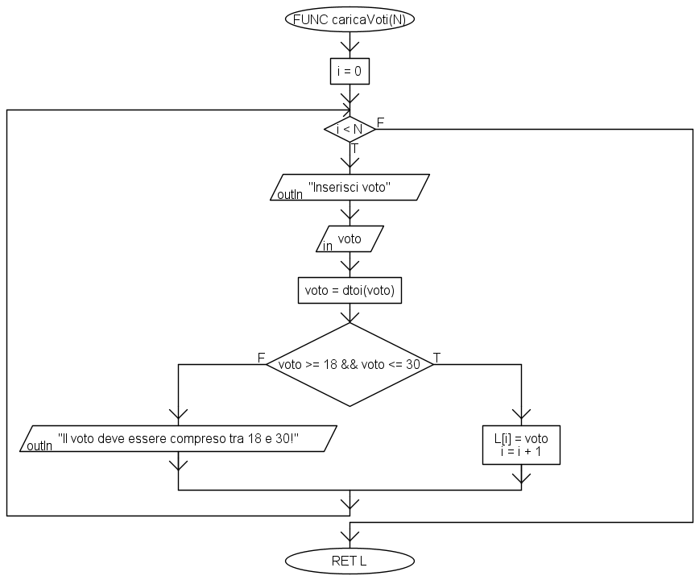

# Soluzione all'esercizio 1

## Parte 1: `caricaVoti()`

In figura 1 è mostrata la funzione `caricaVoti()`. Da notare che, rispetto all'implementazione che vedremo in MATLAB, la funzione non prevede il controllo del valore intero, ma "forza" lo stesso mediante una chiamata alla funzione `dtoi()` che, ricorderemo, trasforma un `double` (tipo accettato di default da Algobuild) in un `int`.

<figure markdown>
  
  <figcaption>Figura 1 - La funzione caricaVoti()</figcaption>
</figure>

## Parte 2: `ordinaVoti()`

L'ordinamento del vettore avviene usando un algoritmo di bubble sort standard, come quello mostrato in figura 2.

<figure markdown>
  
  <figcaption>Figura 1 - La funzione ordinaVettore()</figcaption>
</figure>

## Parte 3: `calcolaMedia()`

La procedura `calcolaStatistiche()` sfrutta l'ordinamento crescente del vettore. Da notare che, dato che `N` è rimasto `double` (formato di default di Algobuild), utilizziamo la funzione `dtoi` per creare una variabile temporanea `len` di tipo intero, a cui sottraiamo il valore `1` (sempre intero), e che utilizziamo per recuperare il massimo del vettore.

<figure markdown>
  
  <figcaption>Figura 1 - La procedura calcolaStatistiche()</figcaption>
</figure>

## Parte 3: `calcolaVotoLaurea()`

La procedura `calcolaStatistiche()` sfrutta l'ordinamento crescente del vettore. Da notare che, dato che `N` è rimasto `double` (formato di default di Algobuild), utilizziamo la funzione `dtoi` per creare una variabile temporanea `len` di tipo intero, a cui sottraiamo il valore `1` (sempre intero), e che utilizziamo per recuperare il massimo del vettore.

<figure markdown>
  
  <figcaption>Figura 1 - La procedura calcolaStatistiche()</figcaption>
</figure>

## Parte 5: `stampaRisultati()`

Nella procedura `stampa` creiamo una singola stringa che man mano popolata con i valori del vettore `V`, opportunamente convertiti in stringhe mediante la funzione `dtos()`, e stampati a schermo al termine dell'iterazione.

<figure markdown>
  
  <figcaption>Figura 1 - La procedura stampa()</figcaption>
</figure>

## Script complessivo

Nello script complessivo usiamo due ulteriori sezioni, una per l'inserimento e la verifica della lunghezza del vettore (parametro `N`), ed una per l'inserimento e la verifica delle modalità di caricamento del vettore (parametro `modCar`). Da notare che in entrambe queste sezioni viene utilizzato un `do-while` per verificare la correttezza del valore inserito dall'utente.

Inoltre, vi è la verifica su quest'ultimo valore che, se pari a `0`, comporta l'uscita dal programma.

<figure markdown>
  
  <figcaption>Figura 1 - Lo script principale</figcaption>
</figure>

!!!note "Nota"
    Le ulteriori sezioni possono essere inserite all'interno di apposite funzioni per la verifica dei valori.
