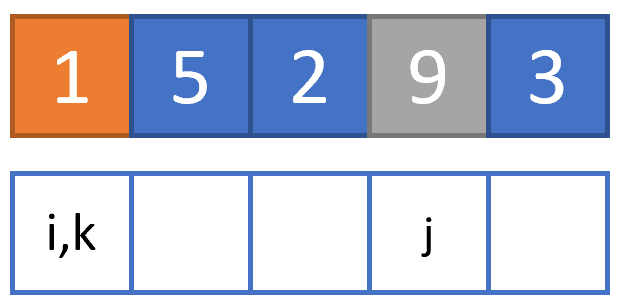
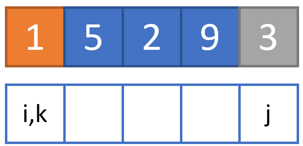
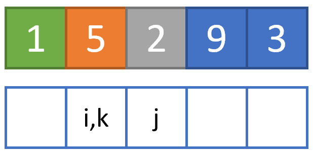
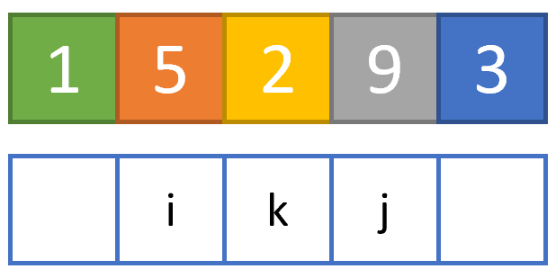
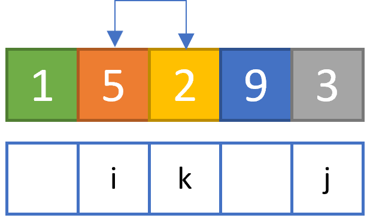
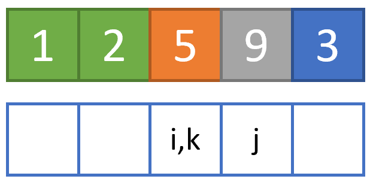
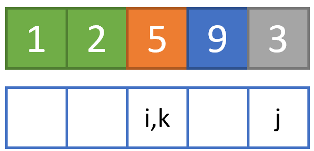
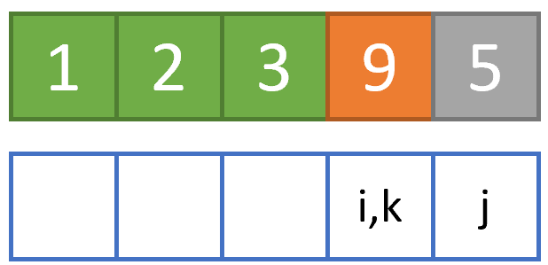
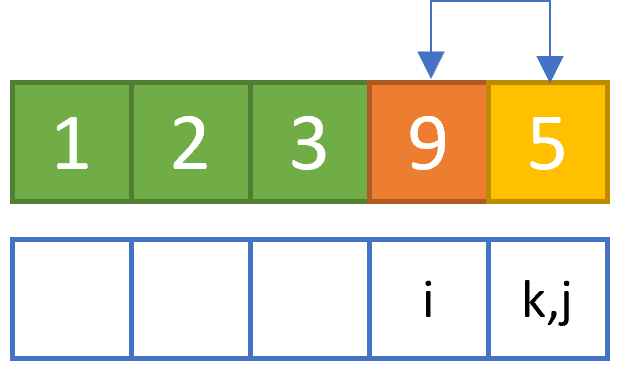
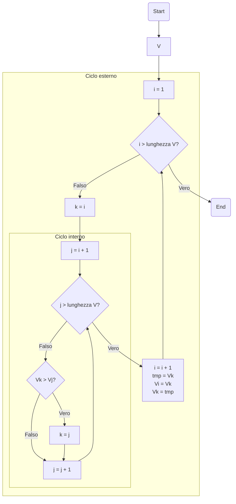

# Selection sort

## Introduzione

Il più semplice algoritmo di ordinamento è quello per *selezione*, comunemente conosciuto con il suo nome inglese, ovvero *selection sort*.

L'assunto da cui parte il selection sort è molto semplice, ed è riassumibile come segue. Immaginiamo di avere un vettore $V$, e di volerlo ordinare in maniera *crescente*, ovvero posizionando all'estrema sinistra l'elemento più piccolo, ed all'estrema destra quello più grande. In altre parole, se:

$$
V = [1, 5, 2, 9, 3]
$$

il vettore ordinato $V_{ord}$ sarà:

$$
V_{ord} = [1, 2, 3, 5, 9]
$$

L'idea su cui si basa il selection sort è quella di "attraversare" il vettore $V$, esplorando un elemento dopo l'altro a partire da quello all'estrema sinistra, individuando, ad ogni iterazione, l'elemento minimo tra quelli a destra dell'elemento considerato.

Così, ad esempio, alla prima iterazione l'elemento considerato sarà quello all'estrema sinistra (ovvero, $V[1]=1$); di quelli alla sua destra (ovvero, $V_{dx}=[5,2,9,3]$) sarà valutato il minimo e, se inferiore ad $1$, i due valori saranno scambiati. Una volta terminata questa iterazione, si passa alla successiva, considerando l'elemento immediatamente a destra di quello considerato precedentemente (in questo caso, $5$), e ripetendo la procedura sui restanti valori (che diventano $V_{dx}=[2,9,3]$), fino a che il vettore non è stato completamente ordinato.

## Funzionamento dell'algoritmo

Vediamo un esempio pratico. Per implementarlo, ci conviene usare tre variabili, ovvero:

* `i`, contatore relativo all'elemento attualmente analizzato, che dovrà iterare su tutti gli elementi del vettore. Chiameremo questo ciclo *esterno*;
* `k`, variabile di appoggio, che all'inizio di ogni iterazione "esterna" sarà pari ad `i`, e sarà aggiornata sulla base di alcune condizioni che vedremo in seguito;
* `j`, contatore relativo ai valori restanti del vettore all'`i`-ma iterazione, rappresentativo del ciclo *interno* e che, all'inizio di ogni iterazione esterna, sarà pari a `i+1`.

Immaginiamo di dover ordinare il nostro vettore `V=[1,5,2,9,3]`. Allora, alla prima iterazione:

* `i` sarà pari ad `1`, e punterà a `V[1] = 1`;
* `k` sarà pari ad `i`, ovvero `1`;
* `j` sarà pari ad `i+1`, ovvero `2`, e punterà a `V[2] = 5`.

Graficamente, saremo in questa situazione.

<figure markdown>
  {width=250}
</figure>

Nella figura precedente (ed in quelle successive):

* gli elementi in <span style="color:blue">blu</span> sono quelli non ancora esaminati dall'algoritmo;
* quelli in <span style="color:orange">arancione</span> sono relativi all'elemento attualmente indicizzato da `i`;
* quelli in <span style="color:yellow">giallo</span> sono relativi all'elemento attualmente indicizzato da `k`;
* quelli in <span style="color:grey">grigio</span> sono relativi all'elemento attualmente indicizzato da `j`;
* quelli in <span style="color:green">verde</span> sono quelli già esaminati ed ordinati.

Data questa situazione, compariamo i valori `V[k]` e `V[j]`: in particolare, se `V[j]` è inferiore a `V[k]`, andiamo ad aggiornare il valore di `k`, ponendolo uguale a `j`, ed incrementiamo di `1` quest'ultimo valore; in caso contrario, limitiamoci ad incrementare `j` di `1`. In questo caso, `V[k]` è pari ad `1`, che è inferiore a `V[j]=5`, quindi limitiamoci ad incrementare `j` di `1`, ottenendo la seguente situazione.

<figure markdown>
  {width=250}
</figure>

Anche in questo caso `V[k]` è minore di `V[j]`, per cui dobbiamo limitarci ad aumentare il valore di `j` di una unità.

<figure markdown>
  {width=250}
</figure>

Proseguiamo:

<figure markdown>
  {width=250}
</figure>

Si nota subito che non è possibile aumentare ulteriormente il valore di `j` senza puntare ad un elemento non esistente. Di conseguenza, dato che `k=i`, siamo certi che non vi è alcun elemento di $V_{dx}$ inferiore a $V[i]$; possiamo quindi passare allo step successivo, che prevede l'incremento del valore di `i`, e la riassegnazione di `k` e `j`.

<figure markdown>
  {width=250}
</figure>

Notiamo che, stavolta, `V[k]=5`, mentre `V[j]=2`. Ciò implica che la condizione che sappiamo deve essere verificata (ovvero `V[k] < V[j]`) *non è più valida*. Di conseguenza, procediamo ad aggiornare il valore di `k`, ponendolo pari a `j`, ed aggiorniamo il valore di quest'ultima, incrementandolo di `1`.

<figure markdown>
  {width=250}
</figure>

Proseguiamo nella nostra analisi, notando che `V[j] > V[k]`, per cui non è necessario aggiornare il valore di `k`.

<figure markdown>
  {width=250}
</figure>

Giunti in questa situazione, notiamo che `k` è diverso da `i`, per cui dovremo sostituire `V[k]` con `V[i]`, e riaggiornare i valori.

<figure markdown>
  {width=250}
</figure>

Continuiamo a seguire la stessa logica per i restanti passaggi.

<figure markdown>
  {width=250}
</figure>

Aggiorniamo il valore di `k`, perché `V[k] > V[j]`.

<figure markdown>
  {width=250}
</figure>

Scambiamo i valori di `V[k]` e `V[i]`.

<figure markdown>
  {width=250}
</figure>

Aggiorniamo il valore di `k`, perché `V[k] > V[j]`.

<figure markdown>
  {width=250}
</figure>

L'algoritmo termina perché `j=i+1=6` punta ad un indice non esistente nel vettore.

<figure markdown>
  {width=250}
</figure>

Come è possibile vedere, il selection sort permette di ordinare in maniera semplice un vettore di lunghezza arbitraria, semplicemente individuando in maniera iterativa il minimo del vettore a destra dell'elemento attualmente considerato.

!!!tip "Ordinamento decrescente"
    Si può usare il selection sort anche per ordinare $V$ in maniera decrescente; per farlo, basta valutare, ad ogni iterazione, se `V[k] < V[j]`. In altre parole, basta cercare il massimo del vettore a destra dell'elemento attualmente considerato.

## Diagramma di flusso

Il diagramma di flusso associato al selection sort è riportato di seguito.



## Implementazione

In ultimo, riportiamo il codice per implementare il selection sort in MATLAB ed in Python.

=== "MATLAB"

    ```matlab title="selectionSort.m"
    function V = selectionSort(V)
    %SELECTIONSORT Ordina il vettore in ingresso V.

    % Ciclo esterno...
    for i = 1:length(V)
        k = i;
        % Ciclo interno...
        for j = i+1:length(V)
            if V(j) < V(k)
                % Aggiornamento elemento minimo
                k = j;
            end
        end
        % Ordinamento
        tmp = V(k);
        V(i) = V(k);
        V(k) = tmp;
    end
    ```

=== "Python"

    ```py title="selection_sort.py"
    def selection_sort(V):
        """ Funzione per l'ordiamento mediante selection sort.
        """
        for i in range(len(V)):
            k = i
            for j in range(i+1, len(V)):
                if V(j) < V(k):
                    k = j
            tmp = V[k]
            V[i] = V[k]
            V[k] = tmp
    ```
