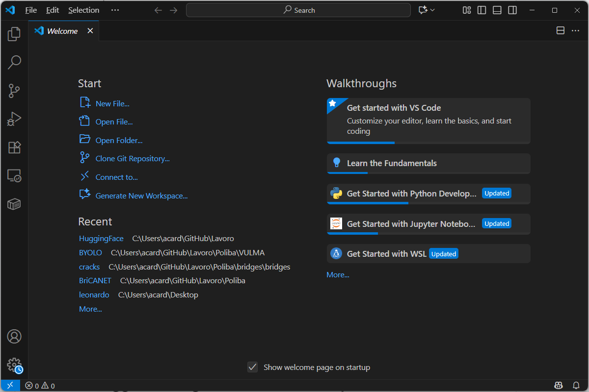
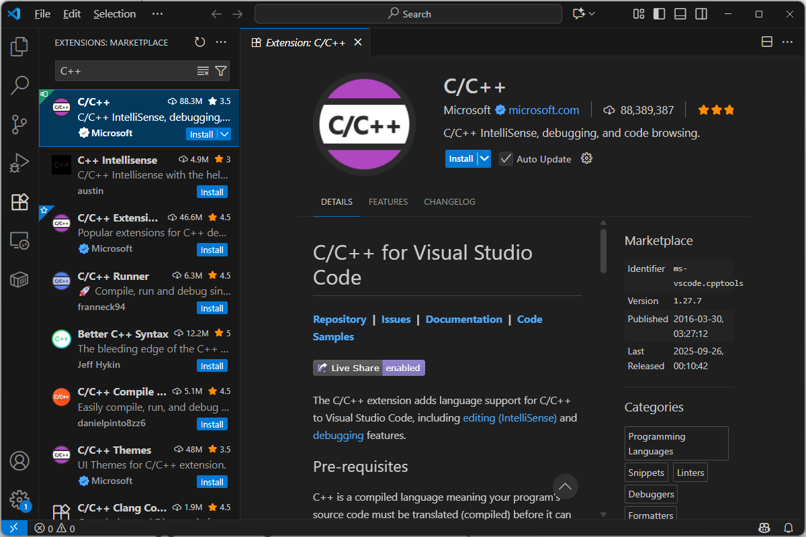
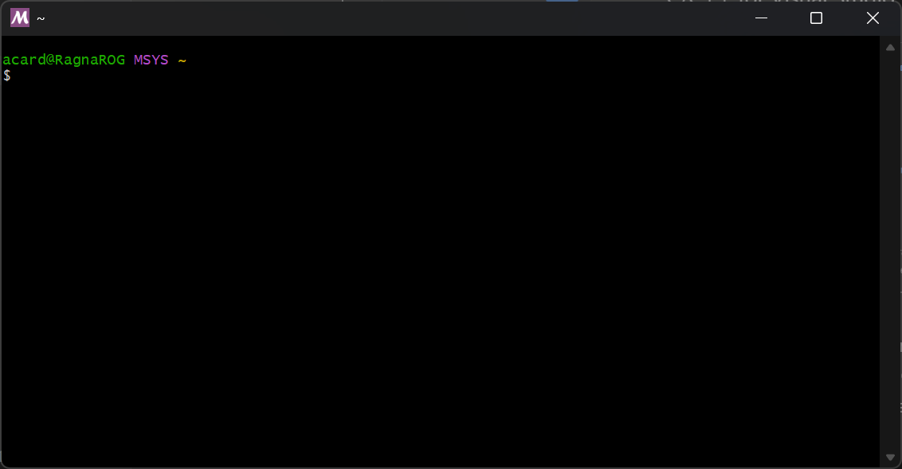
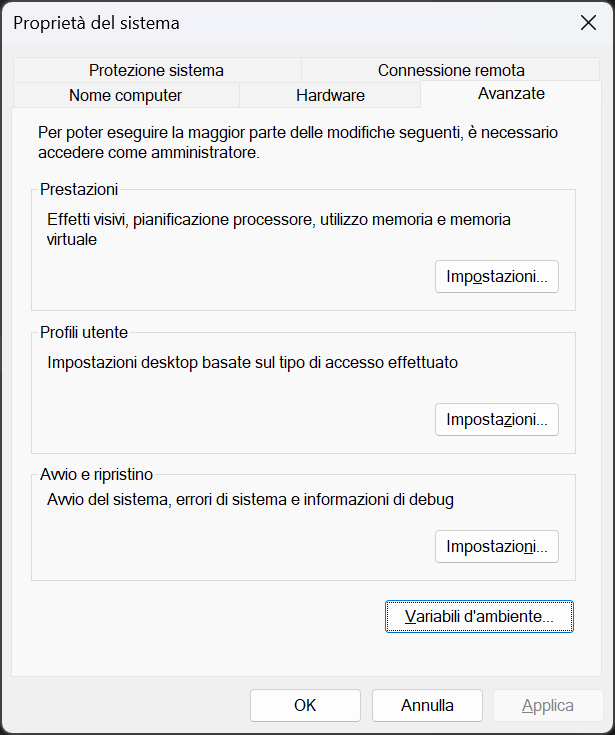
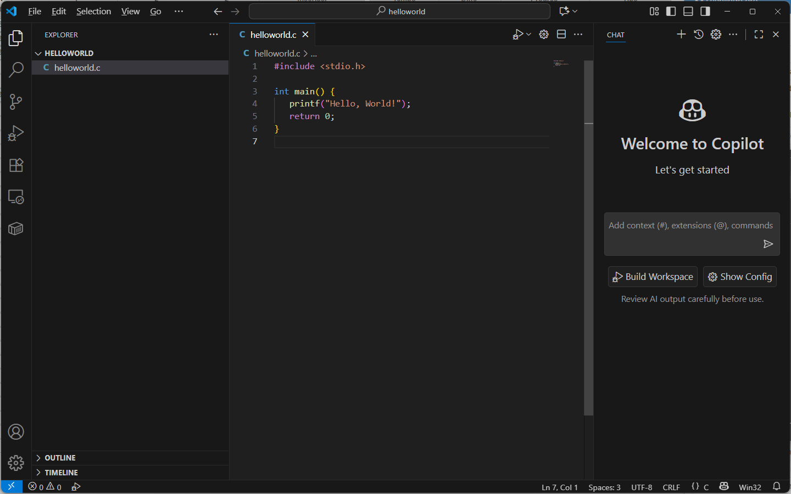
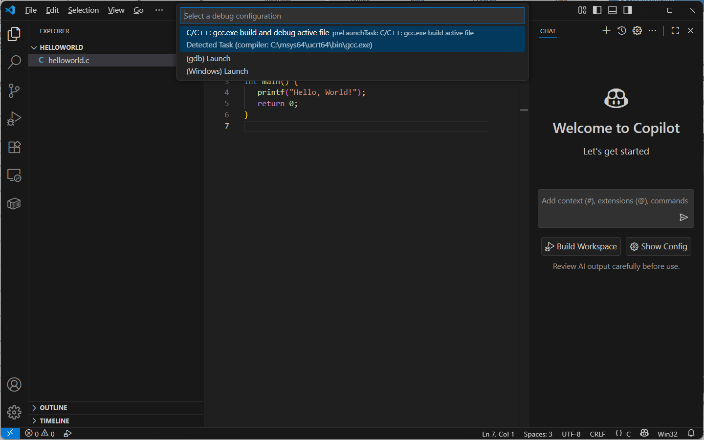
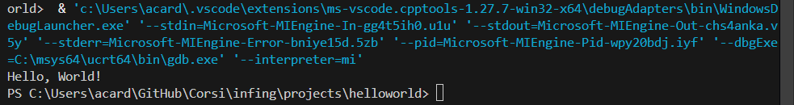

## Il ruolo di Visual Studio Code
*Visual Studio Code* (VS Code) è un *Integrated Development Environment* (IDE) che, per una precisa scelta di design, mantiene una struttura "leggera", non includendo nativamente componenti legati alla compilazione ed al debugging in molteplici linguaggi di programmazione. In altri termini, VS Code è una sorta di "blocco note evoluto", fungendo primariamente da editor di codice "potenziato", ed affidandosi interamente ad estensioni e strumenti esterni per lo sviluppo ed il test del codice.

Questo implica che l'installazione di VS Code sulla nostra macchina sia soltanto il primo passo: lo sviluppo in linguaggio C, infatti, richiede l'installazione della *toolchain*, composta da un *compilatore* e di un *debugger* sul sistema operativo. La corretta configurazione avviene quando VS Code viene istruito su come invocare questi strumenti esterni e, per farlo, occorre manipolare un file di configurazione.
## Installazione di Visual Studio Code e dell'estensione C/C++
Iniziamo scaricando l'editor all'indirizzo https://code.visualstudio.com/. Dopo averlo installato, dovremo ottenere l'estensione che fornisce il supporto al linguaggio C/C++, chiamata **Estensione C/C++ di Microsoft**. Per farlo, dovremo:
+ accedere alla finestra *Estensioni*, selezionando l'icona dalla barra di Attività, oppure usando la scorciatoia da tastiera Ctrl+Shift+X;
+ cercare il termine C++ e selezionare l'estensione opportuna.





Le funzionalità primare fornite dall'estensione includono:
* **IntelliSense**: funzionalità che permette di completare il codice in maniera intelligente, dando informazioni interattive al programmatore, e verificando in rosso gli errori in tempo reale;
* **supporto al debugger**: funzionalità che abilità l'interfaccia di debug di VS Code, che comunica con il debugger esterno che avremo configurato nel sistema.

E' estremamente importante notare come l'**estensione C/C++ non installi il compilatore o il debugger**. Il suo funzionamento dipende quindi dalla capacità di VS Code di localizzare ed eseguire la toolchain già installata nel sistema.

## Installazione della Toolchain
La configurazione della toolchain è un processo dipendente dal sistema operativo della macchina che stiamo utilizzando. Questa guida si focalizzerà **esclusivamente sul sistema operativo Windows**.

In questo caso, la toolchain raccomandata per lo sviluppo è MinGW-w64, preferibilmente installata mediante MSY2. Per installarla, seguiamo i seguenti step:
1. **Installazione di MSYS2**: dall'indirizzo https://www.msys2.org/, scarichiamo ed eseguiamo l'insteller di MSYS2. Utilizziamo le opzioni di default, e lasciamo selezionata la casella *Run MSYS2 now* al termine dell'installazione, in modo da aprire la finestra del terminale MSYS2.
2. **Installazione dei pacchetti GCC/GDB**: all'interno del terminale, eseguiamo il seguente coando per installare la toolchain C/C++ completa:
```sh
pacman -S --needed base-devel mingw-w64-ucrt-x86_64-toolchain
```



## Configurazione delle variabili d'ambiente
Il punto critico adesso è la configurazione delle variabili d'ambiente, ed in particolare del PATH, che permette a VS Code di "ritrovare" la toolchain. Per farlo:
1. **Identifichiamo il percorso di installazione della toolchain**. In particolare, se abbiamo utilizzato le configurazioni predefinite, il percorso da aggiungere sarà `C:\msys64\ucrt64\bin`.
2. **Modifichiamo la variabile PATH**. Per farlo, apriamo la barra di ricerche di Winodws, cerchiamo "Modifica variabili d'ambiente per il tuo account" e, nella sezione "Variabili utente", selezioniamo e odifichiao la variabile PATH, aggiungendo il percorso identificato al punto 1.



3. Dopo aver modificato il PATH, dovremo riavviare ogni terminale aperto, incluso quello di VS Code, per poter verificare l'installazione.
4. Una volta effettuato il riavvio, testiamo la presenza dei binari in Powershell usando i comandi:
```sh
gcc --version
g++ --version
gdb --version
```
Se non abbiamo errori la configurazione è avvenuta con successo.

## Configurazione del workspace
Una volta installata la toolchain esterna, bisogna configurare VS Code affinché la utilizzi. La configurazione specifica per un progetto viene salvata in una cartella nascosta `.vscode` all'interno della cartella dello stesso, contenente almeno un file JSON fondamentale, ovvero `tasks.json`.

Non dovremo creare questo file a mano: invece, dovremo avviare VS Code, creare un nuovo progetto all'interno di una cartella (che, per esempio, potremo chiamare `helloworld`), e quindi creare un nuovo file sorgente (che, in maniera altrettanto originale, potremo chiamare `helloworld.c`). Inseriamo il seguente codice:

```c
#include <stdio.h>

int main() {
	print("Hello, World");
	return 0;
}
```

La schermata apparirà più o meno come segue:



A questo punto, potremo scegliere il pulsante di Debug (la piccola freccia in alto a destra). Selezioniamo la prima opzione, come mostrato in figura, e premiamo **Invio**.



Noteremo che VS Code creerà in automatico la cartella nascosta .vscode con al suo interno il file tasks.json e, se tutto è andato per il verso giusto, vedremo nel terminale qualcosa del tipo:



Se viene lanciato qualche errore, dovremo fare un passo indietro e ripetere gli step precedenti. Et voiltà, VS Code è configurato!