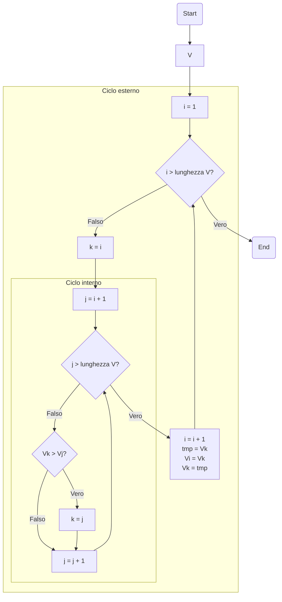

# Bubble sort

Un altro semplice algoritmo di ordinamento è quello *a bolle*, anch'esso comunemente conosciuto con il suo nome inglese, *bubble sort*.

Partiamo dal solito assunto, ovvero quello di avere un vettore $V$ che vogliamo ordinare in maniera crecente. Per semplicità, poniamo:

$$
V = [1, 5, 2, 9, 3]
$$

con il vettore ordinato $V_{ord}$ pari a:

$$
V_{ord} = [1, 2, 3, 5, 9]
$$

Dal punto di vista concettuale, il bubble sort lavora effettuando lo "swap" degli elementi adiacenti *solo e soltanto se* questi risultano essere nell'ordine sbagliato, ovvero se, in una determinata coppia, l'elemento a sinistra è maggiore di quello a destra. Facciamo un esempio pratico.

| Idx | 1 | 2 | 3 | 4 | 5 |
| - | - | - | - | - | - |
| $V$ | 1 | 5 | 2 | 9 | 3 |
| `i` | $\times$ | | | | |
| `k` | $\times$ | | | | |
| `j` | | $\times$ | | |  |

Data questa situazione, compariamo i valori `V[k]` e `V[j]`: in particolare, se `V[j]` è inferiore a `V[k]`, andiamo ad aggiornare il valore di `k`, ponendolo uguale a `j`, ed incrementiamo di `1` quest'ultimo valore; in caso contrario, limitiamoci ad incrementare `j` di `1`. In questo caso, `V[k]` è pari ad `1`, che è inferiore a `V[j]=5`, quindi limitiamoci ad incrementare `j` di `1`, ottenendo la seguente situazione.

| Idx | 1 | 2 | 3 | 4 | 5 |
| - | - | - | - | - | - |
| $V$ | 1 | 5 | 2 | 9 | 3 |
| `i` | $\times$ | | | | |
| `k` | $\times$ | | | | |
| `j` | | | $\times$ | |  |

Anche in questo caso `V[k]` è minore di `V[j]`, per cui dobbiamo limitarci ad aumentare il valore di `j` di una unità.

| Idx | 1 | 2 | 3 | 4 | 5 |
| - | - | - | - | - | - |
| $V$ | 1 | 5 | 2 | 9 | 3 |
| `i` | $\times$ | | | | |
| `k` | $\times$ | | | | |
| `j` | | | | $\times$ | |

Proseguiamo:

| Idx | 1 | 2 | 3 | 4 | 5 |
| - | - | - | - | - | - |
| $V$ | 1 | 5 | 2 | 9 | 3 |
| `i` | $\times$ | | | | |
| `k` | $\times$ | | | | |
| `j` | | | | | $\times$ |

Si nota subito che non è possibile aumentare ulteriormente il valore di `j` senza puntare ad un elemento non esistente. Di conseguenza, dato che `k=i`, siamo certi che non vi è alcun elemento di $V_{dx}$ inferiore a $V[i]$; possiamo quindi passare allo step successivo, che prevede l'incremento del valore di `i`, e la riassegnazione di `k` e `j`.

| Idx | 1 | 2 | 3 | 4 | 5 |
| - | - | - | - | - | - |
| $V$ | 1 | 5 | 2 | 9 | 3 |
| `i` | | $\times$ | | | |
| `k` | | $\times$ | | | |
| `j` | | | $\times$ | | |

Notiamo che, stavolta, `V[k]=5`, mentre `V[j]=2`. Ciò implica che la condizione che sappiamo deve essere verificata (ovvero `V[k] < V[j]`) *non è più valida*. Di conseguenza, procediamo ad aggiornare il valore di `k`, ponendolo pari a `j`, ed aggiorniamo il valore di quest'ultima, incrementandolo di `1`.

| Idx | 1 | 2 | 3 | 4 | 5 |
| - | - | - | - | - | - |
| $V$ | 1 | 5 | 2 | 9 | 3 |
| `i` | | $\times$ | | | |
| `k` | | | $\times$ | | |
| `j` | | | | $\times$ | |

Proseguiamo nella nostra analisi, notando che `V[j] > V[k]`, per cui non è necessario aggiornare il valore di `k`.

| Idx | 1 | 2 | 3 | 4 | 5 |
| - | - | - | - | - | - |
| $V$ | 1 | 5 | 2 | 9 | 3 |
| `i` | | $\times$ | | | |
| `k` | | | $\times$ | | |
| `j` | | | | | $\times$ |

Giunti in questa situazione, notiamo che `k` è diverso da `i`, per cui dovremo sostituire `V[k]` con `V[i]`, e riaggiornare i valori.

| Idx | 1 | 2 | 3 | 4 | 5 |
| - | - | - | - | - | - |
| $V$ | 1 | 2 | 5 | 9 | 3 |
| `i` | | | $\times$ | | |
| `k` | | | $\times$ | | |
| `j` | | | | $\times$ | |

Continuiamo a seguire la stessa logica per i restanti passaggi.

| Idx | 1 | 2 | 3 | 4 | 5 |
| - | - | - | - | - | - |
| $V$ | 1 | 2 | 5 | 9 | 3 |
| `i` | | | $\times$ | | |
| `k` | | | $\times$ | | |
| `j` | | | | | $\times$ |

Aggiorniamo il valore di `k`, perché `V[k] > V[j]`.

| Idx | 1 | 2 | 3 | 4 | 5 |
| - | - | - | - | - | - |
| $V$ | 1 | 2 | 5 | 9 | 3 |
| `i` | | | $\times$ | | |
| `k` | | | | | $\times$ |
| `j` | | | | | $\times$ |

Scambiamo i valori di `V[k]` e `V[i]`.

| Idx | 1 | 2 | 3 | 4 | 5 |
| - | - | - | - | - | - |
| $V$ | 1 | 2 | 3 | 9 | 5 |
| `i` | | | | $\times$ | |
| `k` | | | | $\times$ | |
| `j` | | | | | $\times$ |

Aggiorniamo il valore di `k`, perché `V[k] > V[j]`.

| Idx | 1 | 2 | 3 | 4 | 5 |
| - | - | - | - | - | - |
| $V$ | 1 | 2 | 3 | 9 | 5 |
| `i` | | | | $\times$ | |
| `k` | | | | | $\times$ |
| `j` | | | | | $\times$ |

L'algoritmo termina perché `j=i+1=6` punta ad un indice non esistente nel vettore.

| Idx | 1 | 2 | 3 | 4 | 5 |
| - | - | - | - | - | - |
| $V$ | 1 | 2 | 3 | 5 | 9 |
| `i` | | | | | $\times$ |
| `k` | | | | | $\times$ |
| `j` | | | | | |

Come è possibile vedere, il selection sort permette di ordinare in maniera semplice un vettore di lunghezza arbitraria, semplicemente individuando in maniera iterativa il minimo del vettore a destra dell'elemento attualmente considerato.

!!!tip "Ordinamento decrescente"
    Si può usare il selection sort anche per ordinare $V$ in maniera decrescente; per farlo, basta valutare, ad ogni iterazione, se `V[k] < V[j]`. In altre parole, basta cercare il massimo del vettore a destra dell'elemento attualmente considerato.

Il diagramma di flusso associato al selection sort è riportato di seguito.

